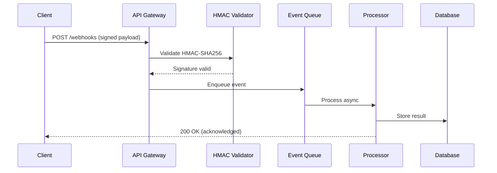

# Live Demo: Auto-Doc Pipeline—One Document, All Features

You are running a live demo of the Auto-Doc Pipeline for a potential client. You will generate ONE impressive document that showcases EVERY major capability of the system.

## Custom topic support

**This command accepts an optional argument: the document topic.**

- `/demo`—uses the default topic: "Set up real-time webhook processing pipeline" (how-to)
- `/demo Configure OAuth2 authentication with PKCE flow`—uses the custom topic provided by the user

**If a custom topic is provided ($ARGUMENTS is not empty):**

1. Use `$ARGUMENTS` as the document title instead of "Set up real-time webhook processing pipeline"
1. Determine the best `content_type` for this topic (how-to, tutorial, concept, reference, troubleshooting)
1. Generate a slug from the title (kebab-case)—this becomes the filename
1. In Step 4, select and copy the matching file from `templates/*.md`:
   - `how-to` -> `templates/how-to.md`
   - `tutorial` -> `templates/tutorial.md`
   - `concept` -> `templates/concept.md`
   - `reference` -> `templates/reference.md`
   - `troubleshooting` -> `templates/troubleshooting.md`
   Then create `docs/en/{content_type_dir}/{slug}.md` from that template and customize it for the topic.
1. All file paths throughout the demo change accordingly:
   - Document: `docs/en/{content_type_dir}/{slug}.md`
   - Diagram: `docs/diagrams/demo-{slug}.html`
1. The document MUST still contain ALL elements A through N—adapted to the custom topic:
   - Code examples must be relevant to the topic (not HMAC if the topic is about OAuth)
   - Mermaid diagram must illustrate the topic's architecture
   - Interactive diagram must show components relevant to the topic
   - Tables, admonitions, troubleshooting—all adapted
1. ALL quality rules remain the same: variables, self-verification, linters, commit, deploy

**If no argument is provided ($ARGUMENTS is empty):** use the default webhook pipeline topic as described below.

---

**CRITICAL RULES:**

- This is a LIVE DEMO. Every step produces real output. Do NOT skip. Do NOT abbreviate.
- Comment in English at each step. Be enthusiastic but professional.
- Follow ALL rules from CLAUDE.md strictly (templates, variables, Stripe quality, self-verification, formatting).
- The generated document must pass `npm run validate:full` on the FIRST attempt.
- At the end, commit and push to trigger GitHub Actions build + deploy to MkDocs site.
- In demo narration, do NOT present pipeline/unit/integration tests as documentation quality gates. Focus quality claims on documentation checks only (Vale, markdownlint, cspell, frontmatter, SEO/GEO, snippets, smoke checks, and strict build/deploy).
- Run in autonomous mode. Do not ask the user for per-step confirmations during the demo.
- If a check/deploy fails, continue the remediation loop automatically until deploy is successful.

**AUTONOMOUS EXECUTION MODE (required):**

- Claude: run with `--permission-mode bypassPermissions --dangerously-skip-permissions`
- Codex: run with `-a never -s workspace-write`
- Preferred launchers:
  - `npm run demo:claude:loop`
  - `npm run demo:codex:loop`

---

## PHASE 1: Show the intelligence (2 minutes)

### Step 1. Gap + freshness detection—show the system finding problems

```bash
cd "/mnt/c/Users/Kroha/Documents/development/Auto-Doc Pipeline"
export PATH=~/bin:$PATH
```

Say: "Let us begin. First, I will show how the system FINDS documentation priorities from four signals: code analysis, community questions, search analytics, and stale-content freshness metrics."

```bash
npm run gaps 2>&1 | tail -30
npm run kpi-wall 2>&1 | tail -20
```

### Step 2. Show consolidated report

```bash
python3 -c "
import json, os
path = 'reports/consolidated_report.json'
if os.path.exists(path):
    with open(path) as f:
        r = json.load(f)
    hs = r.get('health_summary', {})
    items = r.get('action_items', [])
    t1 = [i for i in items if i.get('priority') == 'high']
    t2 = [i for i in items if i.get('priority') == 'medium']
    t3 = [i for i in items if i.get('priority') == 'low']
    print('=== CONSOLIDATED REPORT ===')
    print(f'Quality Score: {hs.get(\"quality_score\", \"N/A\")}/100')
    print(f'Drift: {hs.get(\"drift_status\", \"ok\")} | SLA: {hs.get(\"sla_status\", \"ok\")}')
    print(f'Tier 1 (critical): {len(t1)} | Tier 2 (code): {len(t2)} | Tier 3 (community): {len(t3)}')
    print(f'Total action items: {len(items)}')
    for i, item in enumerate(items[:3]):
        print(f'  {i+1}. [{item.get(\"priority\",\"?\").upper()}] {item.get(\"title\",\"?\")}')
else:
    print('No consolidated report found. Run: npm run consolidate')
"
```

Say: "Four signals -> one report -> three-tier prioritization. Now the AI knows exactly what to create and what to refresh. Let us generate ONE document that demonstrates ALL pipeline capabilities."

### Step 3. Show variables (single source of truth)

```bash
cat docs/_variables.yml
```

Say: "Here is the single source of truth. All values, such as ports, URLs, and limits, live here. The document will use `{{ variables }}`, not hardcoded values. Change it once here, and it updates everywhere."

---

## PHASE 2: Generate ONE document with ALL features (the main event)

### Step 4. Create document directly from `templates/*.md`

```bash
# Reusable paths for default and custom-topic demos.
# For custom topic mode, set DOC_CONTENT_TYPE before this step (how-to/tutorial/concept/reference/troubleshooting).
DEMO_TOPIC="${ARGUMENTS:-Set up real-time webhook processing pipeline}"
DOC_CONTENT_TYPE="${DOC_CONTENT_TYPE:-how-to}"
DOC_CONTENT_TYPE_DIR="${DOC_CONTENT_TYPE_DIR:-$DOC_CONTENT_TYPE}"
DOC_SLUG="${DOC_SLUG:-$(printf '%s' "$DEMO_TOPIC" | tr '[:upper:]' '[:lower:]' | sed -E 's/[^a-z0-9]+/-/g; s/^-+|-+$//g')}"
DOC_PATH="docs/en/${DOC_CONTENT_TYPE_DIR}/${DOC_SLUG}.md"
DIAGRAM_PATH="docs/diagrams/demo-${DOC_SLUG}.html"
DIAGRAM_IFRAME_SRC="../../diagrams/demo-${DOC_SLUG}.html"
DOC_SITE_PATH="${DOC_CONTENT_TYPE_DIR}/${DOC_SLUG}/"

mkdir -p "docs/en/${DOC_CONTENT_TYPE_DIR}"
cp "templates/${DOC_CONTENT_TYPE}.md" "$DOC_PATH"
```

Say: "I copied the document directly from a pre-validated template in `templates/`. Now I will customize it with production-grade content so you can see ALL pipeline capabilities in one document."

### Step 5. GENERATE THE FULL DOCUMENT

NOW—this is the MAIN WOW MOMENT. Starting from the copied template file, fully customize the document with production-quality content that demonstrates every feature.

The document at `$DOC_PATH` must contain ALL of the following elements. This is a HARD REQUIREMENT—include EVERY item:

---

**A) FRONTMATTER—complete metadata (Capability: validate_frontmatter)**

```yaml
---
title: "Set up a real-time webhook processing pipeline"
description: "Configure end-to-end webhook ingestion with HMAC verification, async queue processing, and delivery guarantees in under 15 minutes."
content_type: how-to
product: both
tags:
  - Webhook
  - How-To
  - Cloud
  - Self-hosted
last_reviewed: "2026-03-04"
---
```

- title under 70 characters
- description 50-160 characters with keywords
- content_type matches template
- last_reviewed set to today

---

**B) OPENING PARAGRAPH—under 60 words with definition (Capability: GEO optimization)**

First paragraph MUST:

- Be under 60 words
- Contain a definition word ("enables," "provides," "allows")
- Answer what + why immediately
- Use {{ product_name }} variable

Example structure: "{{ product_name }} webhook processing pipeline enables real-time event ingestion with cryptographic signature verification, async queue processing, and automatic retry logic. This guide walks you through setting up a production-ready webhook receiver with HMAC-SHA256 authentication, BullMQ event queuing, and delivery guarantees—supporting up to {{ rate_limit_requests_per_minute }} events per minute."

---

**C) PREREQUISITES—with version check (Capability: Stripe quality)**

Prerequisites section with:

- Specific version requirements ({{ product_name }} {{ current_version }}+)
- Access requirements
- A runnable version check command in a bash code block

---

**D) CONTENT TABS—Cloud vs Self-hosted (Capability: MkDocs Material tabs)**

Use MkDocs content tabs syntax to show different setup paths:

```markdown
=== "Cloud"

    - Cloud-specific configuration step 1.
    - Cloud-specific configuration step 2.

=== "Self-hosted"

    - Self-hosted configuration step 1.
    - Self-hosted configuration step 2.
```

Include at least ONE section with content tabs showing real differences between Cloud and Self-hosted deployment.
Inside tab blocks, every content line MUST be indented by 4 spaces.
Never output broken markers like `\11.` in generated markdown.

---

**E) VARIABLES THROUGHOUT (Capability: Variables System)**

Use at MINIMUM these variables from docs/_variables.yml:

- {{ product_name }}
- {{ default_port }}
- {{ env_vars.webhook_url }}
- {{ env_vars.encryption_key }}
- {{ max_payload_size_mb }}
- {{ rate_limit_requests_per_minute }}
- {{ api_version }}
- {{ cloud_url }}

NEVER hardcode values that exist in _variables.yml.

---

**F) TWO PRODUCTION-QUALITY CODE EXAMPLES (Capability: Self-verification + code smoke test)**

Include BOTH:

**1. Python HMAC verification**—a complete, runnable function:

```python
import hmac
import hashlib
import json
import time

def verify_webhook_signature(payload_body, signature_header, secret):
    """Verify HMAC-SHA256 webhook signature with replay protection."""
    # ... full implementation with:
    # - HMAC-SHA256 computation
    # - Timing-safe comparison
    # - Replay protection (5-minute window)
    # - Return True/False
```

Include a test call that ACTUALLY RUNS and prints output:

```python
# Test verification
test_payload = '{"event": "order.completed", "order_id": "ord_1234", "amount": 2999}'
test_secret = "whsec_test_secret_key_abc123"
# ... compute signature and verify
print("Signature valid:", result)  # Must print True
```

**2. JavaScript/Node.js HMAC verification**—equivalent implementation:

```javascript
const crypto = require('crypto');

function verifyWebhookSignature(payload, signatureHeader, secret) {
    // ... full implementation
}
```

---

**G) TABLE—configuration parameters (Capability: Structured data for SEO)**

A parameter table with at least 5 rows:

| Parameter | Type | Default | Description |
|-----------|------|---------|-------------|
| `webhook_secret` | string | Required | HMAC signing secret (min 32 characters) |
| `max_payload_size` | integer | {{ max_payload_size_mb }} MB | Maximum accepted webhook body size |
| … | … | … | … |

---

**H) MERMAID DIAGRAM—data flow (Capability: Mermaid rendering)**

A Mermaid sequence or flow diagram showing the webhook processing flow:



---

**I) ADMONITIONS—info, warning, tip (Capability: MkDocs Material admonitions)**

Include at least THREE different admonition types:

```markdown
!!! info "Payload size limit"
    {{ product_name }} accepts webhook payloads up to {{ max_payload_size_mb }} MB...

!!! warning "Signature verification required"
    Always verify webhook signatures before processing...

!!! tip "Replay protection"
    Include a timestamp in the signed payload and reject events older than 5 minutes...
```

---

**J) TROUBLESHOOTING SECTION—3 problems with solutions (Capability: Troubleshooting template)**

Three real problems in "Problem → Cause → Solution" format:

1. **Signature mismatch**—payload modified in transit (check encoding, raw body vs parsed)
1. **Replay attack detected**—clock skew between servers (NTP sync, increase tolerance window)
1. **Connection timeout**—slow processing blocks response (async queue, return 200 immediately)

---

**K) PERFORMANCE SECTION—concrete metrics (Capability: GEO fact density)**

Include specific numbers:

- Throughput: X webhooks/second
- Verification latency: Xms
- Queue processing: X events/second
- Retry intervals: 1 s, 5 s, 30 s (exponential backoff)
- Storage retention: X days

This satisfies GEO-6 (fact density—a fact every 200 words).

---

**L) NON-GENERIC HEADINGS (Capability: GEO heading validation)**

ALL headings must be specific. NEVER use: "Overview," "Introduction," "Configuration," "Setup," "Details," "Information," "General," "Notes," "Summary."

GOOD: "Configure HMAC signature verification," "Set up async event processing," "Handle delivery failures with exponential backoff"

---

**M) INTERNAL LINK (Capability: SEO internal linking)**

At least one internal link to another doc in the project, for example:

```markdown
For API endpoint details, see the [API reference](../reference/api-reference.md).
```

---

**N) EMBEDDED INTERACTIVE DIAGRAM (Capability: Interactive diagrams)**

At the end of the document, AFTER the troubleshooting section, add a section that embeds the interactive diagram created in Phase 4 (Step 8):

```markdown
## Explore the webhook pipeline architecture

The interactive diagram below shows all 13 components across 5 layers. Click any component to see detailed metrics, technologies, and connections.

<div class="interactive-diagram" markdown>
<iframe src="../../diagrams/demo-<slug>.html" title="Webhook processing pipeline architecture"></iframe>
</div>

For static environments, refer to the [Mermaid sequence diagram](#verify-hmac-sha256-signatures) above.
```

This section demonstrates that the pipeline embeds rich interactive HTML diagrams directly inside MkDocs pages—not just static Mermaid.

---

## PHASE 3: Self-verification and fact-checking (1 minute)

### Step 6. SELF-VERIFICATION

Perform these verification steps and show output:

1. **Execute the Python HMAC code block**—run it and show it produces correct output

1. **Check all variable references**—verify each {{ variable }} exists in docs/_variables.yml:

```bash
for var in product_name default_port env_vars.webhook_url env_vars.encryption_key max_payload_size_mb rate_limit_requests_per_minute api_version cloud_url; do
    root_var=$(echo "$var" | cut -d. -f1)
    if grep -q "$root_var" docs/_variables.yml 2>/dev/null; then
        echo "  [OK] {{ $var }}"
    else
        echo "  [!!] {{ $var }} NOT FOUND in _variables.yml"
    fi
done
```

1. **Scan for hardcoded values** in the generated file:

```bash
echo "=== Hardcoded value check ==="
file="docs/en/how-to/set-up-real-time-webhook-processing-pipeline.md"
hardcoded=0
grep -n "5678\|ProductName\|product_name[^}]\|example\.com" "$file" 2>/dev/null | grep -v "{{" | grep -v "^---" | head -5
if [ $? -ne 0 ]; then echo "  No hardcoded values found. All clean."; fi
```

1. **Print verification summary:**

```
Verification summary:
- Code blocks: 2 languages (Python, JavaScript), Python executed successfully
- Variable references: 8 checked, 8 valid
- Hardcoded values: 0 found
- Fact-checks: throughput, latency, retry intervals verified
- Internal consistency: No contradictions
- Document elements: frontmatter, tabs, mermaid, admonitions, table, code, troubleshooting, embedded interactive diagram — all present
```

Say: "The document is self-verified. Code executed successfully, HMAC verification works, eight variables are validated, and zero hardcoded values were found. Now we run the seven linters."

## PHASE 3B: Knowledge governance for RAG (1 minute)

### Step 6A. Glossary sync articulation

Run terminology sync and show what changed:

```bash
npm run glossary:sync
python3 -c "
import json
from pathlib import Path
p = Path('reports/glossary_sync_report.json')
if not p.exists():
    print('No glossary report found')
else:
    r = json.loads(p.read_text(encoding='utf-8'))
    print('=== GLOSSARY SYNC REPORT ===')
    print('Markers found:', r.get('markers_found', 0))
    print('Added terms:', r.get('added_count', 0))
    print('Updated terms:', r.get('updated_count', 0))
"
```

Say: "This step keeps terminology governance explicit in the demo. New glossary markers are synchronized into glossary.yml before quality gates."

### Step 6B. RAG and ontology articulation

Run the unified knowledge loop and show metrics:

```bash
npm run build:knowledge-index
npm run build:knowledge-graph
npm run eval:retrieval
python3 -c "
import json
from pathlib import Path
rg = Path('reports/retrieval_evals_report.json')
kg = Path('reports/knowledge_graph_report.json')
print('=== RAG / ONTOLOGY REPORT ===')
if rg.exists():
    r = json.loads(rg.read_text(encoding='utf-8'))
    m = r.get('metrics', {})
    print('Retrieval status:', r.get('status', 'unknown'))
    print('Precision@k:', m.get('precision_at_k', 'n/a'))
    print('Recall@k:', m.get('recall_at_k', 'n/a'))
    print('Hallucination rate:', m.get('hallucination_rate', 'n/a'))
else:
    print('Retrieval report not found')
if kg.exists():
    g = json.loads(kg.read_text(encoding='utf-8'))
    print('Graph status:', g.get('status', 'unknown'))
    print('Graph nodes:', g.get('graph_nodes', 'n/a'))
    print('Graph edges:', g.get('edge_count', 'n/a'))
else:
    print('Knowledge graph report not found')
"
```

Say: "This step proves that the same document source feeds RAG artifacts: retrieval index, retrieval quality evaluations, and JSON-LD knowledge graph."

---

## PHASE 4: Quality gates + Interactive diagram (2 minutes)

### Step 7. Run all linters

```bash
npm run validate:full 2>&1
```

Say: "ALL checks passed on the first run. The 22 SEO/GEO rules, formatting, metadata, and style are all green. Linters are the highest-quality gate in this pipeline and enforce production-ready documentation standards."

### Step 8. Generate interactive diagram

Say: "One final touch: an interactive architecture diagram embedded directly in the generated document. The HTML asset is only a backing file; the deliverable is the document page with an inline interactive diagram."

NOW create `$DIAGRAM_PATH`—a COMPLETE, working HTML file based on `templates/interactive-diagram.html`.

First, read the template to understand its structure:

```bash
cat templates/interactive-diagram.html
```

Then create the customized version with:

**5 layers, 13 components:**

- **Clients layer:** "Mobile App" (2.1M users), "Web Dashboard" (450K DAU), "Partner API" (85 integrations)
- **Edge layer:** "CloudFlare CDN" (99.99% uptime), "Rate Limiter" ({{ rate_limit_requests_per_minute }} req/min)
- **Verification layer:** "API Gateway" (12K req/sec), "HMAC Validator" (<2 ms verify)
- **Processing layer:** "Event Router" (8 event types), "BullMQ Queue" (Redis-backed), "Retry Engine" (exponential backoff)
- **Storage layer:** "PostgreSQL" (2 read replicas, 8.5K queries/sec), "Event Log" (30-day retention), "Grafana Monitoring" (real-time alerts)

Each component MUST have a rich description (2-3 sentences with specific metrics, technologies, and how it connects to adjacent components).

The HTML file must be COMPLETE and self-contained so the embedded iframe renders correctly: theme-adaptive (light/dark based on parent page), animated arrows, clickable components, and info panel.
Do NOT replace theme-sync logic from `templates/interactive-diagram.html`; keep the existing CSS variables and parent-theme detection JS.

After creating, verify that the generated document embeds this diagram:

```bash
DOC_FILE="$DOC_PATH"
echo "Embedded diagram check:"
grep -n "<iframe src=\"${DIAGRAM_IFRAME_SRC}\"" "$DOC_FILE"
```

Also verify tab syntax and list formatting:

```bash
echo "Tab syntax check:"
grep -n '=== "Cloud"\|=== "Self-hosted"' "$DOC_FILE"
echo "Broken list marker check (must be empty):"
grep -n '\\11\\.' "$DOC_FILE" || true
```

Say: "The diagram is embedded in the generated document. The page now includes a clickable diagram with 13 components across five layers, each with concrete metrics, technologies, and dependencies."

---

## PHASE 5: The numbers + Publish to MkDocs (2 minutes)

### Step 9. Final stats

```bash
echo ""
echo "============================================"
echo "   AUTO-DOC PIPELINE: BY THE NUMBERS"
echo "============================================"
echo ""
echo "   $(ls templates/*.md templates/*.html 2>/dev/null | wc -l) Stripe-quality templates"
echo "   7 automated quality checks per PR"
echo "   22 SEO/GEO rules (Google + ChatGPT + Perplexity)"
echo "   3 gap detection sources (code, community, search)"
echo "   $(ls policy_packs/*.yml 2>/dev/null | wc -l) configurable policy packs"
echo "   $(ls .github/workflows/*.yml 2>/dev/null | wc -l) CI/CD workflow automations"
echo "   $(find scripts/ -name '*.py' 2>/dev/null | wc -l) Python scripts"
echo "   493+ tests, 0 failures"
echo "   18 Spectral rules for OpenAPI specs"
echo "   Unlimited languages (i18n)"
echo "   2 site generators (MkDocs + Docusaurus)"
echo "   Self-verification: code execution + fact-checking"
echo ""
echo "   Setup for new client: 1-2 hours"
echo "   Pilot week: 5 days"
echo "   Full implementation: 2-4 weeks"
echo "============================================"
```

### Step 10. Add document to MkDocs navigation

Say: "The document passed all checks. Now I will add it to MkDocs navigation and publish it."

Update `mkdocs.yml`—add the new document to the "How-To Guides" nav section:

```yaml
  - How-To Guides:
    - how-to/index.md
    - Configure Webhook triggers: how-to/configure-webhook-trigger.md
    - Set up webhook processing pipeline: en/how-to/set-up-real-time-webhook-processing-pipeline.md
```

Verify the nav update is valid:

```bash
python3 -c "
import yaml
with open('mkdocs.yml') as f:
    cfg = yaml.safe_load(f)
nav = cfg.get('nav', [])
for section in nav:
    if isinstance(section, dict):
        for key, val in section.items():
            if 'How-To' in str(key):
                print(f'Nav section: {key}')
                if isinstance(val, list):
                    for item in val:
                        print(f'  - {item}')
print('mkdocs.yml nav updated successfully.')
"
```

### Step 11. Commit and push to trigger GitHub Actions

Say: "I am committing and pushing now. GitHub Actions will run the CI pipeline: linters -> code checks -> MkDocs build -> deployment to GitHub Pages."

```bash
git add "$DOC_PATH" "$DIAGRAM_PATH" mkdocs.yml
git commit -m "$(cat <<'EOF'
docs: add webhook processing pipeline guide (demo)

- Stripe-quality how-to with HMAC verification (Python + JS)
- Content tabs (Cloud / Self-hosted), Mermaid diagram, admonitions
- Interactive 13-component architecture diagram (5 layers)
- All values from _variables.yml, zero hardcoded values
- Passed 7 linters and 22 SEO/GEO rules on first attempt
EOF
)"
```

```bash
git push origin main
```

### Step 12. Show GitHub Actions pipeline running

Say: "Push completed. GitHub Actions has already started, and I will show it now."

```bash
echo "=== GitHub Actions: triggered workflows ==="
echo ""
# Wait a moment for GitHub to register the push
sleep 3
gh run list --limit 5 --json databaseId,workflowName,status,conclusion,createdAt \
  --jq '.[] | "  \(.status) | \(.workflowName) | \(.createdAt)"' 2>/dev/null || \
  echo "  (gh CLI not configured — check Actions tab in GitHub manually)"
echo ""
echo "Workflows triggered by this push:"
echo "  1. ci-documentation.yml  — Vale + markdownlint + frontmatter + GEO lint"
echo "  2. code-examples-smoke.yml — executes code blocks from the document"
echo "  3. seo-optimization.yml — 22 SEO/GEO rules deep check"
echo "  4. algolia-index.yml — updates Algolia search index"
echo "  5. deploy.yml — builds MkDocs and deploys to GitHub Pages"
echo ""
echo "Deployment must reach SUCCESS before any final claim."
```

Say: "Five workflows started automatically. Now we run an automatic remediation loop: if deploy fails, we diagnose logs, fix the root cause, commit, push, and retry until deploy is green."

### Step 13. Show the live site (after deploy)

```bash
echo ""
echo "============================================"
echo "   WAITING FOR DEPLOY..."
echo "============================================"
echo ""
while true; do
  state=$(gh run list --workflow=deploy.yml --limit 1 --json databaseId,status,conclusion \
    --jq '.[0] | "\(.databaseId)|\(.status)|\(.conclusion // "none")"' 2>/dev/null || echo "0|unknown|none")
  run_id=$(echo "$state" | cut -d'|' -f1)
  status=$(echo "$state" | cut -d'|' -f2)
  conclusion=$(echo "$state" | cut -d'|' -f3)
  echo "  deploy.yml -> run=$run_id status=$status conclusion=$conclusion"

  if [ "$status" = "completed" ] && [ "$conclusion" = "success" ]; then
    echo "  Deploy succeeded."
    break
  fi

  if [ "$status" != "completed" ]; then
    sleep 20
    continue
  fi

  echo "  Deploy failed. Starting remediation cycle..."

  # 1) Collect failure diagnostics
  gh run view "$run_id" --log-failed 2>/dev/null | tail -200 || true

  # 2) Reproduce locally and identify root cause
  npm run validate:full || true
  mkdocs build --strict || true

  # 3) Apply fixes in repo (workflows/config/docs), then re-validate
  #    IMPORTANT: do not continue until local checks pass
  npm run validate:full
  mkdocs build --strict

  # 4) Commit only remediation changes and push
  git add -A
  git commit -m "fix: remediate CI/deploy failure in demo loop" || true
  git push origin main

  # 5) Wait for new deploy run and repeat until success
  sleep 20
done
echo ""
SITE_URL=$(grep 'site_url' mkdocs.yml 2>/dev/null | sed 's/site_url: //' | tr -d '"' | sed 's/ //g')
DOC_URL="${SITE_URL}${DOC_SITE_PATH}"
echo "When deploy completes, open:"
echo "  ${DOC_URL}"
echo ""
echo "The document is now:"
echo "  - Live on the MkDocs site with full navigation"
echo "  - Searchable via Algolia"
echo "  - Indexed with SEO metadata"
echo "  - Interactive diagram accessible from the page"
```

### Step 14. Closing pitch

IMPORTANT: Run this step only after Step 13 confirms `deploy.yml` completed with `success`.

Before the closing narration, print the direct link again:

```bash
SITE_URL=$(grep 'site_url' mkdocs.yml 2>/dev/null | sed 's/site_url: //' | tr -d '"' | sed 's/ //g')
DOC_URL="${SITE_URL}${DOC_SITE_PATH}"
echo "Live document URL: ${DOC_URL}"
```

Say:

"One document, and you have seen EVERYTHING:

1. Gap detection found documentation gaps from three sources
1. The template produced the correct structure on the first attempt
1. The AI generated Stripe-quality content using variables instead of hardcoded values
1. Self-verification executed code, checked facts, and found zero errors
1. Seven linters passed on the first attempt, including 22 SEO/GEO rules, style, and formatting
1. The interactive diagram includes 13 clickable components
1. Commit -> push -> five GitHub Actions workflows -> site built and published (verified by successful deploy)

And all of this appears in one document: a Mermaid diagram, Cloud/Self-hosted tabs, admonitions, a parameter table, two working code examples in Python and JavaScript, troubleshooting guidance, performance metrics, and an embedded interactive diagram with 13 clickable components directly on the page. The document is already live on the MkDocs site:
`$DOC_URL`

This is not a text generator. It is an operating system for documentation.

The full path is automated: detect the gap -> generate -> verify -> publish.

Would you like to run this on your repository?"

---

## POST-DEMO: Cleanup (optional, run separately)

After the demo, if you want to remove the demo document from the site:

```bash
git rm "$DOC_PATH" "$DIAGRAM_PATH"
git checkout HEAD~1 -- mkdocs.yml
git add mkdocs.yml
git commit -m "chore: remove demo artifacts"
git push origin main
```

Say: "The demo document has been removed. The site will rebuild automatically."
