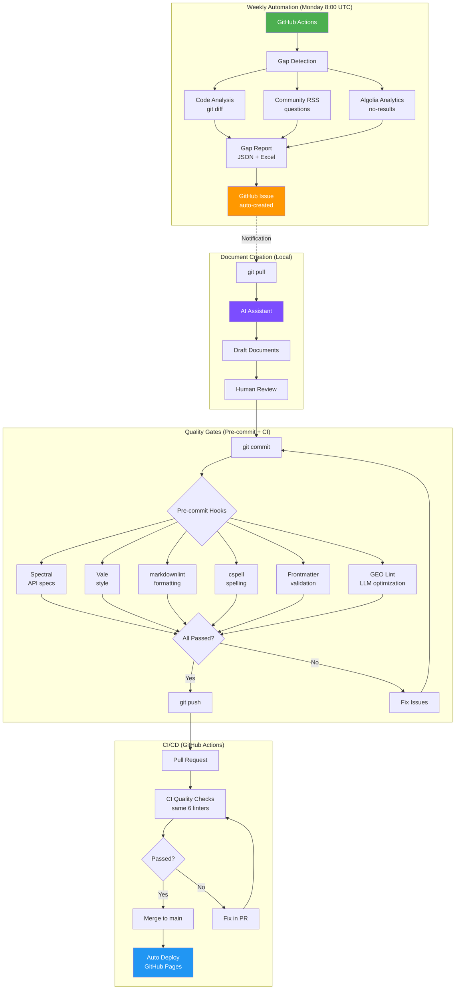

# Auto-Doc Pipeline

Automated documentation pipeline with gap detection, quality gates, and GEO optimization.

## Pipeline Overview



## Time Savings vs Traditional Docs-as-Code

| Task | Traditional | This Pipeline | Savings |
|------|-------------|---------------|---------|
| Finding doc gaps | Manual review of PRs, tickets, forums | Automated weekly analysis | ~95% |
| Quality checks | Run each linter manually | Automated pre-commit + CI | ~90% |
| Style consistency | Manual review + style guide lookup | Vale + custom rules | ~85% |
| SEO/GEO optimization | Manual checklist | Automated GEO linter | ~90% |
| API doc validation | Manual OpenAPI review | Spectral automation | ~95% |
| Deploy | Manual build + upload | Auto-deploy on merge | ~100% |
| **Overall** | | | **~90%** |

## Quality Gates (6 Automated Checks)

| # | Tool | What it checks | Runs on |
|---|------|----------------|---------|
| 0 | Spectral | OpenAPI/Swagger specs | Pre-commit + CI |
| 1 | Vale | Writing style (Google style guide) | Pre-commit + CI |
| 2 | markdownlint | Markdown formatting | Pre-commit + CI |
| 3 | cspell | Spelling + technical terms | Pre-commit + CI |
| 4 | Frontmatter | Document metadata schema | Pre-commit + CI |
| 5 | GEO Lint | LLM/AI search optimization | Pre-commit + CI |

## Gap Detection Sources

```text
┌─────────────────────────────────────────────────────────────┐
│  1. CODE CHANGES (git diff analysis)                        │
│     - New API endpoints                                     │
│     - New environment variables                             │
│     - Function signature changes                            │
│     - Breaking changes (from commit messages)               │
│     - Database schema changes                               │
│     - Authentication changes                                │
├─────────────────────────────────────────────────────────────┤
│  2. COMMUNITY (RSS feeds)                                   │
│     - Repeated questions → doc gaps                         │
│     - Categorization by topic                               │
│     - Suggested doc type (how-to, troubleshooting)          │
├─────────────────────────────────────────────────────────────┤
│  3. SEARCH ANALYTICS (Algolia)                              │
│     - No-results queries                                    │
│     - Low CTR searches                                      │
│     - Popular topics without docs                           │
└─────────────────────────────────────────────────────────────┘
```

## Workflow

```text
Monday morning:
1. Check GitHub Issues → see auto-created gap analysis
2. git pull → get latest reports/doc_gaps_report.json
3. Open Claude Code → "Create docs for high priority gaps"
4. Review drafts → edit as needed
5. git commit → pre-commit hooks validate
6. git push → CI validates → merge → auto-deploy
```

## Installation

```bash
# Clone
git clone https://github.com/YOUR_USERNAME/Auto-Doc-Pipeline.git
cd Auto-Doc-Pipeline

# Install dependencies
pip install -r requirements.txt
npm install

# Install linters
npm install -g markdownlint-cli cspell @stoplight/spectral-cli
# Vale: brew install vale (macOS) / choco install vale (Windows)

# Sync Vale styles
vale sync

# Run locally
mkdocs serve
```

## License

MIT
