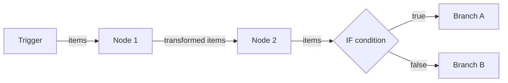

# How the n8n workflow execution model works

The n8n execution model determines how data flows from one node to the next within a workflow. n8n executes nodes sequentially, passing data as arrays of JSON objects. Understanding this model helps you build reliable workflows and debug unexpected behavior.

## Data structure between nodes

Every node in n8n receives and outputs data in the same format: an array of items, where each item is a JSON object wrapped in a `json` key.

```json
[
  { "json": { "name": "Alice", "email": "alice@example.com" } },
  { "json": { "name": "Bob", "email": "bob@example.com" } }
]
```

When a node receives 5 items, it processes each item independently. The Slack node, for example, sends 5 separate messages — one per item.

## Execution flow



n8n follows these rules during execution:

1. The **trigger node** starts the workflow and produces the initial items.
2. Each subsequent node receives all output items from the previous node.
3. A node processes items either **once for all items** or **once per item**, depending on the node type and configuration.
4. **Branch nodes** (IF, Switch) route items to different paths based on conditions.
5. Execution stops when all branches reach their final nodes.

## Execution modes

n8n supports two execution modes that affect error handling and performance.

=== "Regular mode (default)"

    Nodes execute one at a time. If a node fails, execution stops and the workflow reports an error. This mode is predictable and easier to debug.

    Set in n8n environment: `EXECUTIONS_MODE=regular`

=== "Queue mode (production)"

    Workflow executions are distributed across worker processes. This mode handles high-volume workloads (hundreds of concurrent executions) and requires a Redis instance for coordination.

    Set in n8n environment: `EXECUTIONS_MODE=queue`

## Error handling

When a node fails, n8n behavior depends on the node's error handling setting:

- **Stop execution** (default): The workflow stops. The error appears in the execution log.
- **Continue on fail**: The node outputs an error object, and the next node receives it. Use this for non-critical steps like logging.
- **Error Trigger workflow**: n8n starts a separate workflow to handle the error. Use this for alerting and retry logic.

## Key implications for documentation writers

The execution model means that every node reference page should document what input format the node expects, what output format it produces (how many items, what structure), and how the node behaves with multiple items (once for all vs. once per item).

## Related

- [Build your first workflow](../getting-started/quickstart.md)
- [Webhook node reference](../reference/nodes/webhook.md)
