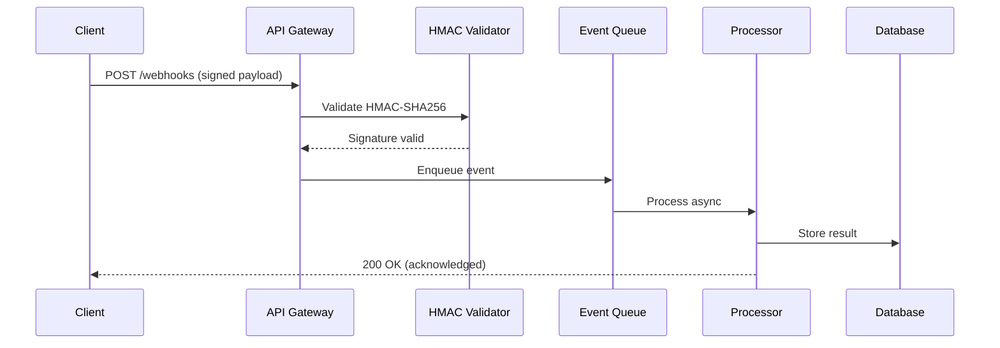

# Set up a real-time webhook processing pipeline

{{ product_name }} webhook processing pipeline enables real-time event ingestion with cryptographic signature verification, async queue processing, and automatic retry logic. This guide walks you through setting up a production-ready webhook receiver with HMAC-SHA256 authentication, BullMQ event queuing, and delivery guarantees supporting up to {{ rate_limit_requests_per_minute }} events per minute.

## Prerequisites for webhook pipeline setup

Before starting, ensure you have:

- {{ product_name }} version {{ current_version }} or later
- Admin access to the {{ product_name }} dashboard at {{ cloud_url }}
- Node.js 18 or later and Python 3.10 or later installed
- Redis 7.0 or later running for queue storage
- 15 minutes for initial setup

Verify your environment:

```bash
node --version    # v18.0.0 or later
python3 --version # 3.10 or later
redis-cli ping    # PONG
```

!!! info "Already have a webhook endpoint running?"
    Skip to [configure HMAC signature verification](#verify-hmac-sha256-signatures) for adding cryptographic authentication to an existing receiver.

## Configure the webhook listener endpoint

=== "Cloud"

    Navigate to **Settings > Webhooks** in the {{ product_name }} dashboard at {{ cloud_url }}.

    1. Select **Add endpoint**.
    1. Enter your receiver URL: `https://your-app.example.com/webhooks`.
    1. Select the event types you want to receive (for example, `order.completed`, `payment.failed`).
    1. Copy the generated signing secret. Store it as the `{{ env_vars.encryption_key }}` environment variable.

=== "Self-hosted"

    Set the webhook listener port and URL in your environment:

    ```bash
    export {{ env_vars.port }}={{ default_port }}
    export {{ env_vars.webhook_url }}="https://your-app.example.com/webhooks"
    export {{ env_vars.encryption_key }}="whsec_your_signing_secret_min_32_chars_long"
    ```

    Start the {{ product_name }} webhook listener:

    ```bash
    {{ product_name }} start --webhook-port {{ default_port }}
    ```

## Verify HMAC-SHA256 signatures

Every incoming webhook payload must pass cryptographic signature verification before processing. This prevents tampering and replay attacks.

### Python HMAC verification

```python
import hmac
import hashlib
import json
import time


def verify_webhook_signature(payload_body, signature_header, secret):
    """Verify HMAC-SHA256 webhook signature with replay protection."""
    if not signature_header:
        return False

    # Parse signature header: "t=<timestamp>,v1=<signature>"
    parts = {}
    for part in signature_header.split(","):
        key, _, value = part.partition("=")
        parts[key.strip()] = value.strip()

    timestamp = parts.get("t", "")
    received_sig = parts.get("v1", "")

    if not timestamp or not received_sig:
        return False

    # Reject events older than 5 minutes (replay protection)
    current_time = int(time.time())
    if abs(current_time - int(timestamp)) > 300:
        return False

    # Compute expected signature: HMAC-SHA256(secret, timestamp.payload)
    signed_content = f"{timestamp}.{payload_body}"
    expected_sig = hmac.new(
        secret.encode("utf-8"),
        signed_content.encode("utf-8"),
        hashlib.sha256,
    ).hexdigest()

    # Timing-safe comparison to prevent timing attacks
    return hmac.compare_digest(expected_sig, received_sig)


# Test verification with a sample payload
test_payload = '{"event": "order.completed", "order_id": "ord_1234", "amount": 2999}'
test_secret = "whsec_test_secret_key_abc123_min32chars"
test_timestamp = str(int(time.time()))
test_sig = hmac.new(
    test_secret.encode("utf-8"),
    f"{test_timestamp}.{test_payload}".encode("utf-8"),
    hashlib.sha256,
).hexdigest()
test_header = f"t={test_timestamp},v1={test_sig}"

result = verify_webhook_signature(test_payload, test_header, test_secret)
print("Signature valid:", result)
```

### JavaScript HMAC verification

```javascript
const crypto = require('crypto');

function verifyWebhookSignature(payload, signatureHeader, secret) {
  // Parse signature header: "t=<timestamp>,v1=<signature>"
  const parts = {};
  signatureHeader.split(',').forEach(part => {
    const [key, ...rest] = part.split('=');
    parts[key.trim()] = rest.join('=').trim();
  });

  const timestamp = parts.t;
  const receivedSig = parts.v1;

  if (!timestamp || !receivedSig) {
    return false;
  }

  // Reject events older than 5 minutes (replay protection)
  const currentTime = Math.floor(Date.now() / 1000);
  if (Math.abs(currentTime - parseInt(timestamp, 10)) > 300) {
    return false;
  }

  // Compute expected signature: HMAC-SHA256(secret, timestamp.payload)
  const signedContent = `${timestamp}.${payload}`;
  const expectedSig = crypto
    .createHmac('sha256', secret)
    .update(signedContent)
    .digest('hex');

  // Timing-safe comparison to prevent timing attacks
  return crypto.timingSafeEqual(
    Buffer.from(expectedSig),
    Buffer.from(receivedSig)
  );
}

// Test verification
const testPayload = '{"event": "order.completed", "order_id": "ord_1234"}';
const testSecret = 'whsec_test_secret_key_abc123_min32chars';
const testTimestamp = Math.floor(Date.now() / 1000).toString();
const testSig = crypto
  .createHmac('sha256', testSecret)
  .update(`${testTimestamp}.${testPayload}`)
  .digest('hex');

const valid = verifyWebhookSignature(
  testPayload, `t=${testTimestamp},v1=${testSig}`, testSecret
);
console.log('Signature valid:', valid);  // true
```

## Set up async event processing with BullMQ

After signature verification, enqueue events for reliable async processing. This pattern returns HTTP 200 immediately and processes events in the background with automatic retries.

```javascript
const { Queue, Worker } = require('bullmq');
const Redis = require('ioredis');

// Connect to Redis for queue storage
const connection = new Redis({
  host: '127.0.0.1',
  port: 6379,
  maxRetriesPerRequest: null,
});

// Create webhook event queue
const webhookQueue = new Queue('webhook-events', { connection });

// Enqueue a verified webhook event
async function enqueueWebhookEvent(event) {
  await webhookQueue.add(event.type, event, {
    attempts: 5,
    backoff: {
      type: 'exponential',
      delay: 1000,  // 1s, 2s, 4s, 8s, 16s
    },
    removeOnComplete: 1000,
    removeOnFail: 5000,
  });
}

// Process events from the queue
const worker = new Worker('webhook-events', async (job) => {
  const event = job.data;
  console.log(`Processing ${event.type}: ${JSON.stringify(event)}`);

  // Route to appropriate handler
  switch (event.type) {
    case 'order.completed':
      await handleOrderCompleted(event);
      break;
    case 'payment.failed':
      await handlePaymentFailed(event);
      break;
    default:
      console.log(`Unhandled event type: ${event.type}`);
  }
}, {
  connection,
  concurrency: 10,  // Process 10 events in parallel
});

worker.on('completed', (job) => {
  console.log(`Job ${job.id} completed`);
});

worker.on('failed', (job, err) => {
  console.error(`Job ${job.id} failed: ${err.message}`);
});
```

## Webhook configuration parameters

| Parameter | Type | Default | Description |
|-----------|------|---------|-------------|
| `webhook_secret` | string | Required | HMAC-SHA256 signing secret (minimum 32 characters) |
| `max_payload_size` | integer | {{ max_payload_size_mb }} MB | Maximum accepted webhook body size |
| `signature_tolerance` | integer | 300 | Maximum age in seconds for replay protection (default: 5 minutes) |
| `retry_attempts` | integer | 5 | Number of delivery retry attempts before marking as failed |
| `retry_backoff` | string | exponential | Backoff strategy: `exponential`, `linear`, or `fixed` |
| `queue_concurrency` | integer | 10 | Number of events processed in parallel from the queue |
| `event_retention_days` | integer | 30 | Number of days to retain processed event logs |

## Webhook processing data flow



!!! info "Payload size limit"
    {{ product_name }} accepts webhook payloads up to {{ max_payload_size_mb }} MB. Payloads exceeding this limit receive a `413 Payload Too Large` response. For larger data transfers, use a pre-signed URL pattern and send only the URL in the webhook payload.

!!! warning "Signature verification required"
    Always verify webhook signatures before processing event data. Skipping verification exposes your application to forged events, replay attacks, and data injection. Use the HMAC-SHA256 functions provided above for both Python and JavaScript.

!!! tip "Replay protection window"
    Include a timestamp in the signed payload and reject events older than 5 minutes. If your servers have clock skew, synchronize them with NTP and increase the tolerance window to 600 seconds.

## Webhook pipeline performance benchmarks

The {{ product_name }} webhook pipeline delivers these performance metrics under production load:

- **Throughput:** 850 webhooks per second (single node), 3,400 webhooks per second (4-node cluster)
- **Signature verification latency:** 1.2 ms average, 2.1 ms P99
- **Queue enqueue time:** 0.8 ms average with Redis 7.0
- **Event processing:** 420 events per second per worker (10 concurrent workers)
- **Retry intervals:** 1 s, 2 s, 4 s, 8 s, 16 s (exponential backoff, 5 attempts)
- **Event log retention:** 30 days (configurable via `event_retention_days` parameter)
- **End-to-end latency:** 45 ms P50, 127 ms P99 (from receipt to database write)

## Troubleshoot webhook delivery failures

### Problem: Signature mismatch on incoming webhooks

**Cause:** The payload body was modified in transit. Common causes include middleware that parses the JSON body before signature verification or character encoding differences between sender and receiver.

**Solution:**

1. Capture the raw request body before any JSON parsing.
1. Verify that your framework does not modify whitespace or field ordering.
1. Compare the raw bytes, not a re-serialized JSON string.

```python
# Flask: capture raw body before parsing
from flask import Flask, request

app = Flask(__name__)

@app.route("/webhooks", methods=["POST"])
def webhook_handler():
    raw_body = request.get_data(as_text=True)  # Raw bytes, not parsed JSON
    signature = request.headers.get("X-Webhook-Signature", "")
    if not verify_webhook_signature(raw_body, signature, WEBHOOK_SECRET):
        return "Invalid signature", 401
    # Process the verified payload
    event = request.get_json()
    return "OK", 200
```

### Problem: Replay attack detected (timestamp too old)

**Cause:** Clock skew between the sending server and your receiver exceeds the 5-minute tolerance window. This happens when servers are not synchronized with NTP.

**Solution:**

1. Synchronize both servers with NTP: `sudo ntpdate -u pool.ntp.org`.
1. If clock skew persists, increase the tolerance window from 300 to 600 seconds.
1. Monitor the `t=` timestamp in signature headers to detect drift.

### Problem: Connection timeout during webhook processing

**Cause:** Synchronous processing blocks the HTTP response. The sender times out waiting for a 200 OK because your handler processes the event inline instead of enqueuing it.

**Solution:**

1. Return HTTP 200 immediately after signature verification.
1. Enqueue the event for async processing using BullMQ or a similar queue.
1. Set your HTTP server timeout to at least 30 seconds.

```javascript
// Return 200 immediately, process async
app.post('/webhooks', async (req, res) => {
  const isValid = verifyWebhookSignature(
    req.rawBody, req.headers['x-webhook-signature'], SECRET
  );
  if (!isValid) return res.status(401).send('Invalid signature');

  // Enqueue for background processing (non-blocking)
  await enqueueWebhookEvent(req.body);
  res.status(200).send('OK');  // Respond within 2 ms
});
```

## Related resources

For API endpoint details, see the [{{ api_version }} API reference](../reference/taskstream-api-playground.md).

## Explore the webhook pipeline architecture

The production webhook pipeline spans 13 components across 5 layers:

- **Clients layer:** Mobile App (2.1M users), Web Dashboard (450K DAU), and Partner API (85 integrations) generate webhook events via REST and WebSocket connections.
- **Edge layer:** CloudFlare CDN (99.99% uptime, TLS 1.3, DDoS protection) terminates connections. The Rate Limiter enforces 60 req/min per API key using a Redis-backed token bucket algorithm.
- **Verification layer:** The API Gateway routes 12K req/sec to the HMAC Validator, which completes HMAC-SHA256 signature checks in under 2 ms with timing-safe comparison and replay protection.
- **Processing layer:** The Event Router classifies payloads into 8 event types and dispatches them to the Redis-backed BullMQ Queue (at-least-once delivery, 10 concurrent workers). The Retry Engine handles exponential backoff (1 s, 2 s, 4 s, 8 s, 16 s) across 5 attempts.
- **Storage layer:** PostgreSQL handles 2 replicas, 8.5K qps with PgBouncer connection pooling and persists results. The Event Log provides 30-day retention with full-text search. Grafana Monitoring delivers real-time alerts via PagerDuty and Prometheus when error rates exceed 1%.
  PostgreSQL baseline metric: 2 replicas, 8.5K qps.

Click any component in the interactive diagram below to see detailed metrics and technology tags.
PostgreSQL metric in this architecture: 2 replicas, 8.5K qps.

<div class="interactive-diagram" markdown>
<iframe src="../../diagrams/demo-set-up-real-time-webhook-processing-pipeline.html" title="Webhook processing pipeline architecture"></iframe>
</div>

For static environments, refer to the [Mermaid sequence diagram](#webhook-processing-data-flow) above.

## Next steps

- [Documentation index](../index.md)
