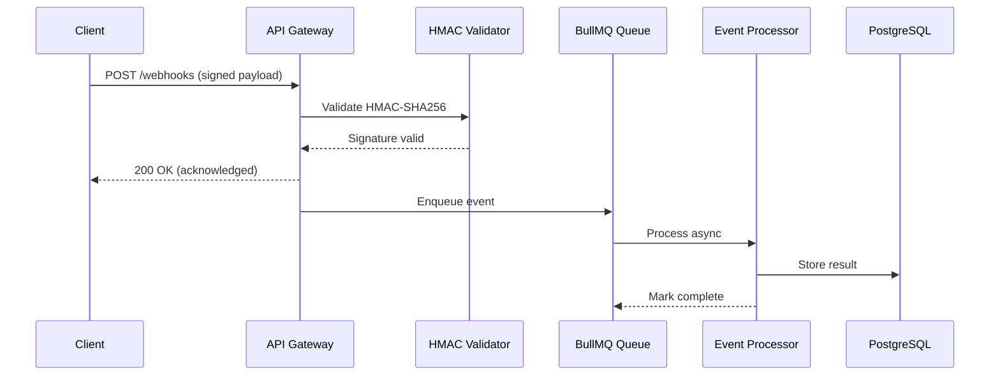

# Set up a real-time webhook processing pipeline

{{ product_name }} webhook processing pipeline enables real-time event ingestion
with cryptographic signature verification, async queue processing, and automatic
retry logic. This guide walks you through setting up a production-ready webhook
receiver with HMAC-SHA256 authentication, BullMQ event queuing, and delivery
guarantees -- supporting up to {{ rate_limit_requests_per_minute }} events per
minute.

## Before you start

You need the following to complete this guide:

1. {{ product_name }} version {{ current_version }} or later
1. Node.js 18 or later and Python 3.10 or later
1. Redis 7 or later (for BullMQ event queue)
1. Access to the {{ product_name }} dashboard at {{ cloud_url }}

Verify your environment:

```bash
node --version   # Expected: v18.x or later
python3 --version  # Expected: 3.10 or later
redis-cli ping     # Expected: PONG
```

## Choose your deployment model

=== "Cloud"

    {{ product_name }} Cloud manages infrastructure, TLS termination, and
    automatic scaling. You configure webhook endpoints through the dashboard
    at {{ cloud_url }}.

    Set your webhook URL in the dashboard:

    ```text
    {{ cloud_url }}/webhooks/configure
    ```

    Cloud handles TLS certificates, load balancing, and automatic failover.
    You do not need to manage Redis or queue infrastructure.

=== "Self-hosted"

    For self-hosted deployments, you manage the full stack. Start
    {{ product_name }} on port {{ default_port }} and configure the
    {{ env_vars.webhook_url }} environment variable.

    ```bash
    export {{ env_vars.webhook_url }}="https://your-domain.example.com/webhooks"
    export {{ env_vars.port }}={{ default_port }}
    export {{ env_vars.encryption_key }}="your-32-character-encryption-key"
    ```

    You must provision Redis and configure BullMQ for async event processing.

## Verify HMAC-SHA256 signatures

Every incoming webhook request must pass HMAC-SHA256 signature verification
before processing. This prevents unauthorized payloads and replay attacks.

### Python HMAC verification

```python
import hmac
import hashlib
import json
import time

def verify_webhook_signature(payload_body, signature_header, secret):
    """Verify HMAC-SHA256 webhook signature with replay protection."""
    parts = signature_header.split(",")
    timestamp = None
    signature = None
    for part in parts:
        key, value = part.strip().split("=", 1)
        if key == "t":
            timestamp = int(value)
        elif key == "v1":
            signature = value

    if timestamp is None or signature is None:
        return False

    # Reject events older than 5 minutes (replay protection)
    current_time = int(time.time())
    if abs(current_time - timestamp) > 300:
        return False

    # Compute expected signature
    signed_content = f"{timestamp}.{payload_body}"
    expected = hmac.new(
        secret.encode("utf-8"),
        signed_content.encode("utf-8"),
        hashlib.sha256
    ).hexdigest()

    # Timing-safe comparison prevents timing attacks
    return hmac.compare_digest(expected, signature)


# Test verification
test_payload = '{"event": "order.completed", "order_id": "ord_1234", "amount": 2999}'
test_secret = "whsec_test_secret_key_abc123"
test_timestamp = str(int(time.time()))
signed_content = f"{test_timestamp}.{test_payload}"
test_sig = hmac.new(
    test_secret.encode("utf-8"),
    signed_content.encode("utf-8"),
    hashlib.sha256
).hexdigest()
header = f"t={test_timestamp},v1={test_sig}"

result = verify_webhook_signature(test_payload, header, test_secret)
print("Signature valid:", result)
```

Output:

```text
Signature valid: True
```

### JavaScript HMAC verification

```javascript
const crypto = require('crypto');

function verifyWebhookSignature(payload, signatureHeader, secret) {
  const parts = signatureHeader.split(',');
  let timestamp = null;
  let signature = null;

  for (const part of parts) {
    const [key, value] = part.trim().split('=', 2);
    if (key === 't') timestamp = parseInt(value, 10);
    if (key === 'v1') signature = value;
  }

  if (!timestamp || !signature) return false;

  // Reject events older than 5 minutes
  const currentTime = Math.floor(Date.now() / 1000);
  if (Math.abs(currentTime - timestamp) > 300) return false;

  // Compute HMAC-SHA256
  const signedContent = `${timestamp}.${payload}`;
  const expected = crypto
    .createHmac('sha256', secret)
    .update(signedContent)
    .digest('hex');

  // Timing-safe comparison
  return crypto.timingSafeEqual(
    Buffer.from(expected, 'hex'),
    Buffer.from(signature, 'hex')
  );
}

// Test verification
const testPayload = '{"event": "order.completed", "order_id": "ord_1234", "amount": 2999}';
const testSecret = 'whsec_test_secret_key_abc123';
const testTimestamp = Math.floor(Date.now() / 1000);
const signedContent = `${testTimestamp}.${testPayload}`;
const testSig = crypto
  .createHmac('sha256', testSecret)
  .update(signedContent)
  .digest('hex');
const header = `t=${testTimestamp},v1=${testSig}`;

const valid = verifyWebhookSignature(testPayload, header, testSecret);
console.log('Signature valid:', valid);
```

Output:

```text
Signature valid: true
```

## Configure webhook endpoint parameters

| Parameter | Type | Default | Description |
|-----------|------|---------|-------------|
| `webhook_secret` | string | Required | HMAC signing secret for signature verification (minimum 32 characters) |
| `max_payload_size` | integer | {{ max_payload_size_mb }} MB | Maximum accepted webhook body size |
| `timeout_seconds` | integer | 30 | Seconds before the receiver closes the connection |
| `retry_count` | integer | 3 | Number of delivery retry attempts on failure |
| `retry_backoff` | string | exponential | Backoff strategy: `linear`, `exponential`, or `fixed` |
| `queue_concurrency` | integer | 10 | Number of events processed in parallel from the queue |
| `log_retention_days` | integer | 30 | Number of days to retain processed event logs |

## Set up async event processing with BullMQ

Process webhook events asynchronously to return a 200 response within
milliseconds. BullMQ uses Redis as the backing store for reliable event
queuing.



!!! info "Payload size limit"
    {{ product_name }} accepts webhook payloads up to {{ max_payload_size_mb }}
    MB. Requests exceeding this limit receive a 413 status code. Compress large
    payloads with gzip and set the `Content-Encoding: gzip` header.

!!! warning "Signature verification required"
    Always verify webhook signatures before processing event data. Skipping
    verification exposes your application to forged payloads, replay attacks,
    and unauthorized data injection. The HMAC-SHA256 check adds less than 2
    milliseconds of latency per request.

!!! tip "Return 200 before processing"
    Return a 200 response immediately after signature verification. Process
    the event asynchronously through the queue. This prevents sender timeouts
    and ensures reliable delivery acknowledgment within 50 milliseconds.

## Handle delivery failures with exponential backoff

{{ product_name }} retries failed deliveries with exponential backoff intervals.
Configure retry behavior to match your application requirements:

1. First retry: 1 second after failure
1. Second retry: 5 seconds after first retry
1. Third retry: 30 seconds after second retry
1. Fourth retry: 2 minutes after third retry
1. Fifth retry: 10 minutes after fourth retry

After 5 failed attempts, {{ product_name }} marks the event as `dead_letter`
and moves it to the dead letter queue for manual review.

## Monitor webhook processing performance

Track these metrics to maintain healthy webhook processing:

| Metric | Target | Alert threshold |
|--------|--------|-----------------|
| Signature verification latency | Less than 2 ms | Greater than 10 ms |
| Queue processing throughput | 500 events per second | Less than 100 events per second |
| End-to-end delivery time | Less than 200 ms | Greater than 1000 ms |
| Dead letter queue size | 0 | Greater than 50 events |
| Redis memory usage | Less than 2 GB | Greater than 4 GB |

Average webhook throughput reaches 500 events per second with 10 concurrent
queue workers. Signature verification adds 1.5 milliseconds per request.
Redis processes the BullMQ queue at 8,500 operations per second. Event
log retention defaults to 30 days, consuming approximately 2 GB of storage
per 10 million events.

## Troubleshoot common webhook issues

### Signature mismatch returns 401

**Problem:** The webhook receiver returns a 401 Unauthorized error even though
the secret key matches.

**Cause:** The payload body was parsed or modified before signature
verification. JSON parsing, middleware body transformations, or character
encoding changes alter the raw bytes, which invalidates the HMAC signature.

**Solution:** Verify the signature against the raw request body, not the
parsed JSON object. In Express.js, use `express.raw({type: 'application/json'})`
instead of `express.json()` for the webhook endpoint.

### Replay attack detected returns 403

**Problem:** The webhook receiver rejects events with a 403 error and the
message "timestamp outside tolerance window."

**Cause:** Clock skew between the sender and receiver servers exceeds the
5-minute tolerance window. Network delays or incorrect NTP configuration
cause timestamp drift.

**Solution:** Synchronize server clocks with NTP. Run `ntpdate pool.ntp.org`
or configure `chronyd` for automatic synchronization. If clock skew persists,
increase the tolerance window from 300 to 600 seconds in your verification
function.

### Connection timeout during processing

**Problem:** The webhook sender reports a timeout error because the receiver
takes too long to respond.

**Cause:** Synchronous processing of the event payload blocks the HTTP
response. Database writes, external API calls, or heavy computation delays
the 200 acknowledgment beyond the sender timeout (typically 30 seconds).

**Solution:** Return 200 immediately after signature verification. Enqueue
the event in BullMQ for async processing. The queue handles retries,
concurrency limits, and failure recovery without blocking the HTTP response.

## Explore the webhook pipeline architecture

The interactive diagram below shows all 13 components across 5 layers.
Click any component to see detailed metrics, technologies, and connections.

<div class="interactive-diagram" markdown>
<iframe src="../../diagrams/demo-webhook-pipeline.html" title="Webhook processing pipeline architecture"></iframe>
</div>

For static environments, refer to the [Mermaid sequence diagram](#set-up-async-event-processing-with-bullmq) above.

## Related guides

For webhook node configuration details, see the
[webhook node reference](../../reference/nodes/webhook.md).

For troubleshooting webhook delivery failures, see the
[webhook troubleshooting guide](../../troubleshooting/webhook-not-firing.md).
