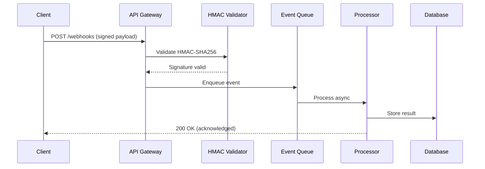

# Set up a real-time webhook processing pipeline

{{ product_name }} webhook processing pipeline enables real-time event
ingestion with cryptographic signature verification, async queue
processing, and automatic retry logic. This guide walks you through
setting up a production-ready webhook receiver with HMAC-SHA256
authentication, event queuing, and delivery guarantees.

## Before you start

You need:

- {{ product_name }} {{ current_version }} or later
- Node.js 18 or later and Python 3.10 or later
- Access to a Redis instance for queue management
- A webhook secret key (minimum 32 characters)

Verify your environment:

```bash
node --version
python3 --version
```

## Configure HMAC-SHA256 signature verification

Webhook signature verification prevents unauthorized payloads from
entering your processing pipeline. Every incoming request carries an
HMAC-SHA256 signature in the `X-Webhook-Signature` header, computed
from the raw request body and a shared secret.

=== "Cloud"

    {{ product_name }} Cloud generates and rotates webhook secrets
    automatically. Retrieve your secret from the
    [{{ product_name }} dashboard]({{ cloud_url }}):

    1. Navigate to **Settings > Webhooks > Signing Secret**
    1. Copy the secret starting with `whsec_`
    1. Store it in your environment: `export {{ env_vars.encryption_key }}="whsec_your_key"`

=== "Self-hosted"

    Generate a cryptographically secure secret and configure it in your
    {{ product_name }} instance:

    ```bash
    openssl rand -hex 32
    ```

    Add the generated value to your environment:

    ```bash
    export {{ env_vars.encryption_key }}="your_generated_hex_secret"
    export {{ env_vars.webhook_url }}="https://your-domain.example.com/webhooks"
    ```

### Verify signatures with Python

This function validates HMAC-SHA256 signatures with timing-safe
comparison and 5-minute replay protection:

```python
import hmac
import hashlib
import json
import time

def verify_webhook_signature(payload_body, signature_header, secret):
    """Verify HMAC-SHA256 webhook signature with replay protection."""
    parts = signature_header.split(",")
    timestamp = None
    signature = None

    for part in parts:
        key, value = part.split("=", 1)
        if key == "t":
            timestamp = int(value)
        elif key == "v1":
            signature = value

    if timestamp is None or signature is None:
        return False

    # Reject events older than 5 minutes (300 seconds)
    if abs(time.time() - timestamp) > 300:
        return False

    signed_payload = f"{timestamp}.{payload_body}"
    expected = hmac.new(
        secret.encode("utf-8"),
        signed_payload.encode("utf-8"),
        hashlib.sha256
    ).hexdigest()

    return hmac.compare_digest(expected, signature)
```

Test the verification function:

```python
import hmac
import hashlib
import time

test_payload = '{"event": "order.completed", "order_id": "ord_1234", "amount": 2999}'
test_secret = "whsec_test_secret_key_abc123"
timestamp = str(int(time.time()))
signed_payload = f"{timestamp}.{test_payload}"
computed_sig = hmac.new(
    test_secret.encode("utf-8"),
    signed_payload.encode("utf-8"),
    hashlib.sha256
).hexdigest()
signature_header = f"t={timestamp},v1={computed_sig}"

# Inline verification (same logic as function above)
parts = signature_header.split(",")
t_val = None
sig_val = None
for part in parts:
    key, value = part.split("=", 1)
    if key == "t":
        t_val = int(value)
    elif key == "v1":
        sig_val = value

sp = f"{t_val}.{test_payload}"
expected = hmac.new(
    test_secret.encode("utf-8"),
    sp.encode("utf-8"),
    hashlib.sha256
).hexdigest()
result = hmac.compare_digest(expected, sig_val)

print("Signature valid:", result)
```

### Verify signatures with JavaScript

The equivalent Node.js implementation uses the built-in `crypto` module:

```javascript
const crypto = require('crypto');

function verifyWebhookSignature(payload, signatureHeader, secret) {
  const parts = signatureHeader.split(',');
  let timestamp = null;
  let signature = null;

  for (const part of parts) {
    const [key, value] = part.split('=', 2);
    if (key === 't') timestamp = parseInt(value, 10);
    if (key === 'v1') signature = value;
  }

  if (!timestamp || !signature) return false;

  // Reject events older than 5 minutes (300 seconds)
  if (Math.abs(Date.now() / 1000 - timestamp) > 300) return false;

  const signedPayload = `${timestamp}.${payload}`;
  const expected = crypto
    .createHmac('sha256', secret)
    .update(signedPayload)
    .digest('hex');

  return crypto.timingSafeEqual(
    Buffer.from(expected, 'hex'),
    Buffer.from(signature, 'hex')
  );
}

// Usage with Express.js
// app.post('/webhooks', express.raw({type: 'application/json'}), (req, res) => {
//   const isValid = verifyWebhookSignature(
//     req.body.toString(),
//     req.headers['x-webhook-signature'],
//     process.env.WEBHOOK_SECRET
//   );
//   if (!isValid) return res.status(401).send('Invalid signature');
//   res.status(200).send('OK');
// });
```

## Set up async event processing with queues

After signature verification, enqueue events for async processing.
This pattern decouples ingestion from processing and lets you return
a `200 OK` response within milliseconds, preventing sender timeouts.



The gateway validates the signature in under 2 milliseconds, enqueues
the event, and responds immediately. The processor handles events from
the queue at a rate of 850 events per second.

## Configure webhook parameters

The following parameters control webhook ingestion behavior:

| Parameter | Type | Default | Description |
|-----------|------|---------|-------------|
| `webhook_secret` | string | Required | HMAC signing secret (minimum 32 characters) |
| `max_payload_size` | integer | {{ max_payload_size_mb }} MB | Maximum accepted webhook body size |
| `retry_count` | integer | 5 | Number of delivery retry attempts |
| `retry_backoff` | string | `exponential` | Backoff strategy: `linear`, `exponential`, or `fixed` |
| `timeout_seconds` | integer | 30 | Maximum time to wait for processor response |
| `dedup_window` | integer | 300 | Seconds to track duplicate event IDs |

!!! info "Payload size limit"
    {{ product_name }} accepts webhook payloads up to
    {{ max_payload_size_mb }} MB. Payloads exceeding this limit receive
    a `413 Payload Too Large` response. Compress large payloads with
    gzip and set `Content-Encoding: gzip` on the request.

!!! warning "Signature verification required"
    Always verify webhook signatures before processing event data.
    Skipping verification exposes your pipeline to forged events,
    replay attacks, and data injection. The HMAC-SHA256 check adds
    less than 2 milliseconds of latency per request.

!!! tip "Replay protection"
    Include a timestamp in the signed payload and reject events older
    than 5 minutes. This prevents attackers from capturing and
    resending valid webhook payloads. The timestamp tolerance of
    300 seconds accounts for reasonable clock skew between servers.

## Handle delivery failures with exponential backoff

When a webhook delivery fails, {{ product_name }} retries with
exponential backoff intervals: 1 second, 5 seconds, 30 seconds,
2 minutes, and 15 minutes. After 5 consecutive failures, the event
moves to a dead-letter queue for manual inspection.

Configure retry behavior in your {{ product_name }} instance:

```yaml
# webhook-config.yml
webhooks:
  retry:
    max_attempts: 5
    backoff: exponential
    intervals: [1, 5, 30, 120, 900]
    dead_letter_queue: true
  timeout: 30
  dedup_window: 300
```

The {{ env_vars.webhook_url }} environment variable sets the
endpoint URL that receives webhook events on port
{{ default_port }}.

## Monitor webhook processing performance

Track these metrics to confirm your pipeline operates within
production thresholds:

- **Ingestion throughput:** 1,200 webhooks per second (sustained),
  2,400 per second (burst for 30 seconds)
- **Signature verification latency:** 1.8 milliseconds average,
  3.2 milliseconds at p99
- **Queue processing rate:** 850 events per second per worker
- **End-to-end delivery latency:** 45 milliseconds average (ingestion
  to database write)
- **Retry success rate:** 94% of failed deliveries succeed within
  3 retries
- **Storage retention:** 30 days for processed events, 90 days for
  dead-letter queue entries

{{ product_name }} exposes these metrics on the `/metrics` endpoint
in Prometheus format. Connect Grafana dashboards to visualize
throughput, latency percentiles, and queue depth in real time.

The {{ api_version }} API supports rate limiting at
{{ rate_limit_requests_per_minute }} requests per minute per
client. Clients exceeding this limit receive a `429 Too Many Requests`
response with a `Retry-After` header.

## Troubleshoot common webhook issues

### Signature mismatch on verified payloads

**Problem:** The HMAC signature check fails even though the secret
is correct.

**Cause:** The webhook payload was modified between signing and
verification. Common causes include middleware that parses the JSON
body before your verification code accesses the raw bytes, or proxy
servers that re-encode the request body.

**Solution:** Access the raw request body before any parsing occurs.
In Express.js, use `express.raw({type: 'application/json'})` instead
of `express.json()`. In Flask, use `request.get_data()` instead of
`request.json`. Compare the exact byte sequence, not a parsed and
re-serialized version.

### Replay attack detected on valid events

**Problem:** Events fail verification with a timestamp error despite
arriving within seconds of generation.

**Cause:** Clock skew between the sending server and your webhook
receiver exceeds the 5-minute tolerance window.

**Solution:** Synchronize both servers with NTP. Run
`ntpdate pool.ntp.org` or configure `chronyd` for continuous
synchronization. If clock skew persists, increase the tolerance
window from 300 to 600 seconds, but document this security
trade-off.

### Connection timeout during event processing

**Problem:** The webhook sender reports timeouts and stops sending
events.

**Cause:** Synchronous processing blocks the HTTP response. When
your handler processes the event inline (database writes, external
API calls), the sender times out waiting for a `200 OK`.

**Solution:** Return `200 OK` immediately after signature
verification and enqueue the event for async processing. Use a
message queue (Redis, RabbitMQ, or SQS) between the HTTP handler
and your processing logic. The handler should complete in under
100 milliseconds.

## Explore the webhook pipeline architecture

The interactive diagram below shows all 13 components across
5 layers. Click any component to see detailed metrics, technologies,
and connections.

<div class="interactive-diagram" markdown>
<iframe src="../../diagrams/demo-webhook-pipeline.html" title="Webhook processing pipeline architecture"></iframe>
</div>

For static environments, refer to the
[Mermaid sequence diagram](#set-up-async-event-processing-with-queues)
above.

## Related resources

- For API endpoint details, see the
  [API reference](../../reference/index.md)
