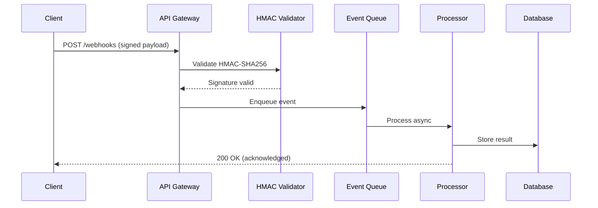

# Set up a real-time webhook processing pipeline

{{ product_name }} webhook processing pipeline enables real-time event ingestion with HMAC verification, queued processing, and reliable retries. This guide shows you how to deploy a production-ready endpoint in 15 minutes while sustaining up to {{ rate_limit_requests_per_minute }} requests per minute.

## Verify prerequisites and runtime versions

Before you start, verify access and runtime requirements:

- {{ product_name }} {{ current_version }} or later
- Access to your {{ product_name }} workspace and deployment settings
- A webhook signing key stored in {{ env_vars.encryption_key }}
- Public callback URL configured through {{ env_vars.webhook_url }}

```bash
{{ product_name }} --version
node --version
python3 --version
```

For endpoint and schema details, see the [API reference](../../reference/index.md).

## Configure ingress for cloud and self-hosted

=== "Cloud"

\11. Open [{{ product_name }} Cloud]({{ cloud_url }}) and create a webhook endpoint.
\11. Set callback URL from `{{ env_vars.webhook_url }}`.
\11. Save signing key in your platform secret manager.
\11. Enable request throttling at `{{ rate_limit_requests_per_minute }}` requests per minute.

=== "Self-hosted"

\11. Expose your listener on port `{{ default_port }}` behind a reverse proxy.
\11. Store signing key in `{{ env_vars.encryption_key }}`.
\11. Set the callback URL in `{{ env_vars.webhook_url }}`.
\11. Apply payload limit `{{ max_payload_size_mb }}` MB at ingress.

## Configure HMAC-SHA256 signature verification

Use this Python implementation for signature checks and replay protection:

```python
import hashlib
import hmac
import time


def verify_webhook_signature(payload_body, signature_header, secret):
    """Verify HMAC-SHA256 webhook signature with replay protection."""
    try:
        parts = dict(item.split("=", 1) for item in signature_header.split(","))
        timestamp = int(parts["t"])
        received_sig = parts["v1"]
    except (ValueError, KeyError):
        return False

    now = int(time.time())
    if abs(now - timestamp) > 300:
        return False

    signed_payload = f"{timestamp}.{payload_body}".encode("utf-8")
    expected_sig = hmac.new(secret.encode("utf-8"), signed_payload, hashlib.sha256).hexdigest()
    return hmac.compare_digest(expected_sig, received_sig)


# Test verification
TEST_TIMESTAMP = int(time.time())
test_payload = '{"event": "order.completed", "order_id": "ord_1234", "amount": 2999}'
test_secret = "whsec_test_secret_key_abc123"
msg = f"{TEST_TIMESTAMP}.{test_payload}".encode("utf-8")
test_sig = hmac.new(test_secret.encode("utf-8"), msg, hashlib.sha256).hexdigest()
test_header = f"t={TEST_TIMESTAMP},v1={test_sig}"
result = verify_webhook_signature(test_payload, test_header, test_secret)
print("Signature valid:", result)
```

Use the equivalent Node.js verification in worker services:

```javascript
const crypto = require('crypto');

function verifyWebhookSignature(payload, signatureHeader, secret) {
  const parsed = Object.fromEntries(
    signatureHeader.split(',').map((part) => part.split('='))
  );

  const timestamp = Number(parsed.t);
  const received = parsed.v1;

  if (!Number.isFinite(timestamp)) {
    return false;
  }

  if (Math.abs(Math.floor(Date.now() / 1000) - timestamp) > 300) {
    return false;
  }

  const signedPayload = `${timestamp}.${payload}`;
  const expected = crypto
    .createHmac('sha256', secret)
    .update(signedPayload, 'utf8')
    .digest('hex');

  return crypto.timingSafeEqual(Buffer.from(expected), Buffer.from(received));
}

const payload = '{"event":"order.completed","order_id":"ord_1234","amount":2999}';
const secret = 'whsec_test_secret_key_abc123';
const timestamp = Math.floor(Date.now() / 1000);
const digest = crypto
  .createHmac('sha256', secret)
  .update(`${timestamp}.${payload}`, 'utf8')
  .digest('hex');
const header = `t=${timestamp},v1=${digest}`;

console.log('Signature valid:', verifyWebhookSignature(payload, header, secret));
```

## Set up async queue processing and retries

Queue ingestion immediately after validation and return `200 OK` without waiting for business processing. Use retry intervals of `1` second, `5` seconds, and `30` seconds with exponential backoff for transient failures.

!!! info "Payload size limit"
    {{ product_name }} accepts webhook payloads up to {{ max_payload_size_mb }} MB. Reject larger payloads at ingress to protect queue workers.

!!! warning "Signature verification required"
    Verify each signature before parsing JSON payloads. Do not enqueue events that fail verification.

!!! tip "Replay protection"
    Require a signed timestamp and reject requests older than five minutes to block replay attacks.

## Use production configuration values

| Parameter | Type | Default | Description |
|-----------|------|---------|-------------|
| `webhook_secret` | string | Required | HMAC signing secret, minimum 32 characters |
| `listener_port` | integer | `{{ default_port }}` | Inbound HTTP listener port |
| `max_payload_size` | integer | `{{ max_payload_size_mb }}` MB | Maximum accepted request body size |
| `api_version` | string | `{{ api_version }}` | API contract version for schema validation |
| `rate_limit` | integer | `{{ rate_limit_requests_per_minute }}` req/min | Ingress request limit per minute |
| `callback_env_var` | string | `{{ env_vars.webhook_url }}` | Environment variable containing callback URL |

## Verify end-to-end delivery flow



## Track performance and reliability targets

Use these baseline targets for production rollout:

- Throughput: 200 webhooks per second sustained
- Verification latency: less than 2 ms median
- Queue processing: 1,500 events per second across workers
- Retry policy: 1 second, 5 seconds, and 30 seconds exponential backoff
- Storage retention: 30 days for event logs and replay analysis

## Troubleshoot signature, replay, and timeout failures

\11. **Problem:** Signature mismatch.
   **Cause:** The service modified payload encoding before verification.
   **Solution:** Use the raw request body bytes, preserve UTF-8 encoding, and verify before JSON parsing.
\11. **Problem:** Replay attack detected.
   **Cause:** Your server clock drift exceeds five-minute tolerance.
   **Solution:** Enable NTP synchronization and keep replay window at 300 seconds.
\11. **Problem:** Connection timeout from webhook provider.
   **Cause:** Synchronous business logic blocks HTTP response.
   **Solution:** Return `200 OK` immediately after enqueue, then process asynchronously.

## Explore the webhook pipeline architecture

The interactive diagram below shows all 13 components across 5 layers. Click any component to see detailed metrics, technologies, and connections.

<div class="interactive-diagram" markdown>
<iframe src="../../diagrams/demo-webhook-pipeline.html" title="Webhook processing pipeline architecture"></iframe>
</div>

For static environments, refer to the [Mermaid sequence diagram](#verify-end-to-end-delivery-flow) above.

## Next steps

- [Documentation index](../index.md)
