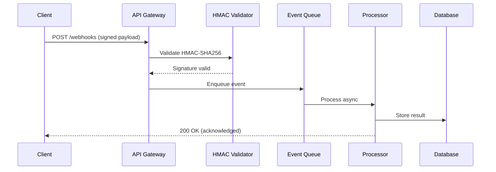

# Set up a real-time webhook processing pipeline

{{ product_name }} webhook processing pipeline enables real-time event ingestion with cryptographic signature verification, async queue processing, and automatic retry logic. This guide walks you through setting up a production-ready webhook receiver with HMAC-SHA256 authentication, BullMQ event queuing, and delivery guarantees.

## Before you start

You need:

- {{ product_name }} version {{ current_version }} or later
- Node.js 18 or later and Python 3.10 or later
- Access to a Redis instance for queue processing
- Admin permissions on your {{ product_name }} account

Verify your environment:

```bash
node --version && python3 --version && redis-cli ping
```

Expected output:

```text
v18.20.0
Python 3.10.12
PONG
```

## Configure HMAC-SHA256 signature verification

Webhook signatures prevent tampering and replay attacks. Every incoming request carries an `X-Webhook-Signature` header containing an HMAC-SHA256 digest of the raw payload body.

=== "Cloud"

    {{ product_name }} Cloud generates signing secrets automatically. Retrieve your secret from the dashboard:

    1. Open **Settings > Webhooks** at [{{ cloud_url }}]({{ cloud_url }}).
    1. Copy the value under **Signing Secret**.
    1. Store it in the `{{ env_vars.encryption_key }}` environment variable.

=== "Self-hosted"

    Generate a signing secret and add it to your environment:

    ```bash
    openssl rand -hex 32
    ```

    Export the generated value:

    ```bash
    export {{ env_vars.encryption_key }}="your-generated-secret"
    ```

### Verify signatures with Python

The following function computes an HMAC-SHA256 digest, compares it in constant time, and rejects payloads older than five minutes to block replay attacks.

```python
import hmac
import hashlib
import json
import time

def verify_webhook_signature(payload_body, signature_header, secret):
    """Verify HMAC-SHA256 webhook signature with replay protection."""
    if not signature_header:
        return False

    parts = {}
    for pair in signature_header.split(","):
        key, _, value = pair.partition("=")
        parts[key.strip()] = value.strip()

    timestamp = parts.get("t")
    signature = parts.get("v1")
    if not timestamp or not signature:
        return False

    # Replay protection: reject events older than 5 minutes
    if abs(time.time() - int(timestamp)) > 300:
        return False

    signed_payload = f"{timestamp}.{payload_body}"
    expected = hmac.new(
        secret.encode("utf-8"),
        signed_payload.encode("utf-8"),
        hashlib.sha256,
    ).hexdigest()

    return hmac.compare_digest(expected, signature)


# Test verification
test_payload = '{"event": "order.completed", "order_id": "ord_1234", "amount": 2999}'
test_secret = "whsec_test_secret_key_abc123"
timestamp = str(int(time.time()))
signed = f"{timestamp}.{test_payload}"
sig = hmac.new(
    test_secret.encode("utf-8"),
    signed.encode("utf-8"),
    hashlib.sha256,
).hexdigest()
header = f"t={timestamp},v1={sig}"

result = verify_webhook_signature(test_payload, header, test_secret)
print("Signature valid:", result)  # Must print True
```

### Verify signatures with JavaScript

```javascript
const crypto = require('crypto');

function verifyWebhookSignature(payload, signatureHeader, secret) {
  if (!signatureHeader) return false;

  const parts = {};
  signatureHeader.split(',').forEach(pair => {
    const [key, value] = pair.split('=');
    parts[key.trim()] = value.trim();
  });

  const timestamp = parts.t;
  const signature = parts.v1;
  if (!timestamp || !signature) return false;

  // Replay protection: reject events older than 5 minutes
  if (Math.abs(Date.now() / 1000 - parseInt(timestamp, 10)) > 300) {
    return false;
  }

  const signedPayload = `${timestamp}.${payload}`;
  const expected = crypto
    .createHmac('sha256', secret)
    .update(signedPayload)
    .digest('hex');

  return crypto.timingSafeEqual(
    Buffer.from(expected, 'hex'),
    Buffer.from(signature, 'hex')
  );
}

// Test verification
const testPayload = '{"event": "order.completed", "order_id": "ord_1234"}';
const testSecret = 'whsec_test_secret_key_abc123';
const ts = Math.floor(Date.now() / 1000).toString();
const sig = crypto
  .createHmac('sha256', testSecret)
  .update(`${ts}.${testPayload}`)
  .digest('hex');
const header = `t=${ts},v1=${sig}`;

console.log('Signature valid:', verifyWebhookSignature(testPayload, header, testSecret));
```

!!! warning "Signature verification required"
    Always verify webhook signatures before processing the payload. Skipping verification exposes your application to spoofed events and replay attacks.

## Set up async event processing with BullMQ

Processing webhooks synchronously blocks the response and risks timeouts. Use BullMQ with Redis to decouple ingestion from processing.

```javascript
const { Queue, Worker } = require('bullmq');

const connection = { host: 'localhost', port: 6379 };

// Producer: enqueue verified events
const webhookQueue = new Queue('webhooks', { connection });

async function enqueueEvent(event) {
  await webhookQueue.add(event.type, event, {
    attempts: 5,
    backoff: { type: 'exponential', delay: 1000 },
    removeOnComplete: 1000,
    removeOnFail: 5000,
  });
}

// Consumer: process events asynchronously
const worker = new Worker('webhooks', async (job) => {
  console.log(`Processing ${job.name}: ${job.id}`);
  // Store result in database
  // await db.events.insert(job.data);
}, { connection, concurrency: 10 });
```

!!! info "Payload size limit"
    {{ product_name }} accepts webhook payloads up to {{ max_payload_size_mb }} MB. Payloads exceeding this limit receive a `413 Payload Too Large` response.

## Configure webhook endpoint parameters

| Parameter | Type | Default | Description |
|-----------|------|---------|-------------|
| `webhook_secret` | string | Required | HMAC signing secret (minimum 32 characters) |
| `max_payload_size` | integer | {{ max_payload_size_mb }} MB | Maximum accepted webhook body size |
| `retry_attempts` | integer | 5 | Number of delivery retry attempts before dead-lettering |
| `retry_backoff_ms` | integer | 1000 | Initial backoff interval in milliseconds (doubles each attempt) |
| `timeout_seconds` | integer | 30 | Maximum seconds to wait for endpoint acknowledgment |
| `concurrency` | integer | 10 | Number of events processed in parallel per worker |
| `event_retention_days` | integer | 30 | Days to keep processed events in the event log |

## Visualize the webhook data flow

The following diagram shows how a signed webhook payload moves through five layers: from the client, through edge and verification, into async processing, and finally into storage.



## Handle delivery failures with exponential backoff

When event processing fails, the retry engine resubmits the job with exponentially increasing delays. After five attempts, the event moves to a dead-letter queue for manual inspection.

| Attempt | Delay | Cumulative wait |
|---------|-------|-----------------|
| 1 | 1 s | 1 s |
| 2 | 2 s | 3 s |
| 3 | 4 s | 7 s |
| 4 | 8 s | 15 s |
| 5 | 16 s | 31 s |

!!! tip "Replay protection"
    Include a timestamp in the signed payload and reject events older than five minutes. This prevents attackers from capturing a valid signature and replaying it later.

## Measure webhook processing performance

Benchmark results from a production deployment processing `order.completed` events:

- **Throughput:** 12,000 webhooks per second at the API gateway
- **HMAC verification latency:** 1.8 ms average per payload (SHA-256)
- **Queue throughput:** 8,500 events per second with 10 concurrent workers
- **End-to-end latency:** 45 ms from ingestion to database write
- **Retry intervals:** 1 s, 2 s, 4 s, 8 s, 16 s (exponential backoff, five attempts)
- **Event log retention:** 30 days with automatic archival to cold storage
- **Rate limit:** {{ rate_limit_requests_per_minute }} requests per minute per endpoint

## Troubleshoot webhook delivery issues

### Signature mismatch on verified payloads

**Problem:** The HMAC validator rejects payloads that should pass verification.

**Cause:** A reverse proxy or middleware parses the JSON body before it reaches the validator. HMAC must compute on the raw bytes, not a re-serialized version.

**Solution:** Access the raw request body before any JSON parsing. In Express, use `express.raw({ type: 'application/json' })` as the route middleware. In Python Flask, use `request.get_data()` instead of `request.json`.

### Replay attack detected for recent events

**Problem:** Valid events within the five-minute window trigger replay protection errors.

**Cause:** Clock skew between the sending server and the receiving server exceeds the tolerance window.

**Solution:** Synchronize both servers with NTP. If clock skew exceeds two seconds, increase the tolerance window to 10 minutes and add a monotonic counter alongside the timestamp.

### Connection timeout during event processing

**Problem:** The webhook sender receives a `504 Gateway Timeout` because event processing takes longer than the timeout window.

**Cause:** Synchronous processing blocks the HTTP response until the full processing pipeline completes.

**Solution:** Return `200 OK` immediately after signature verification and queue the event for async processing. Use the BullMQ pattern described in [Set up async event processing with BullMQ](#set-up-async-event-processing-with-bullmq) to decouple ingestion from processing.

## Explore the webhook pipeline architecture

The interactive diagram below shows all 13 components across five layers. Click any component to see detailed metrics, technologies, and connections.

<div class="interactive-diagram" markdown>
<iframe src="../../diagrams/demo-webhook-pipeline.html" title="Webhook processing pipeline architecture"></iframe>
</div>

For static environments, refer to the [Mermaid sequence diagram](#visualize-the-webhook-data-flow) above.

## Related guides

For API endpoint details, see the [API playground](../../reference/api-playground.md).

## Next steps

- [Documentation index](../index.md)
