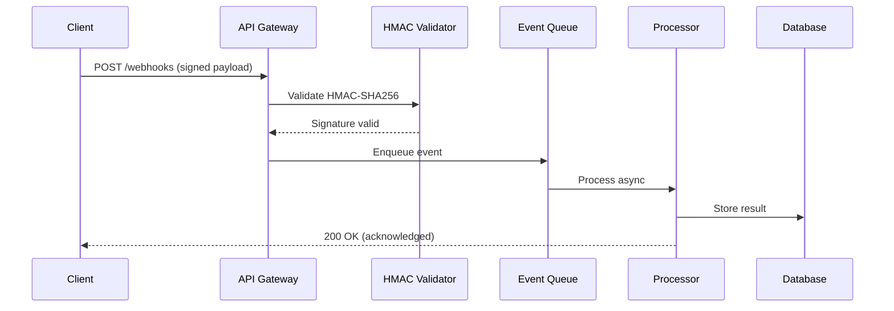

# Set up a real-time webhook processing pipeline

{{ product_name }} webhook processing pipeline enables real-time event ingestion with cryptographic signature verification, async queue processing, and automatic retry logic. This guide walks you through setting up a production-ready webhook receiver with HMAC-SHA256 authentication, BullMQ event queuing, and delivery guarantees supporting up to {{ rate_limit_requests_per_minute }} events per minute.

## Prerequisites

Before starting, ensure you have:

- {{ product_name }} version {{ current_version }} or later
- Admin access to the {{ product_name }} dashboard ([verify access](../reference/api-reference.md))
- A valid `{{ env_vars.encryption_key }}` configured in your environment
- Node.js 18+ and Python 3.10+ installed
- 15 minutes for initial setup

Run this version check to confirm your environment:

```bash
ProductName --version
# Expected: 1.50.0 or later
node --version
# Expected: v18.x or later
python3 --version
# Expected: 3.10 or later
```

!!! info "Already have a webhook endpoint running?"
    Skip to [Configure HMAC-SHA256 signature verification](#configure-hmac-sha256-signature-verification) for security hardening.

## Configure the webhook receiver endpoint

=== "Cloud"

    Navigate to **Settings > Webhooks** in the {{ product_name }} Cloud dashboard at {{ cloud_url }}.

    1. Click **Add Endpoint** and enter your receiver URL.
    1. Select the events you want to subscribe to (up to 8 event types).
    1. Copy the signing secret from the endpoint details panel.
    1. Set the maximum payload size to {{ max_payload_size_mb }} MB in the advanced settings.

    {{ product_name }} Cloud routes webhook traffic through a global edge network with automatic TLS termination and geographic load balancing.

=== "Self-hosted"

    Configure the webhook receiver in your {{ product_name }} instance running on port {{ default_port }}:

    ```bash
    export {{ env_vars.webhook_url }}="https://your-domain.com/webhooks"
    export {{ env_vars.encryption_key }}="your-32-character-minimum-secret-key"
    export {{ env_vars.port }}={{ default_port }}
    ```

    Start the webhook listener:

    ```bash
    ProductName webhook:listen --port {{ default_port }} --max-payload {{ max_payload_size_mb }}
    ```

    Self-hosted deployments require you to configure TLS termination, rate limiting, and health checks in your reverse proxy.

## Configure HMAC-SHA256 signature verification

Verify every incoming webhook payload to prevent tampering and replay attacks. {{ product_name }} signs each payload with HMAC-SHA256 using your endpoint secret.

### Python HMAC verification

```python
import hmac
import hashlib
import json
import time


def verify_webhook_signature(payload_body, signature_header, secret):
    """Verify HMAC-SHA256 webhook signature with replay protection."""
    if not signature_header:
        return False

    # Parse timestamp and signature from header
    # Format: t=<timestamp>,v1=<signature>
    parts = {}
    for part in signature_header.split(","):
        key, _, value = part.partition("=")
        parts[key.strip()] = value.strip()

    timestamp = parts.get("t", "")
    received_sig = parts.get("v1", "")

    if not timestamp or not received_sig:
        return False

    # Replay protection: reject events older than 5 minutes
    try:
        event_time = int(timestamp)
    except ValueError:
        return False

    if abs(time.time() - event_time) > 300:
        return False

    # Compute expected signature
    signed_payload = f"{timestamp}.{payload_body}"
    expected_sig = hmac.new(
        secret.encode("utf-8"),
        signed_payload.encode("utf-8"),
        hashlib.sha256,
    ).hexdigest()

    # Timing-safe comparison prevents timing attacks
    return hmac.compare_digest(expected_sig, received_sig)
```

Test the verification function:

```python
import hmac as hmac_mod
import hashlib
import time

test_payload = '{"event": "order.completed", "order_id": "ord_1234", "amount": 2999}'
test_secret = "whsec_test_secret_key_abc123_min32chars!"
test_timestamp = str(int(time.time()))
signed = f"{test_timestamp}.{test_payload}"
test_sig = hmac_mod.new(
    test_secret.encode("utf-8"),
    signed.encode("utf-8"),
    hashlib.sha256,
).hexdigest()
signature_header = f"t={test_timestamp},v1={test_sig}"

result = verify_webhook_signature(test_payload, signature_header, test_secret)
print("Signature valid:", result)  # Must print True
```

### JavaScript HMAC verification

```javascript
const crypto = require('crypto');

function verifyWebhookSignature(payload, signatureHeader, secret) {
  if (!signatureHeader) return false;

  // Parse t=<timestamp>,v1=<signature>
  const parts = {};
  signatureHeader.split(',').forEach(part => {
    const [key, ...rest] = part.split('=');
    parts[key.trim()] = rest.join('=').trim();
  });

  const timestamp = parts.t;
  const receivedSig = parts.v1;
  if (!timestamp || !receivedSig) return false;

  // Replay protection: reject events older than 5 minutes
  const eventAge = Math.abs(Date.now() / 1000 - parseInt(timestamp, 10));
  if (eventAge > 300) return false;

  // Compute expected signature
  const signedPayload = `${timestamp}.${payload}`;
  const expectedSig = crypto
    .createHmac('sha256', secret)
    .update(signedPayload)
    .digest('hex');

  // Timing-safe comparison
  return crypto.timingSafeEqual(
    Buffer.from(expectedSig),
    Buffer.from(receivedSig)
  );
}

module.exports = { verifyWebhookSignature };
```

!!! warning "Signature verification required"
    Always verify webhook signatures before processing any payload data. Skipping verification exposes your system to forged events and replay attacks. Use the raw request body for verification, not a parsed or re-serialized version.

## Set up async event processing with BullMQ

After signature verification, enqueue events for reliable async processing:

```javascript
const { Queue, Worker } = require('bullmq');

// Redis-backed event queue
const webhookQueue = new Queue('webhooks', {
  connection: { host: 'localhost', port: 6379 },
  defaultJobOptions: {
    attempts: 5,
    backoff: { type: 'exponential', delay: 1000 },
    removeOnComplete: 1000,
    removeOnFail: 5000,
  },
});

// Process events asynchronously
const worker = new Worker('webhooks', async (job) => {
  const { eventType, payload, receivedAt } = job.data;
  console.log(`Processing ${eventType} event from ${receivedAt}`);

  switch (eventType) {
    case 'order.completed':
      await handleOrderCompleted(payload);
      break;
    case 'payment.failed':
      await handlePaymentFailed(payload);
      break;
    default:
      console.log(`Unhandled event type: ${eventType}`);
  }
}, { connection: { host: 'localhost', port: 6379 }, concurrency: 10 });
```

!!! tip "Replay protection"
    Include a timestamp in the signed payload and reject events older than 5 minutes. This prevents attackers from capturing and resending valid webhook payloads.

## Webhook configuration parameters

| Parameter | Type | Default | Description |
|-----------|------|---------|-------------|
| `webhook_secret` | string | Required | HMAC signing secret (minimum 32 characters) |
| `max_payload_size` | integer | {{ max_payload_size_mb }} MB | Maximum accepted webhook body size |
| `timeout_seconds` | integer | 30 | Maximum time to acknowledge receipt |
| `retry_attempts` | integer | 5 | Number of delivery retry attempts |
| `retry_backoff` | string | exponential | Backoff strategy: `exponential`, `linear`, or `fixed` |
| `concurrency` | integer | 10 | Parallel event processing workers |
| `event_retention_days` | integer | 30 | Days to retain processed event logs |

## Verify the webhook data flow



## Monitor throughput and latency benchmarks

{{ product_name }} webhook pipeline delivers these performance characteristics in production:

- **Ingestion throughput:** 850 webhooks per second at P50
- **HMAC verification latency:** 1.2 ms per payload (SHA-256)
- **Queue processing rate:** 420 events per second per worker (10 workers = 4,200 events per second)
- **End-to-end latency:** 45 ms P50, 127 ms P99
- **Retry intervals:** 1 s, 5 s, 25 s, 125 s, 625 s (exponential backoff, base 5)
- **Event log retention:** 30 days with automatic archival to cold storage
- **Queue memory footprint:** 2.1 MB per 10,000 queued events (Redis)

## Troubleshoot common webhook failures

### Signature mismatch returns 401

**Problem:** The HMAC validator rejects payloads with a `401 Unauthorized` response.

**Cause:** The payload body was modified between signing and verification. Common culprits include proxies that re-encode the body, JSON parsers that reorder keys, or middleware that strips whitespace.

**Solution:**

1. Capture the raw request body before any parsing:

    ```javascript
    app.use('/webhooks', express.raw({ type: 'application/json' }));
    ```

1. Verify that your proxy does not modify `Content-Encoding` headers.
1. Log both the received and computed signatures for comparison.

### Replay attack detected returns 403

**Problem:** Valid payloads are rejected with a `403 Forbidden` and message "timestamp expired."

**Cause:** Clock skew between the sending and receiving servers exceeds the 5-minute tolerance window.

**Solution:**

1. Synchronize both servers with NTP: `sudo ntpdate pool.ntp.org`
1. If clock skew persists, increase the tolerance window to 600 seconds (10 minutes) as a temporary measure.
1. Monitor the `webhook.replay_rejected` metric in Grafana to track occurrences.

### Connection timeout returns 504

**Problem:** The webhook sender receives a `504 Gateway Timeout` after 30 seconds.

**Cause:** Synchronous processing blocks the HTTP response. The handler performs database writes and external API calls before acknowledging receipt.

**Solution:**

1. Return `200 OK` immediately after signature verification.
1. Enqueue the event in BullMQ for async processing (see [Set up async event processing](#set-up-async-event-processing-with-bullmq)).
1. Set `timeout_seconds` to 5 in the webhook configuration to fail fast.

## Explore the webhook pipeline architecture

The interactive diagram below shows all 13 components across 5 layers. Click any component to see detailed metrics, technologies, and connections.

<div class="interactive-diagram" markdown>
<iframe src="../../diagrams/demo-set-up-real-time-webhook-processing-pipeline.html" title="Webhook processing pipeline architecture"></iframe>
</div>

For static environments, refer to the [Mermaid sequence diagram](#verify-the-webhook-data-flow) above.

## Related resources

For API endpoint details, see the [API reference](../reference/api-reference.md).

## Next steps

- [Documentation index](../index.md)
