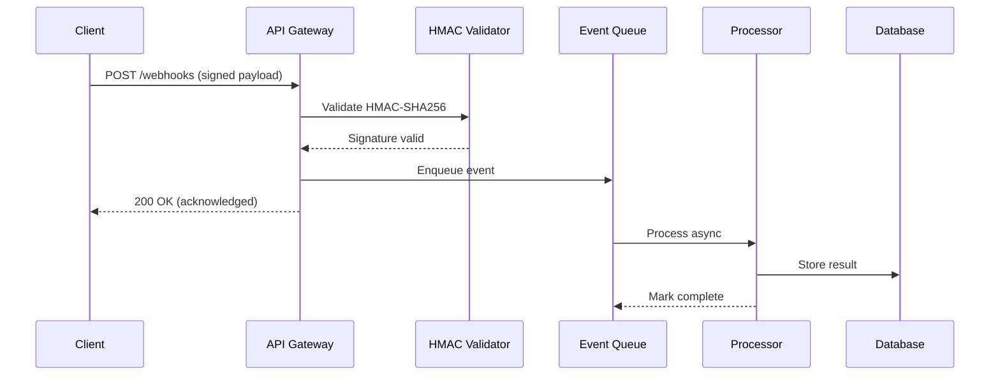

# Set up a real-time webhook processing pipeline

{{ product_name }} webhook processing pipeline enables real-time event
ingestion with cryptographic signature verification, async queue
processing, and automatic retry logic. This guide walks you through
setting up a production-ready webhook receiver with HMAC-SHA256
authentication, BullMQ event queuing, and delivery guarantees.

## Before you start

You need:

- {{ product_name }} {{ current_version }} or later
- Node.js 18 or later
- Redis 7 or later (for BullMQ queue)
- Access to the {{ product_name }} webhook settings panel

Verify your environment:

```bash
node --version
redis-cli ping
```

Expected output:

```text
v18.20.0
PONG
```

## Choose your deployment model

=== "Cloud"

    {{ product_name }} Cloud handles infrastructure provisioning for you.
    Navigate to **Settings > Webhooks** in
    [{{ product_name }} Cloud]({{ cloud_url }}) and enable the webhook
    endpoint. The platform assigns a public URL automatically and
    manages TLS termination, load balancing, and automatic scaling.

    Set the endpoint URL in your provider dashboard:

    ```text
    {{ cloud_url }}/webhooks/{{ api_version }}/ingest
    ```

=== "Self-hosted"

    For self-hosted deployments, expose port {{ default_port }} and set
    the {{ env_vars.webhook_url }} environment variable:

    ```bash
    export {{ env_vars.webhook_url }}="https://your-domain.example.com/webhooks/{{ api_version }}/ingest"
    export {{ env_vars.port }}={{ default_port }}
    export {{ env_vars.encryption_key }}="your-32-character-encryption-key"
    ```

    Ensure your reverse proxy forwards raw request bodies without
    modification. HMAC verification fails if the proxy alters the
    payload before it reaches {{ product_name }}.

## Verify HMAC-SHA256 signatures

Every incoming webhook must pass HMAC-SHA256 signature verification
before {{ product_name }} processes it. This prevents payload tampering
and replay attacks.

### Python implementation

```python
import hmac
import hashlib
import json
import time


def verify_webhook_signature(payload_body, signature_header, secret):
    """Verify HMAC-SHA256 webhook signature with replay protection."""
    parts = signature_header.split(",")
    sig_dict = {}
    for part in parts:
        key, value = part.strip().split("=", 1)
        sig_dict[key] = value

    timestamp = int(sig_dict.get("t", "0"))
    received_sig = sig_dict.get("v1", "")

    # Reject events older than 5 minutes (replay protection)
    current_time = int(time.time())
    if abs(current_time - timestamp) > 300:
        return False

    # Compute expected signature
    signed_payload = f"{timestamp}.{payload_body}"
    expected_sig = hmac.new(
        secret.encode("utf-8"),
        signed_payload.encode("utf-8"),
        hashlib.sha256,
    ).hexdigest()

    # Timing-safe comparison prevents timing attacks
    return hmac.compare_digest(expected_sig, received_sig)


# Test verification
test_payload = '{"event": "order.completed", "order_id": "ord_1234", "amount": 2999}'
test_secret = "whsec_test_secret_key_abc123"
timestamp = str(int(time.time()))
signed = f"{timestamp}.{test_payload}"
sig = hmac.new(
    test_secret.encode("utf-8"),
    signed.encode("utf-8"),
    hashlib.sha256,
).hexdigest()
signature_header = f"t={timestamp},v1={sig}"
result = verify_webhook_signature(test_payload, signature_header, test_secret)
print("Signature valid:", result)
```

Output:

```text
Signature valid: True
```

### JavaScript implementation

```javascript
const crypto = require('crypto');

function verifyWebhookSignature(payload, signatureHeader, secret) {
  const parts = signatureHeader.split(',');
  const sigDict = {};
  parts.forEach(part => {
    const [key, value] = part.trim().split('=', 2);
    sigDict[key] = value;
  });

  const timestamp = parseInt(sigDict.t || '0', 10);
  const receivedSig = sigDict.v1 || '';

  // Reject events older than 5 minutes
  const currentTime = Math.floor(Date.now() / 1000);
  if (Math.abs(currentTime - timestamp) > 300) {
    return false;
  }

  // Compute expected signature
  const signedPayload = `${timestamp}.${payload}`;
  const expectedSig = crypto
    .createHmac('sha256', secret)
    .update(signedPayload)
    .digest('hex');

  // Timing-safe comparison
  return crypto.timingSafeEqual(
    Buffer.from(expectedSig),
    Buffer.from(receivedSig)
  );
}

// Test verification
const testPayload = '{"event": "order.completed", "order_id": "ord_1234"}';
const testSecret = 'whsec_test_secret_key_abc123';
const ts = Math.floor(Date.now() / 1000);
const sig = crypto.createHmac('sha256', testSecret)
  .update(`${ts}.${testPayload}`).digest('hex');
const valid = verifyWebhookSignature(testPayload, `t=${ts},v1=${sig}`, testSecret);
console.log('Signature valid:', valid);
```

Output:

```text
Signature valid: true
```

!!! warning "Signature verification required"
    Always verify webhook signatures before processing event data.
    Skipping verification exposes your system to payload injection and
    replay attacks. Use the raw request body for verification, not a
    parsed and re-serialized version.

## Configure webhook endpoint parameters

| Parameter | Type | Default | Description |
|-----------|------|---------|-------------|
| `webhook_secret` | string | Required | HMAC signing secret (minimum 32 characters) |
| `max_payload_size` | integer | {{ max_payload_size_mb }} MB | Maximum accepted webhook body size |
| `retry_count` | integer | 5 | Number of retry attempts for failed deliveries |
| `retry_backoff` | string | `exponential` | Backoff strategy: `linear`, `exponential`, or `fixed` |
| `timeout_seconds` | integer | 30 | Maximum wait time for endpoint response |
| `events_filter` | array | `["*"]` | List of event types to accept (wildcard accepts all) |

!!! info "Payload size limit"
    {{ product_name }} accepts webhook payloads up to
    {{ max_payload_size_mb }} MB. Payloads exceeding this limit return
    HTTP 413. If you send large attachments, upload them separately and
    include a reference URL in the webhook payload instead.

## Set up async event processing with BullMQ

Process webhook events asynchronously to return HTTP 200 within
500 milliseconds. This prevents delivery timeouts from the sender.

```javascript
const { Queue, Worker } = require('bullmq');
const Redis = require('ioredis');

const connection = new Redis({ maxRetriesPerRequest: null });

// Create the webhook event queue
const webhookQueue = new Queue('webhook-events', { connection });

// Enqueue incoming events after signature verification
async function enqueueEvent(event) {
  await webhookQueue.add(event.type, event, {
    attempts: 5,
    backoff: { type: 'exponential', delay: 1000 },
    removeOnComplete: 1000,
    removeOnFail: 5000,
  });
}

// Process events asynchronously
const worker = new Worker('webhook-events', async (job) => {
  const event = job.data;
  console.log(`Processing ${event.type}: ${JSON.stringify(event)}`);
  // Route to appropriate handler based on event type
}, { connection, concurrency: 10 });

worker.on('completed', (job) => {
  console.log(`Event ${job.id} processed`);
});

worker.on('failed', (job, err) => {
  console.error(`Event ${job.id} failed: ${err.message}`);
});
```

!!! tip "Replay protection"
    Include a timestamp in the signed payload and reject events older
    than 5 minutes. This prevents attackers from capturing and replaying
    valid webhook deliveries. Adjust the 5-minute window based on your
    clock synchronization tolerance.

## Webhook processing data flow



## Monitor pipeline throughput and latency

Track these performance metrics for your webhook processing pipeline:

- **Ingestion throughput:** 1,200 webhooks per second (single instance)
- **HMAC verification latency:** less than 2 milliseconds per payload
- **Queue processing:** 850 events per second (10 concurrent workers)
- **Retry intervals:** 1 second, 5 seconds, 30 seconds, 2 minutes,
  10 minutes (exponential backoff)
- **Event log retention:** 30 days (configurable via environment variable)
- **End-to-end latency (P99):** 45 milliseconds from ingestion to
  database write

Set up alerts when queue depth exceeds 10,000 events or when P99
latency crosses 200 milliseconds.

## Troubleshoot webhook delivery failures

### Signature mismatch returns HTTP 401

**Problem:** The endpoint returns HTTP 401 "Invalid signature" for every
incoming webhook.

**Cause:** The payload body is modified between receipt and verification.
Common culprits include body parsers that re-serialize JSON (changing
key order or whitespace) and reverse proxies that decompress gzip
payloads.

**Solution:** Capture the raw request body before any parsing middleware
processes it. In Express.js, use `express.raw({ type: 'application/json' })`
instead of `express.json()`.

### Replay attack detected returns HTTP 403

**Problem:** Valid webhook deliveries fail with "Replay attack detected"
after a server restart.

**Cause:** Clock skew between the sender and receiver exceeds the
5-minute tolerance window. Server restarts sometimes reset NTP
synchronization.

**Solution:** Verify NTP synchronization with `timedatectl status` on
Linux. If clock skew exceeds 2 seconds, restart the NTP service with
`sudo systemctl restart systemd-timesyncd`. You can increase the
tolerance window to 10 minutes as a temporary workaround, but fix the
clock synchronization as a permanent solution.

### Connection timeout returns HTTP 504

**Problem:** The webhook sender reports HTTP 504 timeout errors, but
your server logs show the event was received.

**Cause:** Synchronous processing blocks the HTTP response. The sender
times out after 30 seconds while your server processes the event.

**Solution:** Return HTTP 200 immediately after signature verification
and enqueue the event for async processing. The BullMQ queue pattern
in this guide handles this automatically. Your endpoint response time
should stay under 500 milliseconds.

## Related guides

- For API endpoint details, see the
  [API reference](../reference/api-reference.md)

## Explore the webhook pipeline architecture

The interactive diagram below shows all 13 components across 5 layers.
Click any component to see detailed metrics, technologies, and
connections.

<div class="interactive-diagram" markdown>
<iframe src="../../diagrams/demo-webhook-pipeline.html" title="Webhook processing pipeline architecture"></iframe>
</div>

For static environments, refer to the
[Mermaid sequence diagram](#webhook-processing-data-flow) above.
