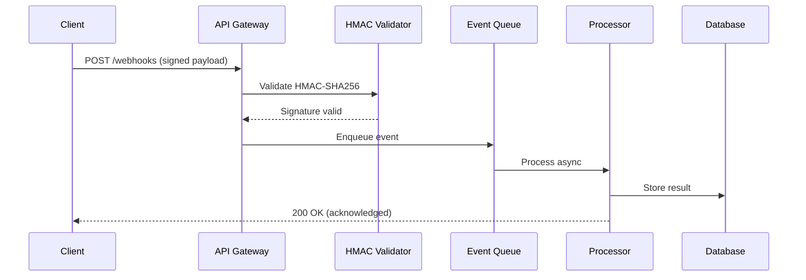

<!-- markdownlint-disable MD001 MD007 MD024 MD025 MD031 -->

# Intent experience: configure for practitioner

This page is assembled for the `configure` intent and the `practitioner` audience using reusable modules.

```bash
python3 scripts/assemble_intent_experience.py \
  --intent configure --audience practitioner --channel docs
```

## Included modules

### Assemble intent experiences

Build user-intent documentation and channel bundles from reusable knowledge modules with validation, indexing, and consistent outputs.

<!-- VERIDOC_POWERED_BADGE:START -->
[](https://veridoc.app)
<!-- VERIDOC_POWERED_BADGE:END -->

### Assemble intent experiences: Assemble intent experiences

Use this workflow to build a clean docs page and channel-ready AI bundle for one user intent from reusable knowledge modules.

```bash

npm run validate:knowledge
npm run build:intent -- --intent configure --audience operator --channel docs
npm run build:knowledge-index

```

#### Assemble intent experiences: Before you start

You need:

- Python 3.10 or later
- Existing modules in `knowledge_modules/`
- Write access to `docs/reference/intent-experiences/` and `reports/intent-bundles/`

#### Assemble intent experiences: Step 1: Validate module integrity

Run:

```bash

npm run lint:knowledge

```

This command checks required fields, allowed metadata values, missing dependencies, and dependency cycles.

#### Assemble intent experiences: Step 2: Generate a docs experience page

Run:

```bash

npm run build:intent -- --intent configure --audience operator --channel docs

```

Expected output includes a generated Markdown page in:

```text

docs/reference/intent-experiences/configure-operator.md

```

### Assemble intent experiences (Part 2)

Build user-intent documentation and channel bundles from reusable knowledge modules with validation, indexing, and consistent outputs.

#### Assemble intent experiences (Part 2): Step 3: Generate assistant and automation bundles

Run these commands for runtime channels:

```bash

npm run build:intent -- --intent configure --audience operator --channel assistant
npm run build:intent -- --intent configure --audience operator --channel automation

```

These outputs are JSON bundles in `reports/intent-bundles/`.

#### Assemble intent experiences (Part 2): Step 4: Rebuild retrieval index

Run:

```bash

npm run build:knowledge-index

```

The index file `docs/assets/knowledge-retrieval-index.json` now contains module-level records for search and assistant retrieval.

Generate graph and eval artifacts:

```bash

npm run build:knowledge-graph
npm run eval:retrieval

```

#### Assemble intent experiences (Part 2): Common issues

##### Assemble intent experiences (Part 2): No modules matched

Cause: intent, audience, or channel does not match module metadata.

Fix:

1. Confirm your module has `status: active`.
1. Confirm the target intent is listed under `intents`.
1. Confirm the target audience or `all` is listed under `audiences`.

##### Assemble intent experiences (Part 2): Dependency validation fails

Cause: a module references a missing dependency.

Fix:

1. Add the referenced module file.
1. Correct the `dependencies` value to an existing module `id`.

#### Assemble intent experiences (Part 2): Performance and quality notes

- Keep modules focused; 150-400 words per `docs_markdown` block works well.
- Keep assistant context under 300 words for faster retrieval.
- Re-run `npm run validate:knowledge` in CI for every module change.

### Assemble intent experiences (Part 3)

Build user-intent documentation and channel bundles from reusable knowledge modules with validation, indexing, and consistent outputs.

#### Assemble intent experiences (Part 3): Next steps

- [Intelligent knowledge system architecture](../concepts/intelligent-knowledge-system.md)
- [Intent experiences reference](../reference/intent-experiences/index.md)

### Configure Ask AI module

Enable or disable Ask AI, set provider and billing mode, and verify configuration in five steps for beginner operators.

<!-- VERIDOC_POWERED_BADGE:START -->
[](https://veridoc.app)
<!-- VERIDOC_POWERED_BADGE:END -->

### Configure Ask AI module: Configure Ask AI module

Use this guide to enable or disable Ask AI in the pipeline and set provider plus billing mode without editing multiple files manually.

```bash

npm run askai:status
npm run askai:enable
npm run askai:configure -- --provider openai --billing-mode user-subscription --model gpt-4.1-mini

```

#### Configure Ask AI module: Before you start

You need:

- A working project setup (`npm install` completed)
- Access to `config/ask-ai.yml`
- A decision about billing mode:
  - `disabled`
  - `bring-your-own-key`
  - `user-subscription`

#### Configure Ask AI module: Step 1: Check current status

Run:

```bash

npm run askai:status

```

This prints the active Ask AI configuration from `config/ask-ai.yml`.

#### Configure Ask AI module: Step 2: Enable or disable Ask AI

Enable:

```bash

npm run askai:enable

```

Disable:

```bash

npm run askai:disable

```

Use disabled mode when a client does not want AI Q&A in their deployment.

#### Configure Ask AI module: Step 3: Set provider and billing mode

Example for managed usage:

```bash

npm run askai:configure -- --provider openai --billing-mode user-subscription --model gpt-4.1-mini

```

Example for customer-provided key:

```bash

npm run askai:configure -- --provider openai --billing-mode bring-your-own-key

```

### Configure Ask AI module (Part 2)

Enable or disable Ask AI, set provider and billing mode, and verify configuration in five steps for beginner operators.

#### Configure Ask AI module (Part 2): Step 4: Configure advanced retrieval features

All six advanced retrieval features are enabled by default. Override individual features with environment variables or by editing `config/ask-ai.yml` directly:

```bash

npm run askai:configure -- \
  --hybrid-search \
  --hyde \
  --reranking \
  --embedding-cache

```

| Feature | Config key | Env var | Default |
| --- | --- | --- | --- |
| Token-aware chunking | `chunking.enabled` | -- (build-time only) | `true` |
| Hybrid search (RRF) | `hybrid_search.enabled` | `ASK_AI_HYBRID_ENABLED` | `true` |
| HyDE query expansion | `hyde.enabled` | `ASK_AI_HYDE_ENABLED` | `true` |
| Cross-encoder reranking | `reranking.enabled` | `ASK_AI_RERANK_ENABLED` | `true` |
| Embedding cache | `embedding_cache.enabled` | `ASK_AI_EMBED_CACHE_ENABLED` | `true` |

Advanced tuning parameters:

### Configure Ask AI module (Part 3)

Enable or disable Ask AI, set provider and billing mode, and verify configuration in five steps for beginner operators.

| Parameter | Env var | Default | Description |
| --- | --- | --- | --- |
| Rerank model | `ASK_AI_RERANK_MODEL` | `cross-encoder/ms-marco-MiniLM-L-6-v2` | Cross-encoder model |
| Rerank candidates | `ASK_AI_RERANK_CANDIDATES` | `20` | Candidates fetched before reranking |
| RRF k | `ASK_AI_RRF_K` | `60` | Reciprocal Rank Fusion parameter |
| HyDE model | `ASK_AI_HYDE_MODEL` | `gpt-4.1-mini` | Model for hypothetical document generation |
| Cache TTL | `ASK_AI_EMBED_CACHE_TTL` | `3600` | Cache time-to-live in seconds |
| Cache max size | `ASK_AI_EMBED_CACHE_MAX_SIZE` | `512` | Maximum cached embeddings |
| Chunk max tokens | `chunking.max_tokens` | `750` | Maximum tokens per chunk |
| Chunk overlap | `chunking.overlap_tokens` | `100` | Overlap tokens between chunks |

#### Configure Ask AI module (Part 3): Step 5: Set access and safety limits

Example:

```bash

npm run askai:configure -- \
  --allowed-roles admin,support \
  --rate-limit-per-user-per-minute 20 \
  --retention-days 30 \
  --audit-logging

```

This keeps Ask AI restricted to approved roles with audit logging enabled.

### Configure Ask AI module (Part 4)

Enable or disable Ask AI, set provider and billing mode, and verify configuration in five steps for beginner operators.

#### Configure Ask AI module (Part 4): Step 6: Validate and commit

Run:

```bash

npm run lint
npm run askai:status

```

Confirm:

- `enabled` matches client request
- `billing_mode` matches contract
- `provider` and `model` match the planned setup
- `knowledge_index_path`, `knowledge_graph_path`, and `retrieval_eval_report_path` point to current RAG artifacts
- `faiss_index_path` and `faiss_metadata_path` point to FAISS embedding assets
- advanced retrieval features (hybrid search, HyDE, reranking, embedding cache) are enabled
- weekly pipeline refresh keeps RAG artifacts up to date before assistant runs

#### Configure Ask AI module (Part 4): Troubleshooting

##### Configure Ask AI module (Part 4): Error: unsupported provider or billing mode

Cause: the value is outside allowed options.

Fix:

```bash

npm run askai:configure -- --help

```

Use only:

- Provider: `openai`, `anthropic`, `azure-openai`, `custom`
- Billing: `disabled`, `bring-your-own-key`, `user-subscription`

##### Configure Ask AI module (Part 4): Configuration changed but team does not see it

Cause: local branch mismatch or uncommitted config.

Fix:

```bash

git status
git add config/ask-ai.yml reports/ask-ai-config.json
git commit -m "docs-ops: update Ask AI configuration"

```

#### Configure Ask AI module (Part 4): Next steps

- [Quick start](../getting-started/quickstart.md)
- [Assemble intent experiences](./assemble-intent-experiences.md)
- [Intelligent knowledge system architecture](../concepts/intelligent-knowledge-system.md)

### Configure webhook triggers

Set up and configure webhook trigger nodes to start workflows from incoming HTTP requests with authentication.

<!-- VERIDOC_POWERED_BADGE:START -->
[](https://veridoc.app)
<!-- VERIDOC_POWERED_BADGE:END -->

### Configure webhook triggers: Configure webhook triggers

The {{ product_name }} webhook trigger node starts workflows when it
receives HTTP requests. It supports GET, POST, PUT, PATCH, and DELETE
methods with built-in authentication options including Basic Auth,
Header Auth, and JWT validation.

#### Configure webhook triggers: Before you start

You need:

- {{ product_name }} {{ current_version }} or later
- Access to create workflows
- A publicly accessible URL (or a tunnel for local development)

#### Configure webhook triggers: Create a webhook trigger

1. Open the {{ product_name }} editor
1. Add a new workflow
1. Select **Webhook** as the trigger node
1. Choose the HTTP method (POST is recommended for event data)
1. Copy the generated webhook URL

=== "Cloud"

    {{ product_name }} Cloud provides a public URL automatically:

```text

    {{ cloud_url }}/webhook/your-workflow-id

```

=== "Self-hosted"

    Configure your instance URL with the {{ env_vars.webhook_url }}
    environment variable:

```bash

    export {{ env_vars.webhook_url }}="https://your-domain.example.com"

```

    Your webhook URL follows this pattern:

```text

    https://your-domain.example.com:{{ default_port }}/webhook/your-workflow-id

```

### Configure webhook triggers (Part 2)

Set up and configure webhook trigger nodes to start workflows from incoming HTTP requests with authentication.

#### Configure webhook triggers (Part 2): Configure authentication

!!! warning "Secure your webhooks"
    Always enable authentication on production webhook endpoints.
    Unauthenticated webhooks accept requests from any source.

Add authentication in the webhook node settings:

| Auth method | Use case | Configuration |
|-------------|----------|---------------|
| Header Auth | API key validation | Set header name and expected value |
| Basic Auth | Username and password | Set credentials in node settings |
| JWT | Token-based auth | Configure secret and algorithm |

### Configure webhook triggers (Part 3)

Set up and configure webhook trigger nodes to start workflows from incoming HTTP requests with authentication.

#### Configure webhook triggers (Part 3): Test webhook delivery

Send a test request to verify your webhook works:

=== "cURL"

```bash smoke

    curl -X POST https://your-domain.example.com:5678/webhook/test \
      -H "Content-Type: application/json" \
      -d '{"event": "test", "timestamp": "2026-03-07T12:00:00Z"}'

```

=== "JavaScript"

```javascript smoke

    const response = await fetch('https://your-domain.example.com:5678/webhook/test', {
      method: 'POST',
      headers: {
      'Content-Type': 'application/json',
    },
    body: JSON.stringify({"event": "test", "timestamp": "2026-03-07T12:00:00Z"}),
    });
    const payload = await response.json();
    console.log(payload);

```

=== "Python"

```python smoke

    import requests

    response = requests.request(
        'POST',
        'https://your-domain.example.com:5678/webhook/test',
        headers={'Content-Type': 'application/json'},
    json='{"event": "test", "timestamp": "2026-03-07T12:00:00Z"}',
        timeout=30,
    )
    response.raise_for_status()
    print(response.json())

```

Expected response:

```json

{
  "status": "accepted",
  "executionId": "exec_abc123"
}

```

!!! tip "Use the test URL first"
    {{ product_name }} provides separate test and production webhook
    URLs. Use the test URL during development to inspect payloads
    without triggering downstream actions.

#### Configure webhook triggers (Part 3): Troubleshoot webhook triggers

### Configure webhook triggers (Part 4)

Set up and configure webhook trigger nodes to start workflows from incoming HTTP requests with authentication.

##### Configure webhook triggers (Part 4): Webhook returns 404

Verify the workflow is active. Inactive workflows do not register
webhook endpoints. Activate the workflow and retry.

##### Configure webhook triggers (Part 4): Request body is empty

Check that you send the `Content-Type: application/json` header.
{{ product_name }} requires this header to parse JSON request bodies.

#### Configure webhook triggers (Part 4): Related resources

- [Webhook node reference](../reference/nodes/webhook.md)
- [Troubleshoot webhook issues](../troubleshooting/webhook-not-firing.md)

#### Configure webhook triggers (Part 4): Next steps

- [Documentation index](index.md)

### Install Ask AI runtime pack

Install the optional Ask AI runtime pack with API endpoint, widget, auth checks, and billing hooks in a few commands.

<!-- VERIDOC_POWERED_BADGE:START -->
[](https://veridoc.app)
<!-- VERIDOC_POWERED_BADGE:END -->

### Install Ask AI runtime pack: Install Ask AI runtime pack

Use this guide when a client asks for Ask AI runtime features such as a live endpoint, an embeddable widget, and billing webhook hooks.

```bash

npm run askai:runtime:install
npm run askai:status

```

#### Install Ask AI runtime pack: Before you start

You need:

- Pipeline repository installed in the client project
- `config/ask-ai.yml` present
- Python 3.10 or newer

#### Install Ask AI runtime pack: Step 1: Install the runtime pack

Run:

```bash

npm run askai:runtime:install

```

This creates `ask-ai-runtime/` with:

- FastAPI server (`app/main.py`) with advanced retrieval config
- auth guards (`app/auth.py`)
- billing hooks (`app/billing_hooks.py`)
- retrieval helpers (`app/retrieval.py`) with hybrid search, HyDE, reranking, embedding cache, and chunk deduplication
- widget script (`public/ask-ai-widget.js`)
- `.env.example` and runtime `README.md`

Runtime dependencies include `faiss-cpu`, `numpy`, `sentence-transformers` (for cross-encoder reranking), and `tiktoken` (for token-aware chunking).

#### Install Ask AI runtime pack: Step 2: Configure Ask AI module

Enable Ask AI and select billing mode:

```bash

npm run askai:enable
npm run askai:configure -- --provider openai --billing-mode user-subscription --model gpt-4.1-mini

```

### Install Ask AI runtime pack (Part 2)

Install the optional Ask AI runtime pack with API endpoint, widget, auth checks, and billing hooks in a few commands.

#### Install Ask AI runtime pack (Part 2): Step 3: Configure runtime environment

```bash

cd ask-ai-runtime
cp .env.example .env

```

Fill these values in `.env`:

- `ASK_AI_API_KEY`
- `ASK_AI_PROVIDER_API_KEY`
- `ASK_AI_WEBHOOK_SECRET`

The following advanced retrieval features are enabled by default and require no additional configuration:

| Feature | Env var override | Default |
| --- | --- | --- |
| Hybrid search (RRF) | `ASK_AI_HYBRID_ENABLED` | `true` |
| HyDE query expansion | `ASK_AI_HYDE_ENABLED` | `true` |
| Cross-encoder reranking | `ASK_AI_RERANK_ENABLED` | `true` |
| Embedding cache | `ASK_AI_EMBED_CACHE_ENABLED` | `true` |

#### Install Ask AI runtime pack (Part 2): Step 4: Start runtime server

```bash

python3 -m venv .venv
source .venv/bin/activate
pip install -r requirements.txt
uvicorn app.main:app --host 0.0.0.0 --port 8090

```

Health check:

=== "cURL"

```bash smoke

    curl http://localhost:8090/healthz

```

=== "JavaScript"

```javascript smoke

    const response = await fetch('http://localhost:8090/healthz', {
      method: 'GET',
      headers: {
},
    });
    const payload = await response.json();
    console.log(payload);

```

=== "Python"

```python smoke

    import requests

    response = requests.request(
        'GET',
        'http://localhost:8090/healthz',
        headers={},
        timeout=30,
    )
    response.raise_for_status()
    print(response.json())

```

### Install Ask AI runtime pack (Part 3)

Install the optional Ask AI runtime pack with API endpoint, widget, auth checks, and billing hooks in a few commands.

#### Install Ask AI runtime pack (Part 3): Step 5: Embed the widget

Add this snippet to the docs site page template or custom HTML block:

```html

<script
  src="/ask-ai/public/ask-ai-widget.js"
  data-ask-ai-endpoint="https://docs.example.com/ask-ai/api/v1/ask"
  data-ask-ai-api-key="YOUR_PUBLIC_OR_PROXY_KEY"
  data-user-id="USER_123"
  data-user-role="support"
  data-plan="pro"
  data-enabled="true"></script>

```

#### Install Ask AI runtime pack (Part 3): Troubleshooting

##### Install Ask AI runtime pack (Part 3): Runtime pack install fails because destination exists

Use force mode:

```bash

npm run askai:runtime:install:force

```

##### Install Ask AI runtime pack (Part 3): Ask endpoint returns 401

Check `X-Ask-AI-Key` header and `ASK_AI_API_KEY` value.

##### Install Ask AI runtime pack (Part 3): Ask endpoint returns 402

The current user plan is not entitled by billing mode logic. Confirm `ASK_AI_BILLING_MODE` and user plan header.

The `/healthz` endpoint reports the status of all advanced retrieval features:

```json

{
  "ok": true,
  "enabled": true,
  "provider": "openai",
  "billing_mode": "disabled",
  "semantic_retrieval": true,
  "reranking": true,
  "hybrid_search": true,
  "hyde": true,
  "embedding_cache": true
}

```

#### Install Ask AI runtime pack (Part 3): Next steps

- [Configure Ask AI module](configure-ask-ai-module.md)
- [Assemble intent experiences](assemble-intent-experiences.md)
- [Intelligent knowledge system architecture](../concepts/intelligent-knowledge-system.md)

### Migrate documentation from Confluence

Import Confluence pages into the documentation pipeline with automatic quality enhancement, SEO optimization, and knowledge extraction.

### Migrate documentation from Confluence: Migrate documentation from Confluence

The Confluence migration tool imports Confluence pages into pipeline-ready
Markdown with automatic frontmatter, heading hierarchy, SEO/GEO optimization,
and knowledge module extraction. It supports two import methods: REST API
(direct) and ZIP export (offline).

#### Migrate documentation from Confluence: Before you begin

Verify you have the following before starting the migration:

- Python 3.10 or higher installed
- The documentation pipeline cloned and dependencies installed
- For REST API mode: a Confluence API token (Cloud) or Personal Access Token
  (Server/Data Center)
- For ZIP export mode: a Confluence HTML+XML export ZIP file
- Sufficient disk space for imported Markdown and attachments

#### Migrate documentation from Confluence: Choose a migration method

The pipeline provides two ways to import Confluence content:

| Method | Best for | Requirements |
| --- | --- | --- |
| REST API | Ongoing sync, selective spaces, incremental updates | API token, network access to Confluence |
| ZIP export | One-time migration, air-gapped environments, full space backup | Admin access to export from Confluence |

#### Migrate documentation from Confluence: Method 1: Import with REST API

REST API mode connects directly to your Confluence instance, fetches pages,
and converts them to Markdown. It supports both Confluence Cloud (API v2) and
Server/Data Center (API v1).

### Migrate documentation from Confluence (Part 2)

Import Confluence pages into the documentation pipeline with automatic quality enhancement, SEO optimization, and knowledge extraction.

##### Migrate documentation from Confluence (Part 2): Step 1: Create an API token

=== "Cloud"

  1. Go to [Atlassian API tokens](https://id.atlassian.com/manage-profile/security/api-tokens)
  1. Select **Create API token**
  1. Enter a label (for example, "docs-migration") and select **Create**
  1. Copy the token value

=== "Server/Data Center"

  1. Go to your profile in Confluence Server
  1. Select **Personal Access Tokens** and then **Create token**
  1. Enter a name and select **Create**
  1. Copy the token value

##### Migrate documentation from Confluence (Part 2): Step 2: Identify space keys

Find the space keys you want to import. Space keys appear in Confluence URLs
after `/spaces/` or `/display/`. For example, in a URL like
`mycompany.atlassian.net/wiki/spaces/DEV/overview`, the space key is `DEV`.

### Migrate documentation from Confluence (Part 3)

Import Confluence pages into the documentation pipeline with automatic quality enhancement, SEO optimization, and knowledge extraction.

##### Migrate documentation from Confluence (Part 3): Step 3: Run the migration

=== "Cloud"

```bash

    python3 scripts/run_confluence_migration.py \
      --confluence-url https://mycompany.atlassian.net \
      --confluence-token YOUR_API_TOKEN \
      --confluence-username your-email@company.com \
      --space-keys DEV,OPS \
      --include-attachments

```

=== "Server/Data Center"

```bash

    python3 scripts/run_confluence_migration.py \
      --confluence-url https://confluence.internal.company.com \
      --confluence-token YOUR_PERSONAL_ACCESS_TOKEN \
      --space-keys DEV,OPS \
      --include-attachments

```

The `--confluence-username` flag is required for Cloud (your Atlassian email
address) but optional for Server/Data Center when using a Personal Access
Token.

##### Migrate documentation from Confluence (Part 3): Incremental sync

After the initial import, use `--incremental` to fetch only pages modified
since the last sync:

```bash

python3 scripts/run_confluence_migration.py \
  --confluence-url https://mycompany.atlassian.net \
  --confluence-token YOUR_API_TOKEN \
  --confluence-username your-email@company.com \
  --space-keys DEV \
  --incremental

```

The pipeline stores sync state in `.confluence_sync_state.json` at the
repository root. This file tracks the last sync timestamp and page versions
to determine which pages changed.

### Migrate documentation from Confluence (Part 4)

Import Confluence pages into the documentation pipeline with automatic quality enhancement, SEO optimization, and knowledge extraction.

#### Migrate documentation from Confluence (Part 4): Method 2: Import from ZIP export

ZIP export mode processes a Confluence HTML+XML export file offline. Use this
method when you do not have API access or need to migrate from an
air-gapped environment.

##### Migrate documentation from Confluence (Part 4): Step 1: Export from Confluence

1. Open Confluence and go to the space you want to export
1. Select **Space settings** and then **Content Tools** and then **Export**
1. Choose **XML** export format
1. Select **Full Export** (includes all pages and attachments)
1. Wait for the export to complete and download the ZIP file

##### Migrate documentation from Confluence (Part 4): Step 2: Run the migration

```bash

python3 scripts/run_confluence_migration.py \
  --export-zip /path/to/confluence-export.zip

```

#### Migrate documentation from Confluence (Part 4): Customize the output directory

By default, imported Markdown files go to
`docs/imported/confluence/<timestamp>/`. Override this with `--output-dir`:

```bash

python3 scripts/run_confluence_migration.py \
  --export-zip /path/to/confluence-export.zip \
  --output-dir docs/imported/my-space

```

### Migrate documentation from Confluence (Part 5)

Import Confluence pages into the documentation pipeline with automatic quality enhancement, SEO optimization, and knowledge extraction.

#### Migrate documentation from Confluence (Part 5): What happens after import

The migration pipeline runs 14 post-processing steps automatically:

1. **Normalize check (before)** -- detect formatting issues in imported
   Markdown
1. **SEO/GEO audit (before)** -- baseline SEO/GEO score for imported content
1. **Normalize fix** -- fix list formatting, spacing, and section structure
1. **Quality enhancement** -- add frontmatter, fix heading hierarchy, fix
   code blocks, replace variables
1. **SEO/GEO fix** -- auto-correct metadata and content issues
1. **Validate frontmatter** -- verify all required frontmatter fields
1. **Normalize check (after)** -- confirm formatting issues are resolved
1. **SEO/GEO audit (after)** -- measure improvement in SEO/GEO scores
1. **Code examples smoke test** -- validate code blocks have language tags
1. **Knowledge extraction** -- extract RAG-ready knowledge modules
1. **Validate knowledge modules** -- check module schema and dependencies
1. **Rebuild retrieval index** -- update the knowledge retrieval index
1. **Glossary sync** -- synchronize terminology with the project glossary
1. **Final lint check** -- run a final SEO/GEO pass

Skip post-processing with `--skip-post-checks` if you want to run the steps
manually:

```bash

python3 scripts/run_confluence_migration.py \
  --export-zip /path/to/confluence-export.zip \
  --skip-post-checks

```

### Migrate documentation from Confluence (Part 6)

Import Confluence pages into the documentation pipeline with automatic quality enhancement, SEO optimization, and knowledge extraction.

#### Migrate documentation from Confluence (Part 6): Enable LLM-powered quality enhancement

Add `--use-llm` to enable AI-powered improvements during the quality
enhancement step:

```bash

python3 scripts/run_confluence_migration.py \
  --confluence-url https://mycompany.atlassian.net \
  --confluence-token YOUR_API_TOKEN \
  --confluence-username your-email@company.com \
  --space-keys DEV \
  --use-llm

```

LLM enhancement performs three additional operations:

- **Replace placeholder code** -- detects generic placeholders (`foo`, `bar`,
  `example.com`, `YOUR_API_KEY`) in code blocks and replaces them with
  realistic, runnable examples
- **Add missing sections** -- adds essential sections based on content type
  (error handling for how-to guides, rate limits for API references,
  security considerations for concept pages)
- **Verify code output** -- executes Python code blocks and corrects
  documented output comments that do not match actual execution results

LLM enhancement requires an LLM provider configured in your environment.
Without a provider, the pipeline skips LLM steps and logs a warning.

### Migrate documentation from Confluence (Part 7)

Import Confluence pages into the documentation pipeline with automatic quality enhancement, SEO optimization, and knowledge extraction.

#### Migrate documentation from Confluence (Part 7): Review migration reports

The pipeline generates two report files in the reports directory
(default: `reports/`):

- `confluence_migration_report.json` -- machine-readable report with page
  counts, check results, and status
- `confluence_migration_report.md` -- human-readable report with migration
  summary, automatic fixes applied, and check results

Specify a custom reports directory with `--reports-dir`:

```bash

python3 scripts/run_confluence_migration.py \
  --export-zip /path/to/confluence-export.zip \
  --reports-dir /path/to/reports

```

#### Migrate documentation from Confluence (Part 7): Troubleshoot common issues

##### Migrate documentation from Confluence (Part 7): Authentication fails with 401 error

**Cause:** Invalid or expired API token.

**Fix:** Generate a new token following the steps in
[Create an API token](#step-1-create-an-api-token). For Cloud, verify you use
your email address with `--confluence-username`, not your display name.

##### Migrate documentation from Confluence (Part 7): Rate limiting (429 responses)

**Cause:** Confluence rate limits API requests.

**Fix:** The pipeline automatically retries with exponential backoff (3
retries). For large spaces with more than 1,000 pages, the pipeline
paginates requests automatically. If rate limiting persists, wait 60 seconds
and retry.

### Migrate documentation from Confluence (Part 8)

Import Confluence pages into the documentation pipeline with automatic quality enhancement, SEO optimization, and knowledge extraction.

##### Migrate documentation from Confluence (Part 8): Large spaces cause memory issues

**Cause:** Spaces with more than 5,000 pages consume significant memory
during conversion.

**Fix:** Import specific spaces one at a time instead of combining multiple
large spaces in a single `--space-keys` value.

##### Migrate documentation from Confluence (Part 8): ZIP export missing entities.xml

**Cause:** The ZIP file does not contain the expected `entities.xml` file.

**Fix:** Re-export from Confluence using **XML** format, not HTML-only
export. The XML export includes `entities.xml` which contains page content
and metadata.

##### Migrate documentation from Confluence (Part 8): Encoding errors in imported content

**Cause:** Confluence pages contain special characters that were not properly
encoded during export.

**Fix:** The pipeline uses UTF-8 encoding by default. If you see encoding
artifacts, re-export from Confluence and verify the export completed without
warnings.

#### Migrate documentation from Confluence (Part 8): Next steps

After migration completes:

- Review the migration report in `reports/confluence_migration_report.md`
- Check imported files in the output directory for content accuracy
- Run `python3 scripts/seo_geo_optimizer.py docs/imported/` to verify
  SEO/GEO scores
- Add imported documents to the `mkdocs.yml` navigation
- Run `python3 scripts/validate_frontmatter.py --paths docs/imported/` to
  confirm frontmatter compliance

### Multi-Protocol Wizard Guide

Wizard UX for protocol-aware provisioning in VeriDoc and VeriOps.

<!-- VERIDOC_POWERED_BADGE:START -->
[](https://veridoc.app)
<!-- VERIDOC_POWERED_BADGE:END -->

### Multi-Protocol Wizard Guide: Multi-Protocol Wizard Guide

### Multi-Protocol Wizard Guide (Part 2)

Wizard UX for protocol-aware provisioning in VeriDoc and VeriOps.

#### Multi-Protocol Wizard Guide (Part 2): Current product definition (2026-03-25)

This content follows the active implementation baseline:

1. The platform is docs-first and also supports `code-first`, `api-first`, and `hybrid` modes.
1. The smooth autopipeline covers all five API protocols (REST, GraphQL, gRPC, AsyncAPI, and WebSocket) in one operational model.
1. Non-REST flow includes generated server stubs with business-logic placeholders.
1. External mock sandbox resolution is integrated, with Postman-supported auto-prepare in external mode.
1. Contract test assets are generated automatically and merged with smart-merge so manual/customized cases are preserved and flagged for review when needed.
1. Knowledge/RAG maintenance, terminology sync, and quality/compliance gates run through the same automation surface when enabled.
1. Plan tiers gate advanced capabilities; higher plans include broader non-REST and governance scope.

Run:

```bash

python3 scripts/provision_client_repo.py --interactive --generate-profile

```

Unified autopipeline run (single command, no standalone chain):

```bash

python3 scripts/run_autopipeline.py --docsops-root docsops --reports-dir reports

```

Wizard includes:

1. `What's your API architecture?`
1. Multi-select protocols: `REST`, `GraphQL`, `gRPC`, `AsyncAPI`, `WebSocket`.
1. Per selected protocol:

- source-of-truth inputs
  - mode (`api-first` / `code-first` / `hybrid`)

### Multi-Protocol Wizard Guide (Part 3)

Wizard UX for protocol-aware provisioning in VeriDoc and VeriOps.

1. Strictness profile:

- `standard`
  - `enterprise-strict`

1. Stack profile:

- backend stack (`node/python/go/java/dotnet/mixed`)
  - API gateway (`none/kong/apigee/aws-api-gateway/nginx/envoy/custom`)

Generated runtime fields:

- `runtime.api_protocols`
- `runtime.api_protocol_settings`
- `runtime.api_governance.strictness`

Generated template/snippet library fields:

- `templates/protocols/graphql-reference.md`
- `templates/protocols/grpc-reference.md`
- `templates/protocols/asyncapi-reference.md`
- `templates/protocols/websocket-reference.md`
- `templates/protocols/api-protocol-snippets.md`

These are used as LLM generation anchors for consistent formatting and Stripe-style
quality across all protocol docs.

In `enterprise-strict`, multi-protocol flow exits non-zero on failed stage.

Generated runtime also enables:

1. protocol server stub generation (`generate_server_stubs`, `stubs_output`)
1. live/mock endpoint verification gates (`self_verify_require_endpoint`, `publish_requires_live_green`)
1. external Postman mock auto-prepare when `runtime.api_first.external_mock.enabled=true`

Operator model:

- pipeline runs automatically,
- client only reviews generated report packet with local LLM (`reports/LOCAL_LLM_REVIEW_PACKET.md`) and approves publish.

VeriDoc mode:

- fully automated run, no manual action required (optional post-publish review only).

### Multi-Protocol Wizard Guide (Part 4)

Wizard UX for protocol-aware provisioning in VeriDoc and VeriOps.

RAG prep behavior:

- multi-protocol docs are normalized and enriched before indexing,
- knowledge modules are refreshed from generated docs,
- retrieval index and knowledge graph are rebuilt in the same pipeline,
- retrieval evals are executed and reported as evidence for quality controls.

Licensing note: Multi-protocol support (GraphQL, gRPC, AsyncAPI, WebSocket) requires an Enterprise license. The wizard generates the appropriate `licensing.plan` in the profile. See `docs/operations/PLAN_TIERS.md` for the full feature matrix.

### Multi-Protocol Wizard Guide (Part 5)

Wizard UX for protocol-aware provisioning in VeriDoc and VeriOps.

#### Multi-Protocol Wizard Guide (Part 5): Non-API documentation flows (docs-first scope)

The platform is not limited to API-first automation. In active production usage, it also runs full docs-first and code-first documentation operations for non-API content:

1. Detects content gaps, stale pages, and drift across product docs, runbooks, admin guides, troubleshooting, and release notes.
1. Generates and updates documentation types beyond API references (tutorial, how-to, concept, reference, troubleshooting, release-note, security, SDK, user/admin, and operations docs).
1. Applies normalization, style, metadata/frontmatter, SEO/GEO, terminology governance, and snippet validation to all documentation categories.
1. Executes lifecycle controls (active/deprecated/removed states, replacement links, and freshness cadence).
1. Runs knowledge extraction and retrieval preparation for all docs, not only API pages.
1. Produces consolidated review artifacts so human input is focused on approval and business accuracy, not repetitive formatting and synchronization work.

#### Multi-Protocol Wizard Guide (Part 5): Next steps

- [Operator Runbook](OPERATOR_RUNBOOK.md) -- step-by-step retainer procedures
- [Documentation index](../index.md)

### Multi-Protocol Wizard Guide (Part 6)

Wizard UX for protocol-aware provisioning in VeriDoc and VeriOps.

#### Multi-Protocol Wizard Guide (Part 6): Implementation status (2026-03-25)

This document is aligned to the current production implementation baseline.

Current baseline:

1. The platform is docs-first and also supports `code-first`, `api-first`, and `hybrid` flows.
1. REST and non-REST protocols are supported in one automation model: REST, GraphQL, gRPC, AsyncAPI, and WebSocket.
1. Non-REST automation includes server stubs with business-logic placeholders.
1. External mock sandbox resolution is integrated into the smooth autopipeline, including Postman-supported auto-prepare mode.
1. Contract test assets are generated automatically and merged with smart-merge rules so manual/customized cases are preserved.
1. Knowledge/RAG tasks run as part of automation when enabled (module extraction, validation, retrieval index, graph, evals).
1. Plan gating is enforced by configuration and policy packs; advanced non-REST automation is reserved for higher plans.

Canonical execution order reference:

- `docs/operations/CANONICAL_FLOW.md`
- `docs/operations/UNIFIED_CLIENT_CONFIG.md`
- `README.md`

Commercial note:

- Where commercial packaging is discussed, recurring service terms (retainer/licensing) are part of the active go-to-market model.

### Operator Runbook (Retainer Operations)

Step-by-step instructions for weekly report review, client questions, new repo setup, and profile tuning.

<!-- VERIDOC_POWERED_BADGE:START -->
[](https://veridoc.app)
<!-- VERIDOC_POWERED_BADGE:END -->

### Operator Runbook (Retainer Operations): Operator Runbook (Retainer Operations)

#### Operator Runbook (Retainer Operations): Current product definition (2026-03-25)

This content follows the active implementation baseline:

1. The platform is docs-first and also supports `code-first`, `api-first`, and `hybrid` modes.
1. The smooth autopipeline covers all five API protocols (REST, GraphQL, gRPC, AsyncAPI, and WebSocket) in one operational model.
1. Non-REST flow includes generated server stubs with business-logic placeholders.
1. External mock sandbox resolution is integrated, with Postman-supported auto-prepare in external mode.
1. Contract test assets are generated automatically and merged with smart-merge so manual/customized cases are preserved and flagged for review when needed.
1. Knowledge/RAG maintenance, terminology sync, and quality/compliance gates run through the same automation surface when enabled.
1. Plan tiers gate advanced capabilities; higher plans include broader non-REST and governance scope.

This runbook covers every retainer task an operator performs. Each procedure has exact steps, expected time, and what to look for. No programming knowledge is required for routine tasks.

### Operator Runbook (Retainer Operations) (Part 10)

Step-by-step instructions for weekly report review, client questions, new repo setup, and profile tuning.

##### Operator Runbook (Retainer Operations) (Part 10): Step 3.2: Interactive wizard (recommended method)

Run from the VeriOps master repo:

```bash

python3 scripts/onboard_client.py

```

The wizard asks these questions in order:

### Operator Runbook (Retainer Operations) (Part 11)

Step-by-step instructions for weekly report review, client questions, new repo setup, and profile tuning.

| Question | What to enter | Notes |
| --- | --- | --- |
| Profile source | "generate from preset" or path to existing `.client.yml` | Choose "generate" for new clients |
| Preset | `small` / `startup` / `enterprise` / `pilot-evidence` | Match the client plan tier |
| Company name | Client company name | Used in reports and PDF |
| Client ID | Lowercase slug (auto-suggested from company name) | Used in filenames and license |
| Contact email | Client docs owner email | Informational |
| License plan | `pilot` / `professional` / `enterprise` | Must match the sales agreement |
| License validity | Number of days (default: 365) | Typically 365 for annual contracts |
| Client repo path | Full path to the client repository | Must exist on disk |
| Docs path | Path to docs folder in client repo (default: `docs`) | |
| API path | Path to API specs (default: `api`) | |
| SDK path | Path to SDK code (default: `sdk`) | |
| Docs flow mode | `code-first` / `api-first` / `hybrid` | `code-first` if code exists, `api-first` if designing API from scratch |
| Vale style guide | `google` / `microsoft` / `hybrid` | Google is the default |
| Output targets | `mkdocs`, `readme`, `github`, etc. | Comma-separated |
| PR auto-fix | Yes/No (default: No) | Enable if client wants automatic PR doc updates |
| API sandbox backend | `docker` / `prism` / `external` | Only asked for api-first/hybrid mode |
| Test asset upload | Yes/No | TestRail/Zephyr upload |
| Algolia integration | Yes/No | Search index |
| Ask AI integration | Yes/No | AI assistant |
| Intent weekly build | Yes/No | Intent experience pages |
| Finalize gate confirmation | Yes/No | Interactive commit confirmation |
| Advanced module toggles | Yes/No per module | If enabled, configures each module individually |
| Scheduler | `none` / `linux` / `windows` | Install weekly cron/task |

### Operator Runbook (Retainer Operations) (Part 12)

Step-by-step instructions for weekly report review, client questions, new repo setup, and profile tuning.

After answering, the wizard:

1. Generates a profile at `profiles/clients/generated/<client-id>.client.yml`.
1. Shows a preview for your confirmation.
1. Builds the bundle.
1. Copies bundle into the client repo under `docsops/`.
1. Installs the scheduler (if selected).
1. Generates `ENV_CHECKLIST.md` for required secrets.

##### Operator Runbook (Retainer Operations) (Part 12): Step 3.3: Manual method (for repeat setups)

If you already have a profile from a previous client or want to clone settings:

1. Copy a preset profile:

```bash

cp profiles/clients/presets/startup.yml profiles/clients/<client-id>.client.yml

```

1. Edit the profile with a text editor. Fill in:

```yaml

client:
  id: "acme"
  company_name: "ACME Inc."
  contact_email: "docs-owner@acme.example"
licensing:
  plan: "professional"
  days: 365

```

1. Adjust paths and modules as needed.

1. Provision:

```bash

python3 scripts/provision_client_repo.py \
  --client profiles/clients/<client-id>.client.yml \
  --client-repo /path/to/client-repo \
  --docsops-dir docsops \
  --install-scheduler linux

```

Windows:

```bash

python3 scripts/provision_client_repo.py \
  --client profiles/clients/<client-id>.client.yml \
  --client-repo C:\path\to\client-repo \
  --docsops-dir docsops \
  --install-scheduler windows

```

### Operator Runbook (Retainer Operations) (Part 13)

Step-by-step instructions for weekly report review, client questions, new repo setup, and profile tuning.

##### Operator Runbook (Retainer Operations) (Part 13): Step 3.4: Post-setup verification checklist

After provisioning, verify these files exist in the client repo:

- [ ] `docsops/config/client_runtime.yml` -- runtime configuration
- [ ] `docsops/policy_packs/selected.yml` -- active policy pack
- [ ] `docsops/ENV_CHECKLIST.md` -- secrets checklist
- [ ] `docsops/license.jwt` -- license token (or placeholder)
- [ ] `docsops/ops/run_weekly_docsops.sh` (Linux) or `docsops/ops/run_weekly_docsops.ps1` (Windows) -- weekly script
- [ ] `docsops/CLAUDE.md` and/or `docsops/AGENTS.md` -- LLM instructions

##### Operator Runbook (Retainer Operations) (Part 13): Step 3.5: Coordinate secrets with client

Open `<client-repo>/docsops/ENV_CHECKLIST.md`. It lists all required environment variables for the enabled features. Send this to the client and ask them to provide values for:

| If this is enabled | Client must provide |
| --- | --- |
| External mock server (Postman) | `POSTMAN_API_KEY`, `POSTMAN_WORKSPACE_ID` |
| TestRail upload | `TESTRAIL_BASE_URL`, `TESTRAIL_EMAIL`, `TESTRAIL_API_KEY`, `TESTRAIL_SECTION_ID` |
| Zephyr upload | `ZEPHYR_SCALE_API_TOKEN`, `ZEPHYR_SCALE_PROJECT_KEY` |
| Algolia search | `ALGOLIA_APP_ID`, `ALGOLIA_API_KEY`, `ALGOLIA_INDEX_NAME` |
| PR auto-fix (org repos) | `DOCSOPS_BOT_TOKEN` (GitHub PAT) |

Secrets go into `<client-repo>/.env.docsops.local` (which is gitignored).

### Operator Runbook (Retainer Operations) (Part 14)

Step-by-step instructions for weekly report review, client questions, new repo setup, and profile tuning.

##### Operator Runbook (Retainer Operations) (Part 14): Step 3.6: Run a smoke test

Run one manual weekly cycle to verify everything works:

```bash

cd /path/to/client-repo
python3 docsops/scripts/run_weekly_gap_batch.py \
  --docsops-root docsops \
  --reports-dir reports

```

Verify:

- [ ] Script completes without errors (warnings are OK).
- [ ] `reports/consolidated_report.json` was created with a fresh timestamp.
- [ ] `reports/docsops_status.json` exists.

If the smoke test passes, the scheduler takes over and runs this automatically every Monday.

### Operator Runbook (Retainer Operations) (Part 15)

Step-by-step instructions for weekly report review, client questions, new repo setup, and profile tuning.

##### Operator Runbook (Retainer Operations) (Part 15): Step 3.7: Different-laptop delivery

If you cannot access the client repo directly (client is on a different machine):

1. Build the bundle on your machine:

```bash

python3 scripts/build_client_bundle.py \
  --client profiles/clients/<client-id>.client.yml

```

1. The bundle is created at `generated/client_bundles/<client-id>/`.

1. Send the entire bundle folder to the client.

1. Client copies it into their repo as `docsops/`.

1. Client installs the scheduler:

Linux/macOS:

```bash

bash docsops/ops/install_cron_weekly.sh

```

Windows:

```bash

powershell -ExecutionPolicy Bypass -File docsops/ops/install_windows_task.ps1

```

1. Client fills in `.env.docsops.local` with their secrets per `ENV_CHECKLIST.md`.

Important: Before scheduler install, the client must verify that `git pull` works from the repo root for the user account that runs the scheduler (SSH key or credential helper must be configured).

---

#### Operator Runbook (Retainer Operations) (Part 15): Task 4: Adjust client profile settings

**When:** Client requests changes to strictness, policy packs, protocol settings, or thresholds.

### Operator Runbook (Retainer Operations) (Part 16)

Step-by-step instructions for weekly report review, client questions, new repo setup, and profile tuning.

##### Operator Runbook (Retainer Operations) (Part 16): What the wizard configures vs what you edit manually

The interactive wizard (`python3 scripts/provision_client_repo.py --interactive --generate-profile`) configures all of these settings during initial setup:

- Preset selection (sets the baseline strictness)
- Policy pack (`minimal`, `api-first`, `monorepo`, `multi-product`, `plg`)
- Style guide (`google`, `microsoft`, `hybrid`)
- Protocol-specific thresholds (per-protocol autofix cycles, semantic checks)
- Module toggles (17 feature switches)
- SLA thresholds (via `policy_overrides`)
- All integration settings

For changes after initial setup, you have two options:

###### Operator Runbook (Retainer Operations) (Part 16): Option A: Re-run the wizard

```bash

python3 scripts/provision_client_repo.py --interactive --generate-profile

```

This regenerates the profile from scratch. Choose the new preset and adjust settings.

###### Operator Runbook (Retainer Operations) (Part 16): Option B: Edit the profile manually

Edit `profiles/clients/<client-id>.client.yml` directly.

### Operator Runbook (Retainer Operations) (Part 17)

Step-by-step instructions for weekly report review, client questions, new repo setup, and profile tuning.

##### Operator Runbook (Retainer Operations) (Part 17): Common adjustments

###### Operator Runbook (Retainer Operations) (Part 17): Change strictness level

```yaml

# Lenient (warnings only, no blocking)
bundle:
  base_policy_pack: "minimal"

# Medium (blocks on critical issues)
bundle:
  base_policy_pack: "api-first"

# Strict (blocks on all quality issues)
bundle:
  base_policy_pack: "multi-product"
  policy_overrides:
    kpi_sla:
      min_doc_coverage: 90
      max_stale_pct: 10
      max_quality_score_drop: 2

```

###### Operator Runbook (Retainer Operations) (Part 17): Change protocol-specific thresholds

```yaml

runtime:
  api_protocol_settings:
    graphql:
      autofix_cycle_enabled: true
      autofix_max_attempts: 3       # Reduce to 1 for faster runs
      semantic_autofix_max_attempts: 3
    grpc:
      autofix_cycle_enabled: true
      autofix_max_attempts: 3

```

###### Operator Runbook (Retainer Operations) (Part 17): Change stale document threshold

```yaml

private_tuning:
  stale_days: 21          # Days before a doc is considered stale in reports
  weekly_stale_days: 90   # Days before stale doc appears in weekly consolidated report

```

###### Operator Runbook (Retainer Operations) (Part 17): Add protocols (Enterprise only)

```yaml

runtime:
  api_protocols: ["rest", "graphql", "grpc"]
  api_protocol_settings:
    graphql:
      enabled: true
      schema_path: "api/schema.graphql"
    grpc:
      enabled: true
      proto_paths: ["api/proto"]

```

### Operator Runbook (Retainer Operations) (Part 18)

Step-by-step instructions for weekly report review, client questions, new repo setup, and profile tuning.

##### Operator Runbook (Retainer Operations) (Part 18): After any profile change

Rebuild and re-provision:

```bash

python3 scripts/build_client_bundle.py \
  --client profiles/clients/<client-id>.client.yml

python3 scripts/provision_client_repo.py \
  --client profiles/clients/<client-id>.client.yml \
  --client-repo /path/to/client-repo \
  --docsops-dir docsops

```

Or for different-laptop delivery, build the bundle and send it to the client to replace their `docsops/` folder.

---

#### Operator Runbook (Retainer Operations) (Part 18): Task 5: Run a full audit (for sales or evidence)

**When:** Preparing a sales pitch, generating a client health report, or creating evidence for a pilot.

```bash

python3 scripts/run_full_audit_wizard.py

```

The wizard asks for:

1. Company name (for PDF branding).
1. Topology mode (`single-product` or `multi-project`).
1. Max pages per site and request timeout.
1. Whether to enable LLM analysis (needs API key).
1. Public documentation URLs (one per line).

It runs three stages automatically:

1. **Internal scorecard** -- analyzes the repo itself (code quality, coverage, drift).
1. **Public docs audit** -- crawls external documentation sites.
1. **Executive PDF** -- generates a consulting-grade PDF report.

Output files:

- `reports/audit_scorecard.html` -- interactive dashboard
- `reports/public_docs_audit.html` -- detailed crawl results
- `reports/<company-slug>-executive-audit.pdf` -- the deliverable PDF

---

#### Operator Runbook (Retainer Operations) (Part 18): Licensing

### Operator Runbook (Retainer Operations) (Part 19)

Step-by-step instructions for weekly report review, client questions, new repo setup, and profile tuning.

##### Operator Runbook (Retainer Operations) (Part 19): How licensing works

Every pipeline run validates the license locally using an Ed25519-signed JWT token. No client data is ever sent to any server.

Plan tiers control which features are available:

| Feature group | Pilot | Professional | Enterprise |
| --- | --- | --- | --- |
| Core quality (lint, frontmatter, SEO report) | Yes | Yes | Yes |
| Gap detection (code-only) | Yes | Yes | Yes |
| Glossary sync | Yes | Yes | Yes |
| REST protocol | Yes | Yes | Yes |
| SEO/GEO scoring + auto-fix | No | Yes | Yes |
| API-first flow | No | Yes | Yes |
| Drift detection | No | Yes | Yes |
| KPI/SLA reports | No | Yes | Yes |
| Test assets generation | No | Yes | Yes |
| Consolidated reports | No | Yes | Yes |
| All 5 protocols | No | No | Yes |
| Knowledge modules + RAG | No | No | Yes |
| Knowledge graph | No | No | Yes |
| FAISS retrieval | No | No | Yes |
| Executive audit PDF | No | No | Yes |
| i18n system | No | No | Yes |
| Custom policy packs | No | No | Yes |
| TestRail/Zephyr upload | No | No | Yes |

### Operator Runbook (Retainer Operations) (Part 2)

Step-by-step instructions for weekly report review, client questions, new repo setup, and profile tuning.

#### Operator Runbook (Retainer Operations) (Part 2): Non-API documentation flows (docs-first scope)

The platform is not limited to API-first automation. In active production usage, it also runs full docs-first and code-first documentation operations for non-API content:

1. Detects content gaps, stale pages, and drift across product docs, runbooks, admin guides, troubleshooting, and release notes.
1. Generates and updates documentation types beyond API references (tutorial, how-to, concept, reference, troubleshooting, release-note, security, SDK, user/admin, and operations docs).
1. Applies normalization, style, metadata/frontmatter, SEO/GEO, terminology governance, and snippet validation to all documentation categories.
1. Executes lifecycle controls (active/deprecated/removed states, replacement links, and freshness cadence).
1. Runs knowledge extraction and retrieval preparation for all docs, not only API pages.
1. Produces consolidated review artifacts so human input is focused on approval and business accuracy, not repetitive formatting and synchronization work.

### Operator Runbook (Retainer Operations) (Part 20)

Step-by-step instructions for weekly report review, client questions, new repo setup, and profile tuning.

##### Operator Runbook (Retainer Operations) (Part 20): What happens without a license

The pipeline runs in **community mode** (degraded):

- Markdown lint works (no quality scoring)
- Frontmatter validation works (no quality scoring)
- SEO/GEO report only (no auto-fix, no scoring)
- Gap detection code-only (no community/search sources)
- REST protocol only
- No PDF reports, no KPI wall, no drift detection
- Quality gates warn-only (never block)

##### Operator Runbook (Retainer Operations) (Part 20): License file location

License JWT is stored at `<client-repo>/docsops/license.jwt`. The public key for verification is at `<client-repo>/docsops/keys/veriops-licensing.pub`.

##### Operator Runbook (Retainer Operations) (Part 20): Dev/test bypass

For local development and testing, set the environment variable:

```bash

export VERIOPS_LICENSE_PLAN=enterprise

```

This bypasses JWT validation entirely.

---

#### Operator Runbook (Retainer Operations) (Part 20): Troubleshooting

### Operator Runbook (Retainer Operations) (Part 21)

Step-by-step instructions for weekly report review, client questions, new repo setup, and profile tuning.

##### Operator Runbook (Retainer Operations) (Part 21): Scheduler did not run

1. Check if the cron job (Linux) or Windows Task (Windows) exists:

Linux:

```bash

crontab -l | grep docsops

```

Windows:

```bash

schtasks /query /tn "VeriOps Weekly"

```

1. If missing, re-install:

Linux:

```bash

bash <client-repo>/docsops/ops/install_cron_weekly.sh

```

Windows:

```bash

powershell -ExecutionPolicy Bypass -File <client-repo>/docsops/ops/install_windows_task.ps1

```

1. Check git access: the scheduler runs under the user account that installed it. That account must have `git pull` access to the repo (SSH key or credential helper).

1. Check logs: `<client-repo>/reports/docsops-weekly.log`.

##### Operator Runbook (Retainer Operations) (Part 21): Pipeline fails with license error

```text

[license] BLOCKED: Feature 'drift_detection' requires a plan upgrade (current: community).

```

Cause: License file is missing, expired, or corrupted.

Fix:

1. Check `docsops/license.jwt` exists and is not empty.
1. Check expiration: `python3 docsops/scripts/license_gate.py` (prints license summary).
1. If expired, generate a new license and send it to the client.
1. For dev/test: `export VERIOPS_LICENSE_PLAN=enterprise`.

### Operator Runbook (Retainer Operations) (Part 22)

Step-by-step instructions for weekly report review, client questions, new repo setup, and profile tuning.

##### Operator Runbook (Retainer Operations) (Part 22): Quality score dropped significantly

1. Open `reports/consolidated_report.json`.
1. Check `input_reports` to find which source caused the drop.
1. Look for new `action_items` with `priority: "high"`.
1. Common causes:
   - New code was pushed without documentation updates (drift).
   - Documents were not reviewed in 180+ days (stale).
   - API endpoints were added without reference docs.

##### Operator Runbook (Retainer Operations) (Part 22): Client wants to change their plan tier

1. Edit the client profile: change `licensing.plan` to the new tier.
1. Rebuild and re-provision the bundle.
1. The new license JWT will have the updated plan.

---

#### Operator Runbook (Retainer Operations) (Part 22): Quick reference commands

| Task | Command |
| --- | --- |
| Interactive onboarding | `python3 scripts/onboard_client.py` |
| Build bundle only | `python3 scripts/build_client_bundle.py --client profiles/clients/<client>.client.yml` |
| Provision (same machine) | `python3 scripts/provision_client_repo.py --client <profile> --client-repo <path> --install-scheduler linux` |
| Re-provision (update bundle) | Same as above -- overwrites existing `docsops/` |
| Run weekly manually | `cd <client-repo> && python3 docsops/scripts/run_weekly_gap_batch.py` |
| Full audit wizard | `python3 scripts/run_full_audit_wizard.py` |
| Check license status | `python3 scripts/license_gate.py` |
| Validate a specific doc | `vale docs/path/to/file.md` |
| Run all linters | `npm run lint` |

### Operator Runbook (Retainer Operations) (Part 23)

Step-by-step instructions for weekly report review, client questions, new repo setup, and profile tuning.

#### Operator Runbook (Retainer Operations) (Part 23): Next steps

- [Canonical Flow](CANONICAL_FLOW.md) -- full sales and delivery flow
- [Unified Client Config](UNIFIED_CLIENT_CONFIG.md) -- all config options reference
- [Plan Tiers](PLAN_TIERS.md) -- feature matrix by plan
- [Pipeline Capabilities](PIPELINE_CAPABILITIES_CATALOG.md) -- all available pipeline modules

### Operator Runbook (Retainer Operations) (Part 24)

Step-by-step instructions for weekly report review, client questions, new repo setup, and profile tuning.

#### Operator Runbook (Retainer Operations) (Part 24): Implementation status (2026-03-25)

This document is aligned to the current production implementation baseline.

Current baseline:

1. The platform is docs-first and also supports `code-first`, `api-first`, and `hybrid` flows.
1. REST and non-REST protocols are supported in one automation model: REST, GraphQL, gRPC, AsyncAPI, and WebSocket.
1. Non-REST automation includes server stubs with business-logic placeholders.
1. External mock sandbox resolution is integrated into the smooth autopipeline, including Postman-supported auto-prepare mode.
1. Contract test assets are generated automatically and merged with smart-merge rules so manual/customized cases are preserved.
1. Knowledge/RAG tasks run as part of automation when enabled (module extraction, validation, retrieval index, graph, evals).
1. Plan gating is enforced by configuration and policy packs; advanced non-REST automation is reserved for higher plans.

Canonical execution order reference:

- `docs/operations/CANONICAL_FLOW.md`
- `docs/operations/UNIFIED_CLIENT_CONFIG.md`
- `README.md`

Commercial note:

- Where commercial packaging is discussed, recurring service terms (retainer/licensing) are part of the active go-to-market model.

### Operator Runbook (Retainer Operations) (Part 3)

Step-by-step instructions for weekly report review, client questions, new repo setup, and profile tuning.

#### Operator Runbook (Retainer Operations) (Part 3): Before you start

You need access to:

- The VeriOps master repository (this repo) on your machine
- The client repository (either direct path access or SSH/HTTPS clone)
- Terminal (PowerShell on Windows, bash on Linux/macOS)
- A text editor (VS Code recommended)

Key paths in this repo:

| What | Where |
| --- | --- |
| Client profiles | `profiles/clients/<client>.client.yml` |
| Plan presets | `profiles/clients/presets/` (small, startup, enterprise, pilot-evidence) |
| Generated bundles | `generated/client_bundles/<client-id>/` |
| Policy packs | `policy_packs/` (minimal, api-first, monorepo, multi-product, plg) |
| Scripts | `scripts/` |

Key paths in a client repository (after provisioning):

| What | Where |
| --- | --- |
| Runtime config | `<client-repo>/docsops/config/client_runtime.yml` |
| Policy pack | `<client-repo>/docsops/policy_packs/selected.yml` |
| Weekly reports | `<client-repo>/reports/consolidated_report.json` |
| Status file | `<client-repo>/reports/docsops_status.json` |
| Env checklist | `<client-repo>/docsops/ENV_CHECKLIST.md` |
| License | `<client-repo>/docsops/license.jwt` |
| Scheduler | `<client-repo>/docsops/ops/` |

---

#### Operator Runbook (Retainer Operations) (Part 3): Task 1: Review weekly report (5-10 minutes)

**When:** Every Monday (or the day after the scheduler runs).

**Purpose:** Check that the automated pipeline ran successfully and review the health of the client documentation.

### Operator Runbook (Retainer Operations) (Part 4)

Step-by-step instructions for weekly report review, client questions, new repo setup, and profile tuning.

##### Operator Runbook (Retainer Operations) (Part 4): Step 1.1: Verify the report was generated

Open the client repository folder. Check the modified date of `reports/consolidated_report.json`.

- **If the date is today or yesterday** (depending on the scheduler time): the pipeline ran successfully. Continue to Step 1.2.
- **If the date is old (more than 7 days):** the scheduler did not run. See [Troubleshooting: scheduler did not run](#troubleshooting-scheduler-did-not-run).

You can also check `reports/docsops_status.json` for a quick status summary.

##### Operator Runbook (Retainer Operations) (Part 4): Step 1.2: Read the health summary

Open `reports/consolidated_report.json` in a text editor. Look at the top-level `health_summary` section:

```json

{
  "health_summary": {
    "quality_score": 76,
    "drift_status": "ok",
    "sla_status": "ok",
    "total_action_items": 12
  }
}

```

**What to check:**

| Field | Good value | Action if bad |
| --- | --- | --- |
| `quality_score` | 80 or higher | If below 80, prioritize action items in the report |
| `drift_status` | `"ok"` | If `"drift"`, API docs are out of sync with code -- urgent |
| `sla_status` | `"ok"` | If `"breach"`, SLA thresholds are violated -- check `input_reports.sla.details.breaches` |
| `total_action_items` | Stable or decreasing | If increasing week over week, backlog is growing |

### Operator Runbook (Retainer Operations) (Part 5)

Step-by-step instructions for weekly report review, client questions, new repo setup, and profile tuning.

##### Operator Runbook (Retainer Operations) (Part 5): Step 1.3: Review action items by priority

Scroll to `action_items` array. Items are pre-sorted by priority:

- **Tier 1 (high priority):** items with `source_report: "drift"` or `source_report: "sla"` -- these indicate broken API docs or SLA violations. Inform the client immediately.
- **Tier 2 (medium priority):** items with categories like `stale_doc`, `signature_change`, `new_function` -- these are code-driven gaps. Include in next documentation sprint.
- **Tier 3 (low priority):** community/search-driven gaps. Schedule when capacity allows.

##### Operator Runbook (Retainer Operations) (Part 5): Step 1.4: Send the weekly summary to the client

Write a brief summary (3-5 sentences) covering:

1. Quality score and trend (up/down/stable vs last week).
1. Any drift or SLA issues that need attention.
1. Number of action items by tier.
1. Recommended next steps (if any).

**Example email:**

> Weekly VeriOps Report -- ACME Inc. (March 21, 2026)
>
> Quality score: 82 (up from 76 last week). No API drift detected.
> SLA status: OK (all thresholds met).
> Action items: 3 high priority (stale auth docs), 5 medium, 4 low.
> Recommendation: Update authentication reference docs this week.

### Operator Runbook (Retainer Operations) (Part 6)

Step-by-step instructions for weekly report review, client questions, new repo setup, and profile tuning.

##### Operator Runbook (Retainer Operations) (Part 6): Step 1.5: Process action items with LLM (optional)

If the client wants documentation fixes generated automatically, use the local LLM:

1. Open terminal in the client repository.
1. Ask the local LLM (Claude Code or Codex) to process the report:

```text

Process reports/consolidated_report.json

```

The LLM reads the consolidated report and generates/updates documentation based on the prioritized action items. It follows the rules in `CLAUDE.md` or `AGENTS.md` that were installed in the client repo.

1. Review the generated changes: `git diff`.
1. If changes look good, commit and push (or create a PR for client review).

---

#### Operator Runbook (Retainer Operations) (Part 6): Task 2: Answer client question (10-15 minutes, 2-3 times per month)

**When:** Client asks about their documentation health, a specific report number, or how to adjust pipeline behavior.

### Operator Runbook (Retainer Operations) (Part 7)

Step-by-step instructions for weekly report review, client questions, new repo setup, and profile tuning.

##### Operator Runbook (Retainer Operations) (Part 7): Common question types and answers

###### Operator Runbook (Retainer Operations) (Part 7): "What does this quality score mean?"

The quality score (0-100) is a weighted composite:

| Pillar | Weight | What it measures |
| --- | --- | --- |
| Content quality (lint, formatting) | 22% | Style guide compliance, markdown formatting |
| SEO/GEO optimization | 20% | Search engine and AI discoverability |
| Freshness | 14% | How recently docs were reviewed/updated |
| API coverage | 12% | Percentage of API endpoints with docs |
| Example reliability | 12% | Code examples that compile/run correctly |
| Terminology consistency | 10% | Glossary term usage |
| Retrieval quality | 10% | RAG/knowledge base accuracy |

Scoring grading: A (90-100), B (80-89), C (70-79), D (60-69), F (below 60).

###### Operator Runbook (Retainer Operations) (Part 7): "Why did our score drop?"

Open `reports/consolidated_report.json` and check:

1. `input_reports.kpi.details` -- look for `stale_docs` count increase.
1. `input_reports.drift.details.status` -- API drift lowers score.
1. `input_reports.sla.details.breaches` -- which SLA thresholds were violated.
1. `action_items` -- new items with `priority: "high"` indicate fresh problems.

Common causes: new code was pushed without documentation updates, docs were not reviewed in 180+ days, API endpoints were added without reference docs.

###### Operator Runbook (Retainer Operations) (Part 7): "How do I change the stale threshold?"

### Operator Runbook (Retainer Operations) (Part 8)

Step-by-step instructions for weekly report review, client questions, new repo setup, and profile tuning.

Edit `<client-repo>/docsops/config/client_runtime.yml` or the client profile:

```yaml

private_tuning:
  weekly_stale_days: 90  # Default is 180. Lower = stricter.

```

Rebuild and re-provision the bundle if changing the profile (see Task 3).

###### Operator Runbook (Retainer Operations) (Part 8): "Can we add a new protocol?"

This depends on the client plan:

| Plan | Protocols |
| --- | --- |
| Pilot | REST only |
| Professional | REST only |
| Enterprise | REST, GraphQL, gRPC, AsyncAPI, WebSocket |

If the client is on Enterprise, add the protocol to their profile under `runtime.api_protocols` and re-provision. If they need to upgrade to Enterprise, that is a sales conversation.

###### Operator Runbook (Retainer Operations) (Part 8): "Can we turn off a specific check?"

Edit the client runtime config. Every check is controlled by a module toggle:

```yaml

runtime:
  modules:
    drift_detection: false    # Turn off drift checks
    i18n_sync: false          # Turn off translation sync
    snippet_lint: false       # Turn off code snippet linting

```

After editing, the change takes effect on the next weekly run. No re-provisioning needed -- the runtime config is read live.

###### Operator Runbook (Retainer Operations) (Part 8): "The pipeline is too strict / too lenient"

Adjust the policy pack or overrides in the client profile:

### Operator Runbook (Retainer Operations) (Part 9)

Step-by-step instructions for weekly report review, client questions, new repo setup, and profile tuning.

```yaml

bundle:
  base_policy_pack: "minimal"   # Least strict
  # or "api-first"              # Medium
  # or "multi-product"          # Strict
  # or "plg"                    # Product-led growth focus
  policy_overrides:
    kpi_sla:
      min_doc_coverage: 70      # Lower the coverage requirement
      max_stale_pct: 20         # Allow more stale docs
      max_quality_score_drop: 5 # Allow bigger score drops

```

Rebuild and re-provision the bundle after profile changes.

---

#### Operator Runbook (Retainer Operations) (Part 9): Task 3: Set up a new client repository (30-60 minutes, about once per quarter)

**When:** A new client signs on or an existing client adds a new repository.

##### Operator Runbook (Retainer Operations) (Part 9): Step 3.1: Choose the method

Two methods:

| Method | When to use | Command |
| --- | --- | --- |
| **Interactive wizard** (recommended) | First time, or if unsure about settings | `python3 scripts/onboard_client.py` |
| **Manual profile + provision** | Repeat setup with known settings | Edit YAML + run `provision_client_repo.py` |

### Build your first workflow in 5 minutes

Create a webhook-triggered workflow that receives HTTP requests and sends Slack notifications. No coding required.

<!-- VERIDOC_POWERED_BADGE:START -->
[](https://veridoc.app)
<!-- VERIDOC_POWERED_BADGE:END -->

#### Build your first workflow in 5 minutes: Build your first workflow in 5 minutes

A workflow is a series of connected nodes that process data automatically. In this tutorial you create a workflow that receives an HTTP request via a Webhook node and sends a notification to Slack.

#### Build your first workflow in 5 minutes: Prerequisites

- An instance (Cloud or self-hosted). See the [getting started overview](index.md).
- A Slack workspace where you can add apps.

#### Build your first workflow in 5 minutes: Step 1: Create a new workflow

=== "Cloud"

- Log in to your Cloud instance.
- Select **New Workflow** from the top-right menu.
- The canvas opens with an empty workflow.

=== "Self-hosted"

- Open your instance at `http://localhost:5678`.
- Select **New Workflow**.
- The canvas opens with an empty workflow.

#### Build your first workflow in 5 minutes: Step 2: Add a Webhook trigger node

1. Select the **+** button on the canvas.
1. Search for **Webhook** and select it.
1. Set **HTTP Method** to `POST`.
1. Copy the **Test URL**—you will need it in Step 5.

!!! info "Test URL vs Production URL"
 The Test URL is active only while the workflow editor is open. The Production URL activates after you toggle the workflow to **Active**.

### Build your first workflow in 5 minutes (Part 2)

Create a webhook-triggered workflow that receives HTTP requests and sends Slack notifications. No coding required.

#### Build your first workflow in 5 minutes (Part 2): Step 3: Add a Slack node

1. Select the **+** button after the Webhook node.
1. Search for **Slack** and select it.
1. Set **Operation** to **Send a Message**.
1. Select your Slack credential or create one (requires a Slack Bot Token with `chat:write` scope).
1. Set **Channel** to your target channel name or ID.
1. Set **Text** to an expression:

```text

New webhook received: {{ $json.body.message }}

```

#### Build your first workflow in 5 minutes (Part 2): Step 4: Test the workflow

1. Select **Test Workflow** in the top bar.
1. In a terminal, send a test request:

```bash

curl -X POST YOUR_TEST_URL \
 -H "Content-Type: application/json" \
 -d '{"message": "Hello from my first workflow!"}'

```

1. Check your Slack channel—the message appears within 2 seconds.

#### Build your first workflow in 5 minutes (Part 2): Step 5: Activate the workflow

1. Toggle the workflow to **Active** in the top-right corner.
1. Replace the Test URL with the **Production URL** in your application.

The workflow now runs automatically for every incoming request, without the editor open.

#### Build your first workflow in 5 minutes (Part 2): Next steps

- [Configure Webhook authentication](../how-to/configure-webhook-trigger.md) to secure your endpoint
- [Understand the execution model](../concepts/workflow-execution-model.md) to learn how workflows process data
- [Webhook node reference](../reference/nodes/webhook.md) for all available parameters

### Run API-first production flow

Generate OpenAPI from planning notes, run full lint and self-verification, publish playground assets, and keep a sandbox ready for client testing.

<!-- VERIDOC_POWERED_BADGE:START -->
[](https://veridoc.app)
<!-- VERIDOC_POWERED_BADGE:END -->

### Run API-first production flow: Run API-first production flow

This flow turns planning notes into a validated OpenAPI contract, generated stubs, and a testable sandbox with repeatable automation.

#### Run API-first production flow: Step 1: Prepare planning notes

Use this input artifact format:

```markdown

Project: **TaskStream**
API version: **v1**
Base URL: `https://api.taskstream.example.com/v1`
Status: Draft for OpenAPI writing

```

Store notes in `demos/api-first/taskstream-planning-notes.md`.

### Run API-first production flow (Part 10)

Generate OpenAPI from planning notes, run full lint and self-verification, publish playground assets, and keep a sandbox ready for client testing.

#### Run API-first production flow (Part 10): Step 5: Apply multilingual examples baseline

Run these commands to keep code snippets aligned with the new docs standard:

```bash

python3 scripts/generate_multilang_tabs.py --paths docs templates --scope api --write
python3 scripts/validate_multilang_examples.py --docs-dir docs --scope api --required-languages curl,javascript,python
python3 scripts/check_code_examples_smoke.py --paths docs templates --allow-empty
python3 scripts/check_openapi_regression.py --spec api/openapi.yaml --spec-tree api/taskstream --snapshot api/.openapi-regression.json

```

Use this API request tab set as the baseline format for executable examples:

=== "cURL"

```bash

    curl -sS https://<your-real-public-mock-url>/v1/healthz

```

=== "JavaScript"

```javascript

    const res = await fetch("https://<your-real-public-mock-url>/v1/healthz");
    console.log(await res.json());

```

=== "Python"

```python

    import requests

    res = requests.get("https://<your-real-public-mock-url>/v1/healthz", timeout=10)
    print(res.json())

```

#### Run API-first production flow (Part 10): Step 6: Stop sandbox when needed

```bash

bash scripts/api_sandbox_project.sh down taskstream ./api/openapi.yaml 4010
bash scripts/api_prodlike_project.sh down taskstream 4011

```

### Run API-first production flow (Part 11)

Generate OpenAPI from planning notes, run full lint and self-verification, publish playground assets, and keep a sandbox ready for client testing.

#### Run API-first production flow (Part 11): Next steps

- [TaskStream API playground](../reference/taskstream-api-playground.md)
- [TaskStream API planning notes](../reference/taskstream-planning-notes.md)

### Run API-first production flow (Part 2)

Generate OpenAPI from planning notes, run full lint and self-verification, publish playground assets, and keep a sandbox ready for client testing.

#### Run API-first production flow (Part 2): Step 2: Run generation and verification

Run the universal flow command:

```bash

python3 scripts/run_api_first_flow.py \
  --project-slug taskstream \
  --notes demos/api-first/taskstream-planning-notes.md \
  --spec api/openapi.yaml \
  --spec-tree api/taskstream \
  --openapi-version 3.1.0 \
  --manual-overrides api/overrides/openapi.manual.yml \
  --regression-snapshot api/.openapi-regression.json \
  --docs-provider mkdocs \
  --verify-user-path \
  --mock-base-url https://<your-real-public-mock-url>/v1 \
  --generate-test-assets \
  --upload-test-assets \
  --auto-remediate \
  --max-attempts 3

```

The runner performs:

1. OpenAPI generation from notes.
1. Contract validation.
1. Spectral, Redocly, and Swagger CLI lint checks.
1. FastAPI stub generation.
1. Self-verification of operation coverage and user-path calls.
1. Finalize gate (`scripts/finalize_docs_gate.py`): iterative `lint -> fix -> lint` before completion.

For interactive confirmation before commit, add:

```bash

--ask-commit-confirmation

```

If you maintain multiple API versions, run one flow per version and publish to separate docs asset paths.
Example layout:

```text

api/v1/openapi.yaml -> docs/assets/api/v1/
api/v2/openapi.yaml -> docs/assets/api/v2/

```

Use overrides and regression snapshot as follows:

### Run API-first production flow (Part 3)

Generate OpenAPI from planning notes, run full lint and self-verification, publish playground assets, and keep a sandbox ready for client testing.

- `--manual-overrides`: keep advanced hand-crafted schema parts (`x-*`, `oneOf`, vendor extensions) across regeneration.
- `--regression-snapshot`: block unexpected contract drift.
- `--update-regression-snapshot`: refresh baseline snapshot only when intentional changes are approved.

#### Run API-first production flow (Part 3): Test asset smart merge

When you pass `--generate-test-assets`, the pipeline generates contract test cases
from the OpenAPI spec into `reports/api-test-assets/api_test_cases.json`.
The generator uses a smart merge strategy that preserves manual and customized cases
across re-runs.

### Run API-first production flow (Part 4)

Generate OpenAPI from planning notes, run full lint and self-verification, publish playground assets, and keep a sandbox ready for client testing.

##### Run API-first production flow (Part 4): How merge works

Each test case carries metadata fields:

| Field | Values | Purpose |
| --- | --- | --- |
| `origin` | `auto`, `manual` | Distinguishes generated cases from QA-written cases |
| `customized` | `true`, `false` | Marks auto cases that QA refined |
| `needs_review` | `true`, `false` | Flags customized cases affected by API changes |
| `review_reason` | text or `null` | Explains why the case requires review |
| `spec_hash` | 12-char hex | Fingerprint of the operation signature for change detection |

On every re-run the merge engine applies these rules:

1. **Manual cases** (`origin: manual`) survive every re-generation untouched.
1. **Customized auto cases** (`customized: true`) keep QA edits. If the API spec changed (different `spec_hash`), the case gets `needs_review: true` with a reason message.
1. **Pure auto cases** (`origin: auto`, `customized: false`) get overwritten with the latest generated version.
1. **Stale auto cases** for removed operations get dropped automatically.

### Run API-first production flow (Part 5)

Generate OpenAPI from planning notes, run full lint and self-verification, publish playground assets, and keep a sandbox ready for client testing.

##### Run API-first production flow (Part 5): Add a manual business-logic case

Open `reports/api-test-assets/api_test_cases.json` and append a case to the `cases` array:

```json

{
  "id": "TC-manual-order-capacity-1",
  "title": "Order queue rejects when warehouse is at capacity",
  "suite": "Business Logic",
  "operation_id": "manual",
  "traceability": {"method": "POST", "path": "/orders", "operation_id": "manual"},
  "preconditions": ["Warehouse capacity is set to 500.", "Current queue has 500 items."],
  "steps": [
    "Send POST /orders with a new order payload.",
    "Verify the response returns 409 Conflict.",
    "Verify the error body includes a capacity_exceeded code."
  ],
  "expected_result": "Order is rejected with a capacity exceeded error.",
  "priority": "high",
  "type": "functional",
  "origin": "manual",
  "customized": false,
  "needs_review": false,
  "review_reason": null,
  "spec_hash": ""
}

```

Set `origin` to `manual` and leave `spec_hash` empty. The merge engine never overwrites or drops manual cases.

### Run API-first production flow (Part 6)

Generate OpenAPI from planning notes, run full lint and self-verification, publish playground assets, and keep a sandbox ready for client testing.

##### Run API-first production flow (Part 6): Mark an auto case as customized

Find the auto-generated case you refined and set `customized` to `true`:

```json

{
  "id": "TC-get-tasks-by-task-id-positive",
  "customized": true,
  "steps": ["Your refined step 1.", "Your refined step 2."],
  "expected_result": "Your refined expected result."
}

```

On the next re-generation, the merge engine preserves your edits. If the underlying
API operation changes, the case gets `needs_review: true` so you know to verify
your custom steps still apply.

##### Run API-first production flow (Part 6): Resolve needs_review flags

After re-generation, search the report for flagged cases:

```bash

python3 -c "
import json, sys
data = json.loads(open('reports/api-test-assets/api_test_cases.json').read())
flagged = [c for c in data['cases'] if c.get('needs_review')]
for c in flagged:
    print(f'{c[\"id\"]}: {c[\"review_reason\"]}')
if not flagged:
    print('No cases need review.')
"

```

For each flagged case, review the API changes, update steps if needed, then set
`needs_review` back to `false` and `review_reason` to `null`.

### Run API-first production flow (Part 7)

Generate OpenAPI from planning notes, run full lint and self-verification, publish playground assets, and keep a sandbox ready for client testing.

##### Run API-first production flow (Part 7): Merge summary in the report

The generated report at `reports/api-test-assets/api_test_assets_report.json` includes
merge statistics:

```json

{
  "auto_cases": 143,
  "manual_cases": 1,
  "customized_cases": 1,
  "needs_review_cases": 0,
  "merge_stats": {
    "auto_kept": 139,
    "auto_updated": 3,
    "auto_new": 1,
    "auto_dropped": 0,
    "manual_preserved": 1,
    "customized_preserved": 1,
    "customized_flagged": 0
  }
}

```

### Run API-first production flow (Part 8)

Generate OpenAPI from planning notes, run full lint and self-verification, publish playground assets, and keep a sandbox ready for client testing.

#### Run API-first production flow (Part 8): Step 3: Start sandbox for live testing

For contract-mock mode:

```bash

bash scripts/api_sandbox_project.sh up taskstream ./api/openapi.yaml 4010

```

For no-Docker mode (local Prism mock):

```bash

bash scripts/api_sandbox_project.sh up taskstream ./api/openapi.yaml 4010 prism

```

For public hosted sandbox mode (shared for all docs users):

```bash

API_SANDBOX_EXTERNAL_BASE_URL="https://<your-real-public-mock-url>/v1" \
bash scripts/api_sandbox_project.sh up taskstream ./api/openapi.yaml 4010 external

```

Supported external services are provider-agnostic. You can use Postman Mock Servers, Stoplight-hosted Prism, Mockoon Cloud, or your own hosted Prism-compatible endpoint.

In external mode, run API-first verification against the same public URL:

```bash

python3 scripts/run_api_first_flow.py \
  --project-slug taskstream \
  --notes demos/api-first/taskstream-planning-notes.md \
  --spec api/openapi.yaml \
  --spec-tree api/taskstream \
  --verify-user-path \
  --mock-base-url "https://<your-real-public-mock-url>/v1" \
  --generate-test-assets \
  --upload-test-assets \
  --sync-playground-endpoint

```

`--sync-playground-endpoint` keeps `mkdocs.yml` playground `sandbox_base_url` aligned with your public mock URL.

For fully automatic Postman-managed external mock:

### Run API-first production flow (Part 9)

Generate OpenAPI from planning notes, run full lint and self-verification, publish playground assets, and keep a sandbox ready for client testing.

```bash

export POSTMAN_API_KEY="YOUR_POSTMAN_API_KEY"
export POSTMAN_WORKSPACE_ID="YOUR_WORKSPACE_ID"
# optional: export POSTMAN_COLLECTION_UID="YOUR_COLLECTION_UID"
# optional: export POSTMAN_MOCK_SERVER_ID="YOUR_EXISTING_MOCK_ID"

```

Then add these flags to the same flow command:

```text

--sandbox-backend external --auto-prepare-external-mock --external-mock-provider postman --external-mock-base-path /v1

```

If you want automatic upload to test-management tools, add environment variables:

```bash

export TESTRAIL_UPLOAD_ENABLED=true
export TESTRAIL_BASE_URL="https://<your-company>.testrail.io"
export TESTRAIL_EMAIL="qa-owner@company.com"
export TESTRAIL_API_KEY="YOUR_TESTRAIL_API_KEY"
export TESTRAIL_SECTION_ID="123"
# optional: export TESTRAIL_SUITE_ID="45"

export ZEPHYR_UPLOAD_ENABLED=true
export ZEPHYR_SCALE_API_TOKEN="YOUR_ZEPHYR_TOKEN"
export ZEPHYR_SCALE_PROJECT_KEY="PROJ"
# optional: export ZEPHYR_SCALE_BASE_URL="https://api.zephyrscale.smartbear.com/v2"
# optional: export ZEPHYR_SCALE_FOLDER_ID="1001"

```

For prod-like mode on VPS:

```bash

bash scripts/api_prodlike_project.sh up taskstream 4011

```

#### Run API-first production flow (Part 9): Step 4: Keep sandbox always on

Use Docker restart policy and health checks through:

- `docker-compose.api-sandbox.prodlike.yml`
- `restart: unless-stopped`
- built-in healthcheck on `/v1/healthz`

### Set up a real-time webhook processing pipeline

Configure end-to-end webhook ingestion with HMAC verification, async queue processing, and delivery guarantees in under 15 minutes.

<!-- VERIDOC_POWERED_BADGE:START -->
[](https://veridoc.app)
<!-- VERIDOC_POWERED_BADGE:END -->

### Set up a real-time webhook processing pipeline: Set up a real-time webhook processing pipeline

{{ product_name }} webhook processing pipeline enables real-time event ingestion with cryptographic signature verification, async queue processing, and automatic retry logic. This guide walks you through setting up a production-ready webhook receiver with HMAC-SHA256 authentication, BullMQ event queuing, and delivery guarantees supporting up to {{ rate_limit_requests_per_minute }} events per minute.

#### Set up a real-time webhook processing pipeline: Prerequisites for webhook pipeline setup

Before starting, ensure you have:

- {{ product_name }} version {{ current_version }} or later
- Admin access to the {{ product_name }} dashboard at {{ cloud_url }}
- Node.js 18 or later and Python 3.10 or later installed
- Redis 7.0 or later running for queue storage
- 15 minutes for initial setup

Verify your environment:

```bash

node --version    # v18.0.0 or later
python3 --version # 3.10 or later
redis-cli ping    # PONG

```

!!! info "Already have a webhook endpoint running?"
    Skip to [configure HMAC signature verification](#verify-hmac-sha256-signatures) for adding cryptographic authentication to an existing receiver.

### Set up a real-time webhook processing pipeline (Part 10)

Configure end-to-end webhook ingestion with HMAC verification, async queue processing, and delivery guarantees in under 15 minutes.

#### Set up a real-time webhook processing pipeline (Part 10): Webhook pipeline performance benchmarks

The {{ product_name }} webhook pipeline delivers these performance metrics under production load:

- **Throughput:** 850 webhooks per second (single node), 3,400 webhooks per second (4-node cluster)
- **Signature verification latency:** 1.2 ms average, 2.1 ms P99
- **Queue enqueue time:** 0.8 ms average with Redis 7.0
- **Event processing:** 420 events per second per worker (10 concurrent workers)
- **Retry intervals:** 1 s, 2 s, 4 s, 8 s, 16 s (exponential backoff, 5 attempts)
- **Event log retention:** 30 days (configurable via `event_retention_days` parameter)
- **End-to-end latency:** 45 ms P50, 127 ms P99 (from receipt to database write)

#### Set up a real-time webhook processing pipeline (Part 10): Troubleshoot webhook delivery failures

### Set up a real-time webhook processing pipeline (Part 11)

Configure end-to-end webhook ingestion with HMAC verification, async queue processing, and delivery guarantees in under 15 minutes.

##### Set up a real-time webhook processing pipeline (Part 11): Problem: Signature mismatch on incoming webhooks

**Cause:** The payload body was modified in transit. Common causes include middleware that parses the JSON body before signature verification or character encoding differences between sender and receiver.

**Solution:**

1. Capture the raw request body before any JSON parsing.
1. Verify that your framework does not modify whitespace or field ordering.
1. Compare the raw bytes, not a re-serialized JSON string.

```python

# Flask: capture raw body before parsing
from flask import Flask, request

app = Flask(__name__)

@app.route("/webhooks", methods=["POST"])
def webhook_handler():
    raw_body = request.get_data(as_text=True)  # Raw bytes, not parsed JSON
    signature = request.headers.get("X-Webhook-Signature", "")
    if not verify_webhook_signature(raw_body, signature, WEBHOOK_SECRET):
        return "Invalid signature", 401
    # Process the verified payload
    event = request.get_json()
    return "OK", 200

```

### Set up a real-time webhook processing pipeline (Part 12)

Configure end-to-end webhook ingestion with HMAC verification, async queue processing, and delivery guarantees in under 15 minutes.

##### Set up a real-time webhook processing pipeline (Part 12): Problem: Replay attack detected (timestamp too old)

**Cause:** Clock skew between the sending server and your receiver exceeds the 5-minute tolerance window. This happens when servers are not synchronized with NTP.

**Solution:**

1. Synchronize both servers with NTP: `sudo ntpdate -u pool.ntp.org`.
1. If clock skew persists, increase the tolerance window from 300 to 600 seconds.
1. Monitor the `t=` timestamp in signature headers to detect drift.

##### Set up a real-time webhook processing pipeline (Part 12): Problem: Connection timeout during webhook processing

**Cause:** Synchronous processing blocks the HTTP response. The sender times out waiting for a 200 OK because your handler processes the event inline instead of enqueuing it.

**Solution:**

1. Return HTTP 200 immediately after signature verification.
1. Enqueue the event for async processing using BullMQ or a similar queue.
1. Set your HTTP server timeout to at least 30 seconds.

```javascript

// Return 200 immediately, process async
app.post('/webhooks', async (req, res) => {
  const isValid = verifyWebhookSignature(
    req.rawBody, req.headers['x-webhook-signature'], SECRET
  );
  if (!isValid) return res.status(401).send('Invalid signature');

  // Enqueue for background processing (non-blocking)
  await enqueueWebhookEvent(req.body);
  res.status(200).send('OK');  // Respond within 2 ms
});

```

### Set up a real-time webhook processing pipeline (Part 13)

Configure end-to-end webhook ingestion with HMAC verification, async queue processing, and delivery guarantees in under 15 minutes.

#### Set up a real-time webhook processing pipeline (Part 13): Related resources

For API endpoint details, see the [{{ api_version }} API reference](../reference/taskstream-api-playground.md).

### Set up a real-time webhook processing pipeline (Part 14)

Configure end-to-end webhook ingestion with HMAC verification, async queue processing, and delivery guarantees in under 15 minutes.

#### Set up a real-time webhook processing pipeline (Part 14): Explore the webhook pipeline architecture

The production webhook pipeline spans 13 components across 5 layers:

- **Clients layer:** Mobile App (2.1M users), Web Dashboard (450K DAU), and Partner API (85 integrations) generate webhook events via REST and WebSocket connections.
- **Edge layer:** CloudFlare CDN (99.99% uptime, TLS 1.3, DDoS protection) terminates connections. The Rate Limiter enforces 60 req/min per API key using a Redis-backed token bucket algorithm.
- **Verification layer:** The API Gateway routes 12K req/sec to the HMAC Validator, which completes HMAC-SHA256 signature checks in under 2 ms with timing-safe comparison and replay protection.
- **Processing layer:** The Event Router classifies payloads into 8 event types and dispatches them to the Redis-backed BullMQ Queue (at-least-once delivery, 10 concurrent workers). The Retry Engine handles exponential backoff (1 s, 2 s, 4 s, 8 s, 16 s) across 5 attempts.
- **Storage layer:** PostgreSQL handles 2 replicas, 8.5K qps with PgBouncer connection pooling and persists results. The Event Log provides 30-day retention with full-text search. Grafana Monitoring delivers real-time alerts via PagerDuty and Prometheus when error rates exceed 1%.
  PostgreSQL baseline metric: 2 replicas, 8.5K qps.

### Set up a real-time webhook processing pipeline (Part 15)

Configure end-to-end webhook ingestion with HMAC verification, async queue processing, and delivery guarantees in under 15 minutes.

Click any component in the interactive diagram below to see detailed metrics and technology tags.
PostgreSQL metric in this architecture: 2 replicas, 8.5K qps.

<div class="interactive-diagram" markdown>
<iframe src="../../diagrams/demo-set-up-real-time-webhook-processing-pipeline.html" title="Webhook processing pipeline architecture"></iframe>
</div>

For static environments, refer to the [Mermaid sequence diagram](#webhook-processing-data-flow) above.

#### Set up a real-time webhook processing pipeline (Part 15): Next steps

- [Documentation index](../index.md)

### Set up a real-time webhook processing pipeline (Part 2)

Configure end-to-end webhook ingestion with HMAC verification, async queue processing, and delivery guarantees in under 15 minutes.

#### Set up a real-time webhook processing pipeline (Part 2): Configure the webhook listener endpoint

=== "Cloud"

    Navigate to **Settings > Webhooks** in the {{ product_name }} dashboard at {{ cloud_url }}.

  1. Select **Add endpoint**.
  1. Enter your receiver URL: `https://your-app.example.com/webhooks`.
  1. Select the event types you want to receive (for example, `order.completed`, `payment.failed`).
  1. Copy the generated signing secret. Store it as the `{{ env_vars.encryption_key }}` environment variable.

=== "Self-hosted"

    Set the webhook listener port and URL in your environment:

```bash

    export {{ env_vars.port }}={{ default_port }}
    export {{ env_vars.webhook_url }}="https://your-app.example.com/webhooks"
    export {{ env_vars.encryption_key }}="whsec_your_signing_secret_min_32_chars_long"

```

    Start the {{ product_name }} webhook listener:

```bash

    {{ product_name }} start --webhook-port {{ default_port }}

```

#### Set up a real-time webhook processing pipeline (Part 2): Verify HMAC-SHA256 signatures

Every incoming webhook payload must pass cryptographic signature verification before processing. This prevents tampering and replay attacks.

### Set up a real-time webhook processing pipeline (Part 3)

Configure end-to-end webhook ingestion with HMAC verification, async queue processing, and delivery guarantees in under 15 minutes.

##### Set up a real-time webhook processing pipeline (Part 3): Python HMAC verification

```python

import hmac
import hashlib
import json
import time

def verify_webhook_signature(payload_body, signature_header, secret):
    """Verify HMAC-SHA256 webhook signature with replay protection."""
    if not signature_header:
        return False

# Parse signature header: "t=<timestamp>,v1=<signature>"
    parts = {}
    for part in signature_header.split(","):
        key, _, value = part.partition("=")
        parts[key.strip()] = value.strip()

timestamp = parts.get("t", "")
    received_sig = parts.get("v1", "")

if not timestamp or not received_sig:
        return False

# Reject events older than 5 minutes (replay protection)
    current_time = int(time.time())
    if abs(current_time - int(timestamp)) > 300:
        return False

# Compute expected signature: HMAC-SHA256(secret, timestamp.payload)
    signed_content = f"{timestamp}.{payload_body}"
    expected_sig = hmac.new(
        secret.encode("utf-8"),
        signed_content.encode("utf-8"),
        hashlib.sha256,
    ).hexdigest()

# Timing-safe comparison to prevent timing attacks
    return hmac.compare_digest(expected_sig, received_sig)

### Set up a real-time webhook processing pipeline (Part 4)

Configure end-to-end webhook ingestion with HMAC verification, async queue processing, and delivery guarantees in under 15 minutes.

### Set up a real-time webhook processing pipeline (Part 4): Test verification with a sample payload
test_payload = '{"event": "order.completed", "order_id": "ord_1234", "amount": 2999}'
test_secret = "whsec_test_secret_key_abc123_min32chars"
test_timestamp = str(int(time.time()))
test_sig = hmac.new(
    test_secret.encode("utf-8"),
    f"{test_timestamp}.{test_payload}".encode("utf-8"),
    hashlib.sha256,
).hexdigest()
test_header = f"t={test_timestamp},v1={test_sig}"

result = verify_webhook_signature(test_payload, test_header, test_secret)
print("Signature valid:", result)

```

### Set up a real-time webhook processing pipeline (Part 5)

Configure end-to-end webhook ingestion with HMAC verification, async queue processing, and delivery guarantees in under 15 minutes.

##### Set up a real-time webhook processing pipeline (Part 5): JavaScript HMAC verification

```javascript

const crypto = require('crypto');

function verifyWebhookSignature(payload, signatureHeader, secret) {
  // Parse signature header: "t=<timestamp>,v1=<signature>"
  const parts = {};
  signatureHeader.split(',').forEach(part => {
    const [key, ...rest] = part.split('=');
    parts[key.trim()] = rest.join('=').trim();
  });

const timestamp = parts.t;
  const receivedSig = parts.v1;

if (!timestamp || !receivedSig) {
    return false;
  }

// Reject events older than 5 minutes (replay protection)
  const currentTime = Math.floor(Date.now() / 1000);
  if (Math.abs(currentTime - parseInt(timestamp, 10)) > 300) {
    return false;
  }

// Compute expected signature: HMAC-SHA256(secret, timestamp.payload)
  const signedContent = `${timestamp}.${payload}`;
  const expectedSig = crypto
    .createHmac('sha256', secret)
    .update(signedContent)
    .digest('hex');

// Timing-safe comparison to prevent timing attacks
  return crypto.timingSafeEqual(
    Buffer.from(expectedSig),
    Buffer.from(receivedSig)
  );
}
```

### Set up a real-time webhook processing pipeline (Part 6)

Configure end-to-end webhook ingestion with HMAC verification, async queue processing, and delivery guarantees in under 15 minutes.

```javascript
// Test verification
const testPayload = '{"event": "order.completed", "order_id": "ord_1234"}';
const testSecret = 'whsec_test_secret_key_abc123_min32chars';
const testTimestamp = Math.floor(Date.now() / 1000).toString();
const testSig = crypto
  .createHmac('sha256', testSecret)
  .update(`${testTimestamp}.${testPayload}`)
  .digest('hex');

const valid = verifyWebhookSignature(
  testPayload, `t=${testTimestamp},v1=${testSig}`, testSecret
);
console.log('Signature valid:', valid);  // true

```

### Set up a real-time webhook processing pipeline (Part 7)

Configure end-to-end webhook ingestion with HMAC verification, async queue processing, and delivery guarantees in under 15 minutes.

#### Set up a real-time webhook processing pipeline (Part 7): Set up async event processing with BullMQ

After signature verification, enqueue events for reliable async processing. This pattern returns HTTP 200 immediately and processes events in the background with automatic retries.

```javascript

const { Queue, Worker } = require('bullmq');
const Redis = require('ioredis');

// Connect to Redis for queue storage
const connection = new Redis({
  host: '127.0.0.1',
  port: 6379,
  maxRetriesPerRequest: null,
});

// Create webhook event queue
const webhookQueue = new Queue('webhook-events', { connection });

// Enqueue a verified webhook event
async function enqueueWebhookEvent(event) {
  await webhookQueue.add(event.type, event, {
    attempts: 5,
    backoff: {
      type: 'exponential',
      delay: 1000,  // 1s, 2s, 4s, 8s, 16s
    },
    removeOnComplete: 1000,
    removeOnFail: 5000,
  });
}

// Process events from the queue
const worker = new Worker('webhook-events', async (job) => {
  const event = job.data;
  console.log(`Processing ${event.type}: ${JSON.stringify(event)}`);

// Part 8: route and process events in worker handlers.

// Route to appropriate handler
  switch (event.type) {
    case 'order.completed':
      await handleOrderCompleted(event);
      break;
    case 'payment.failed':
      await handlePaymentFailed(event);
      break;
    default:
      console.log(`Unhandled event type: ${event.type}`);
  }
}, {
  connection,
  concurrency: 10,  // Process 10 events in parallel
});

worker.on('completed', (job) => {
  console.log(`Job ${job.id} completed`);
});

worker.on('failed', (job, err) => {
  console.error(`Job ${job.id} failed: ${err.message}`);
});

```

## Webhook configuration parameters

| Parameter | Type | Default | Description |
|-----------|------|---------|-------------|
| `webhook_secret` | string | Required | HMAC-SHA256 signing secret (minimum 32 characters) |
| `max_payload_size` | integer | {{ max_payload_size_mb }} MB | Maximum accepted webhook body size |
| `signature_tolerance` | integer | 300 | Maximum age in seconds for replay protection (default: 5 minutes) |
| `retry_attempts` | integer | 5 | Number of delivery retry attempts before marking as failed |
| `retry_backoff` | string | exponential | Backoff strategy: `exponential`, `linear`, or `fixed` |
| `queue_concurrency` | integer | 10 | Number of events processed in parallel from the queue |
| `event_retention_days` | integer | 30 | Number of days to retain processed event logs |

### Set up a real-time webhook processing pipeline (Part 9)

Configure end-to-end webhook ingestion with HMAC verification, async queue processing, and delivery guarantees in under 15 minutes.

#### Set up a real-time webhook processing pipeline (Part 9): Webhook processing data flow



!!! info "Payload size limit"
    {{ product_name }} accepts webhook payloads up to {{ max_payload_size_mb }} MB. Payloads exceeding this limit receive a `413 Payload Too Large` response. For larger data transfers, use a pre-signed URL pattern and send only the URL in the webhook payload.

!!! warning "Signature verification required"
    Always verify webhook signatures before processing event data. Skipping verification exposes your application to forged events, replay attacks, and data injection. Use the HMAC-SHA256 functions provided above for both Python and JavaScript.

!!! tip "Replay protection window"
    Include a timestamp in the signed payload and reject events older than 5 minutes. If your servers have clock skew, synchronize them with NTP and increase the tolerance window to 600 seconds.

### Smart Merge and Manual Review

How needs_review works for protocol test assets and where operators review flagged cases.

<!-- VERIDOC_POWERED_BADGE:START -->
[](https://veridoc.app)
<!-- VERIDOC_POWERED_BADGE:END -->

### Smart Merge and Manual Review: Smart Merge and Manual Review

#### Smart Merge and Manual Review: Current product definition (2026-03-25)

This content follows the active implementation baseline:

1. The platform is docs-first and also supports `code-first`, `api-first`, and `hybrid` modes.
1. The smooth autopipeline covers all five API protocols (REST, GraphQL, gRPC, AsyncAPI, and WebSocket) in one operational model.
1. Non-REST flow includes generated server stubs with business-logic placeholders.
1. External mock sandbox resolution is integrated, with Postman-supported auto-prepare in external mode.
1. Contract test assets are generated automatically and merged with smart-merge so manual/customized cases are preserved and flagged for review when needed.
1. Knowledge/RAG maintenance, terminology sync, and quality/compliance gates run through the same automation surface when enabled.
1. Plan tiers gate advanced capabilities; higher plans include broader non-REST and governance scope.

### Smart Merge and Manual Review (Part 2)

How needs_review works for protocol test assets and where operators review flagged cases.

#### Smart Merge and Manual Review (Part 2): Non-API documentation flows (docs-first scope)

The platform is not limited to API-first automation. In active production usage, it also runs full docs-first and code-first documentation operations for non-API content:

1. Detects content gaps, stale pages, and drift across product docs, runbooks, admin guides, troubleshooting, and release notes.
1. Generates and updates documentation types beyond API references (tutorial, how-to, concept, reference, troubleshooting, release-note, security, SDK, user/admin, and operations docs).
1. Applies normalization, style, metadata/frontmatter, SEO/GEO, terminology governance, and snippet validation to all documentation categories.
1. Executes lifecycle controls (active/deprecated/removed states, replacement links, and freshness cadence).
1. Runs knowledge extraction and retrieval preparation for all docs, not only API pages.
1. Produces consolidated review artifacts so human input is focused on approval and business accuracy, not repetitive formatting and synchronization work.

#### Smart Merge and Manual Review (Part 2): Where smart-merge runs

- `scripts/generate_protocol_test_assets.py`
- `reports/api-test-assets/api_test_cases.json`

### Smart Merge and Manual Review (Part 3)

How needs_review works for protocol test assets and where operators review flagged cases.

#### Smart Merge and Manual Review (Part 3): Merge rules

1. `origin=manual` cases are always preserved.
1. `customized=true` auto cases are preserved.
1. If contract signature changed, customized cases get `needs_review=true`.
1. Removed contract entities keep customized/manual cases with `needs_review=true` and `review_reason=contract_entity_removed`.
1. Non-customized auto cases are regenerated.

#### Smart Merge and Manual Review (Part 3): Where reviewer sees required edits

Review queue is in generated JSON:

- `needs_review_count`
- `needs_review_ids`
- per-case `needs_review`, `review_reason`, `last_generated_signature`

Suggested operator flow:

1. Open `reports/api-test-assets/api_test_cases.json`.
1. Filter by `needs_review=true`.
1. Update cases and set `customized=true` for intentional overrides.
1. Re-run protocol test-asset generation.

#### Smart Merge and Manual Review (Part 3): Next steps

- [Documentation index](../index.md)

### Smart Merge and Manual Review (Part 4)

How needs_review works for protocol test assets and where operators review flagged cases.

#### Smart Merge and Manual Review (Part 4): Implementation status (2026-03-25)

This document is aligned to the current production implementation baseline.

Current baseline:

1. The platform is docs-first and also supports `code-first`, `api-first`, and `hybrid` flows.
1. REST and non-REST protocols are supported in one automation model: REST, GraphQL, gRPC, AsyncAPI, and WebSocket.
1. Non-REST automation includes server stubs with business-logic placeholders.
1. External mock sandbox resolution is integrated into the smooth autopipeline, including Postman-supported auto-prepare mode.
1. Contract test assets are generated automatically and merged with smart-merge rules so manual/customized cases are preserved.
1. Knowledge/RAG tasks run as part of automation when enabled (module extraction, validation, retrieval index, graph, evals).
1. Plan gating is enforced by configuration and policy packs; advanced non-REST automation is reserved for higher plans.

Canonical execution order reference:

- `docs/operations/CANONICAL_FLOW.md`
- `docs/operations/UNIFIED_CLIENT_CONFIG.md`
- `README.md`

Commercial note:

- Where commercial packaging is discussed, recurring service terms (retainer/licensing) are part of the active go-to-market model.

### Configure HMAC authentication for inbound webhooks

Covers secure webhook authentication setup for docs, assistant responses, in-product hints, and automation workflows with one reusable module.

Use HMAC validation to reject spoofed webhook requests before your workflow executes. Set the shared secret in {{ env_vars.webhook_url }} settings, then verify the `X-Signature` header with SHA-256. Reject requests older than 300 seconds, and return HTTP 401 for invalid signatures.

```bash

curl -X POST "http://localhost:{{ default_webhook_port }}/webhook/order-events" \\
  -H "Content-Type: application/json" \\
  -H "X-Signature: sha256=YOUR_CALCULATED_SIGNATURE" \\
  -d '{"order_id":"ord_9482","event":"order_paid","amount":129.99}'

```

Keep replay protection enabled, rotate the secret every 90 days, and monitor 401 spikes for abuse detection.

## Next steps

- Validate modules: `npm run lint:knowledge`
- Rebuild retrieval index: `npm run build:knowledge-index`
- Generate assistant pack: `npm run build:intent -- --channel assistant`
