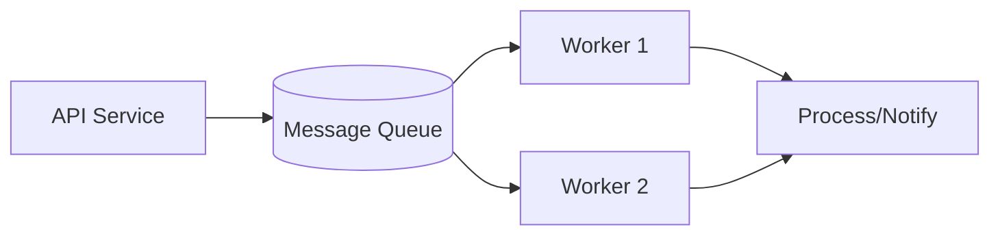
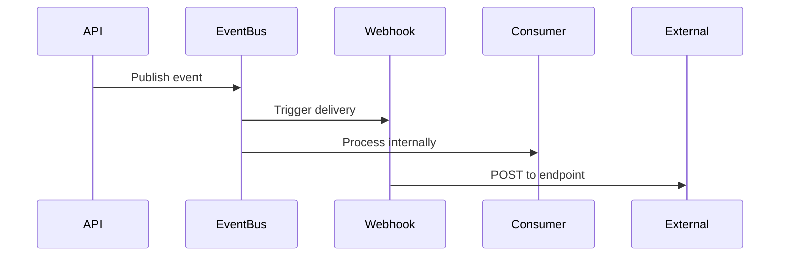
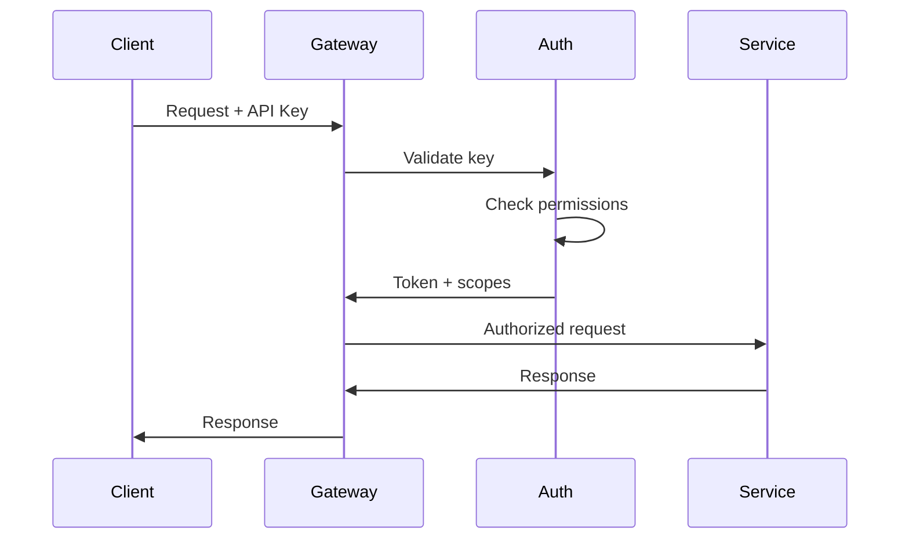

## Architecture overview

This document describes the technical architecture of [Product], including system components, data flow, and design principles.

## System overview

```mermaid
flowchart TB
    subgraph Clients
        SDK[SDK/API Client]
        Web[Web Dashboard]
        WH[Webhook Consumers]
    end

    subgraph Edge["Edge Layer"]
        LB[Load Balancer]
        CDN[CDN]
        WAF[WAF]
    end

    subgraph API["API Layer"]
        GW[API Gateway]
        Auth[Auth Service]
        RL[Rate Limiter]
    end

    subgraph Core["Core Services"]
        S1[[Resource] Service]
        S2[Processing Service]
        S3[Notification Service]
    end

    subgraph Data["Data Layer"]
        DB[(Primary Database)]
        Cache[(Cache)]
        Queue[(Message Queue)]
        Search[(Search Index)]
    end

    SDK --> LB
    Web --> CDN --> LB
    LB --> GW
    GW --> Auth --> RL
    RL --> S1 & S2 & S3
    S1 & S2 & S3 --> DB & Cache & Queue
    S3 --> WH
```

## Design principles

### [Principle 1: e.g., API-first]

[Product] is designed API-first:

- All functionality available via API
- Dashboard built on the same API
- Consistent behavior across interfaces

### [Principle 2: e.g., Event-driven]

System components communicate through events:

- Loose coupling between services
- Reliable event delivery
- Easy scaling and debugging

### [Principle 3: e.g., Idempotent operations]

All write operations are idempotent:

- Safe to retry failed requests
- No duplicate actions from retries
- Predictable system behavior

## Core components

### API Gateway

The API Gateway handles:

- Request routing to appropriate services
- Authentication and authorization
- Request/response transformation
- Rate limiting enforcement

**Technologies:** [e.g., Kong, AWS API Gateway, custom]

### Authentication service

Manages all authentication flows:

- API key validation
- OAuth 2.0 token issuance
- JWT generation and verification
- Session management

### [Resource] service

The primary service for [resource] operations:

- CRUD operations
- Business logic validation
- Event emission

### Processing service

Handles asynchronous processing:

- Background jobs
- Data transformations
- External integrations

### Notification service

Manages outbound communications:

- Webhook delivery
- Email notifications
- Real-time updates

## Data architecture

### Primary database

| Component | Technology | Purpose |
| ----------- | ------------ | --------- |
| Primary DB | [PostgreSQL/MySQL] | Transactional data |
| Read replicas | [Same] | Read scaling |
| Sharding | [Strategy] | Horizontal scaling |

**Data model:**

```text
[Resource]
├── id (primary key)
├── organization_id (tenant key)
├── [fields...]
├── created_at
└── updated_at
```

### Caching strategy

Multi-layer caching:

| Layer | Technology | TTL | Use case |
| ------- | ------------ | ----- | ---------- |
| Edge | CDN | 5 min | Static assets |
| Application | Redis | 1 min | API responses |
| Database | Query cache | 30 sec | Frequent queries |

**Cache invalidation:**

```text
Event → Cache invalidation → Fresh data on next request
```

### Message queue

Asynchronous processing uses [RabbitMQ/Kafka/SQS]:



**Queue types:**

| Queue | Purpose | Priority |
| ------- | --------- | ---------- |
| `webhooks` | Webhook delivery | High |
| `processing` | Background jobs | Normal |
| `analytics` | Usage tracking | Low |

## Event system

### Event flow



### Event structure

```json
{
  "id": "evt_abc123",
  "type": "[resource].created",
  "api_version": "2024-01-01",
  "created": 1704067200,
  "data": {
    "object": { ... }
  }
}
```

### Event delivery guarantees

- **At-least-once delivery:** Events may be delivered multiple times
- **Ordering:** Events for the same resource are ordered
- **Durability:** Events persisted for 30 days

## Infrastructure

### Deployment architecture

```text
┌─────────────────────────────────────────────────────────┐
│                        Region 1                          │
├─────────────────────────────────────────────────────────┤
│  ┌─────────────────┐    ┌─────────────────┐            │
│  │  Availability   │    │  Availability   │            │
│  │    Zone A       │    │    Zone B       │            │
│  │                 │    │                 │            │
│  │  [Services]     │    │  [Services]     │            │
│  │  [Database]     │◄──►│  [Replica]      │            │
│  │  [Cache]        │    │  [Cache]        │            │
│  └─────────────────┘    └─────────────────┘            │
└─────────────────────────────────────────────────────────┘
```

### High availability

| Component | HA Strategy | RTO | RPO |
| ----------- | ------------- | ----- | ----- |
| API | Multi-AZ, auto-scaling | <1 min | N/A |
| Database | Multi-AZ replica | <5 min | <1 min |
| Cache | Cluster mode | <1 min | N/A |
| Queue | Mirrored queues | <1 min | 0 |

### Disaster recovery

- **Backup frequency:** [Hourly/Daily]
- **Retention:** [30 days]
- **Recovery testing:** [Quarterly]
- **Multi-region:** [Yes/Planned]

## Security architecture

### Network security

```text
Internet → WAF → Load Balancer → VPC → Services
                                  ↓
                              Private Subnet
                                  ↓
                              Database
```

**Layers:**

1. **WAF:** Block malicious requests
1. **DDoS protection:** [Provider]
1. **VPC:** Network isolation
1. **Security groups:** Service-level access control

### Data security

| Data state | Protection |
| ------------ | ------------ |
| In transit | TLS 1.3 |
| At rest | AES-256 |
| In use | [Additional measures] |

### Authentication flow



## Scalability

### Horizontal scaling

| Component | Scaling trigger | Max instances |
| ----------- | ----------------- | --------------- |
| API servers | CPU > 70% | [N] |
| Workers | Queue depth > 1000 | [N] |
| Cache | Memory > 80% | Cluster mode |

### Vertical scaling

Database scaling path:

1. Read replicas for read scaling
1. Connection pooling
1. Query optimization
1. Sharding for write scaling

### Performance targets

| Metric | Target | Current |
| -------- | -------- | --------- |
| API latency (p50) | <100ms | [Current] |
| API latency (p99) | <500ms | [Current] |
| Throughput | [X] req/sec | [Current] |
| Uptime | 99.99% | [Current] |

## Monitoring and observability

### Metrics

Key metrics tracked:

- Request rate and latency
- Error rates by type
- Queue depths
- Database connections
- Cache hit rates

### Logging

Structured logging with:

- Request ID correlation
- User/organization context
- Performance timing

### Tracing

Distributed tracing across services using [Jaeger/Datadog/etc.].

## API versioning

### Version strategy

- **Dated versions:** `2024-01-01`
- **Header:** `[Product]-Version: 2024-01-01`
- **Default:** Latest stable version

### Compatibility

- Non-breaking changes added without version bump
- Breaking changes require new version
- Old versions supported for [X] months

## Related

- [API Reference](../reference/api.md)
- [Security overview](./security.md)
- [Rate limits](../reference/rate-limits.md)
