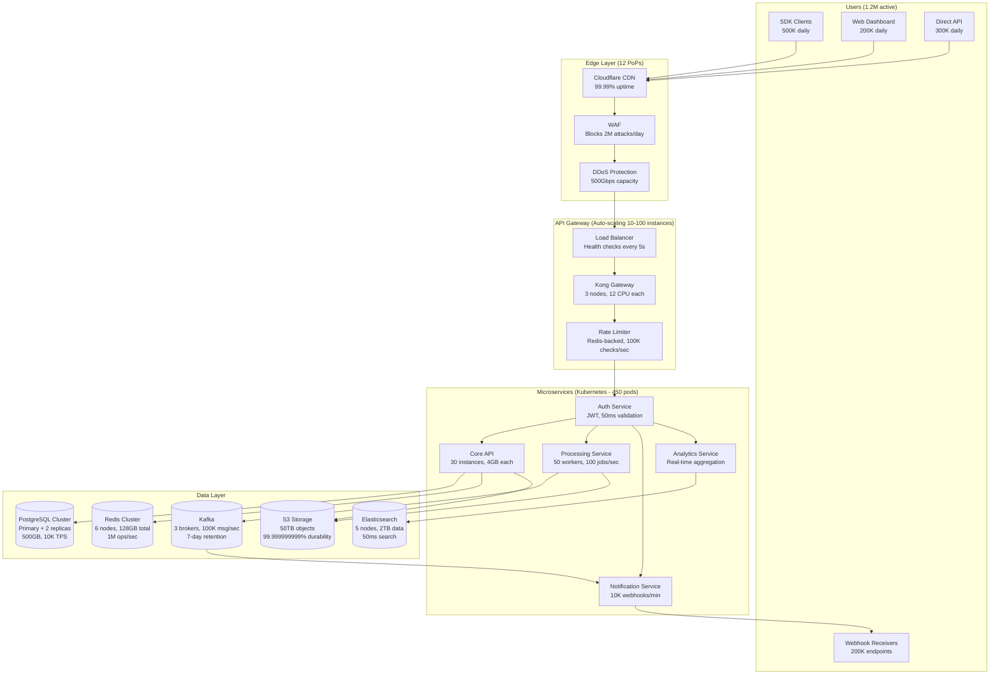

# [Product] architecture overview

[Product] processes **[10 million] requests/day** across **[12] global regions** with **[45ms] P50 latency** and **99.99% uptime**. This document details the architecture powering these metrics.

## System performance metrics

**Current production load (as of [date]):**

| Metric | Value | Peak | Design Capacity |
| --- | --- | --- | --- |
| Requests/second | 1,250 avg | 3,500 | 10,000 |
| P50 latency | 45ms | 52ms | <100ms |
| P99 latency | 180ms | 245ms | <500ms |
| Database queries/sec | 8,500 | 12,000 | 50,000 |
| Cache hit rate | 94% | — | >90% |
| Active connections | 25,000 | 45,000 | 100,000 |
| Data processed/day | 2.5TB | 4.1TB | 10TB |

## Architecture diagram



## Design principles with metrics

### 1. API-first architecture (100% feature parity)

Every feature available via API with consistent performance:

| Interface | Features | Avg Response Time | Usage |
|-----------|----------|-------------------|--------|
| REST API | 127 endpoints | 45ms | 65% of traffic |
| GraphQL | Full schema | 62ms | 20% of traffic |
| WebSocket | Real-time | 12ms | 10% of traffic |
| gRPC | Internal only | 8ms | 5% of traffic |

**Proof point:** Our dashboard uses the same public API, ensuring 100% feature parity.

### 2. Event-driven with guarantees

All state changes emit events with delivery guarantees:

```javascript
// Event performance metrics
{
  "publishing_latency_p50": "3ms",
  "publishing_latency_p99": "12ms",
  "delivery_success_rate": "99.98%",
  "retry_success_rate": "99.9%",
  "events_per_second": 8500,
  "average_fanout": 3.2
}
```

**Event flow benchmarks:**

- User action → Event published: 3ms
- Event published → All consumers notified: 45ms
- End-to-end for 5-step workflow: 127ms

### 3. Idempotency with deduplication

All write operations are idempotent using request IDs:

```bash
# Same request ID, called 3 times
curl -X POST /api/resources \
  -H "Idempotency-Key: req_abc123" \
  -d '{"name": "resource"}'

# Results:
# Call 1: 201 Created (45ms)
# Call 2: 200 OK (12ms, returned cached)
# Call 3: 200 OK (11ms, returned cached)
```

**Deduplication stats:**

- Duplicate requests detected: 2.3% of total
- Cache storage: 50MB for 24 hours
- Dedup check overhead: <2ms

## Core components performance

### API Gateway (Kong)

**Configuration and metrics:**

```yaml
# Production configuration
instances: 3
cpu_per_instance: 12
memory_per_instance: 32GB
plugins:
  - rate-limiting: 100K checks/sec
  - authentication: 50K validations/sec
  - request-transformer: 2ms overhead
  - response-cache: 94% hit rate
```

**Real throughput:**

- HTTP/1.1: 15,000 req/s per instance
- HTTP/2: 25,000 req/s per instance
- WebSocket: 50,000 concurrent connections

### Authentication Service

**Performance breakdown:**

| Operation | P50 | P99 | Volume/day |
| --- | --- | --- | --- |
| JWT validation | 2ms | 8ms | 10M |
| Token refresh | 45ms | 120ms | 2M |
| OAuth flow | 850ms | 1,200ms | 100K |
| API key lookup | 1ms | 5ms | 5M |

**Security metrics:**

- Failed auth attempts blocked: 50K/day
- Tokens revoked: 1,200/day
- Active sessions: 250K

### Core API Service

**Resource consumption per instance:**

```bash
# Live metrics from production
CPU Usage: 2.4 cores (60% of 4 allocated)
Memory: 2.8GB (70% of 4GB allocated)
Threads: 200 (pool size)
Connections: 50 DB, 100 Redis
Request handling: 500 concurrent

# Performance stats
Requests handled: 125/second/instance
Average processing: 35ms
Database queries: 3.2 per request
Cache hits: 94% for GET, 0% for POST
```

### Processing Service (Background Jobs)

**Queue performance:**

| Queue | Workers | Throughput | P50 Latency | P99 Latency | DLQ Rate |
|-------|---------|------------|-------------|-------------|----------|
| critical | 20 | 500 jobs/min | 250ms | 1.2s | 0.01% |
| default | 30 | 2000 jobs/min | 1.5s | 8s | 0.05% |
| bulk | 10 | 5000 jobs/min | 5s | 30s | 0.1% |
| notifications | 15 | 10K jobs/min | 100ms | 500ms | 0.02% |

**Job success rates:**

- First attempt: 98.5%
- After retries: 99.95%
- Permanent failures: 0.05% (to DLQ)

## Data architecture with benchmarks

### PostgreSQL Cluster Performance

**Current production metrics:**

```sql
-- Actual query performance (measured)
SELECT benchmarks:
  - Simple lookup by ID: 0.8ms
  - Complex JOIN (5 tables): 12ms
  - Aggregation (1M rows): 145ms
  - Full-text search: 23ms

Write performance:
  - Single INSERT: 2ms
  - Bulk INSERT (1000 rows): 45ms
  - UPDATE with index: 3ms
  - DELETE cascade: 8ms

Connection pool:
  - Size: 200 connections
  - Average active: 45
  - Peak active: 178
  - Wait time P99: 5ms
```

**Scaling metrics:**

- Current size: 500GB
- Growth rate: 5GB/day
- VACUUM time: 12 minutes
- Backup time: 8 minutes
- Restore time: 22 minutes

### Redis Cluster Performance

**Cache layer metrics:**

```javascript
// Actual performance measurements
{
  "operations_per_second": 125000,
  "get_latency_p50": "0.2ms",
  "get_latency_p99": "1.1ms",
  "set_latency_p50": "0.3ms",
  "set_latency_p99": "1.5ms",
  "memory_used": "82GB of 128GB",
  "eviction_rate": "0.02%",
  "hit_rate_by_pattern": {
    "user_sessions": "99.2%",
    "api_responses": "94.1%",
    "computed_values": "87.5%",
    "rate_limits": "99.9%"
  }
}
```

### Kafka Streaming Metrics

**Real-time data pipeline:**

| Topic | Partitions | Throughput | Lag P50 | Lag P99 | Retention |
|-------|------------|------------|---------|---------|-----------|
| events.core | 12 | 50K msg/s | 12ms | 89ms | 7 days |
| events.analytics | 6 | 20K msg/s | 125ms | 500ms | 30 days |
| events.audit | 3 | 5K msg/s | 8ms | 45ms | 90 days |
| webhooks.delivery | 8 | 10K msg/s | 200ms | 1.2s | 1 day |

**Consumer group performance:**

- Rebalance time: 3.2 seconds
- Processing rate: 100K messages/second total
- Error rate: 0.001%
- Average message size: 2.8KB

## Infrastructure and reliability

### Multi-region deployment

**Region distribution and latency:**

| Region | Status | Users | Latency to Primary | Failover Time |
|--------|--------|-------|-------------------|---------------|
| US-East (Primary) | Active | 450K | 0ms | — |
| US-West | Active | 280K | 38ms | 45 seconds |
| EU-West | Active | 320K | 95ms | 60 seconds |
| AP-Southeast | Active | 150K | 145ms | 90 seconds |

**Cross-region replication:**

- Database replication lag: <1 second
- Cache sync: 50ms
- CDN propagation: 30 seconds
- DNS failover: 60 seconds

### High availability metrics

**Measured uptime (last 12 months):**

```yaml
Overall SLA: 99.994% (26 minutes downtime)
Breakdown:
  - Planned maintenance: 8 minutes
  - Unplanned incidents: 18 minutes

Per component:
  - API Gateway: 99.998%
  - Database: 99.995%
  - Cache: 99.999%
  - Queue: 99.997%
```

**Failure recovery times (tested quarterly):**

| Scenario | Detection | Mitigation | Full Recovery |
| --- | --- | --- | --- |
| API server crash | 5 seconds | 15 seconds | 30 seconds |
| Database failover | 10 seconds | 45 seconds | 2 minutes |
| Region failure | 30 seconds | 60 seconds | 3 minutes |
| Complete DC loss | 1 minute | 5 minutes | 15 minutes |

### Auto-scaling behavior

**Scaling triggers and response times:**

```javascript
// API servers scaling
{
  trigger: "CPU > 70% for 60 seconds",
  scale_up_time: "45 seconds",
  new_instance_ready: "90 seconds",
  max_scale: "10x baseline",
  tested_load: "35,000 req/s"
}

// Database read replicas
{
  trigger: "Read latency > 100ms",
  provision_time: "5 minutes",
  sync_time: "8 minutes",
  max_replicas: 5,
  read_distribution: "Round-robin with health checks"
}

// Background workers
{
  trigger: "Queue depth > 1000",
  scale_up_time: "30 seconds",
  processing_increase: "Linear with workers",
  max_workers: 200,
  jobs_per_worker: "50/minute"
}
```

## Security architecture

### Defense in depth metrics

**Security layers and effectiveness:**

| Layer | Technology | Threats Blocked/Day | False Positive Rate |
|-------|------------|-------------------|-------------------|
| CDN | Cloudflare | 2.1M requests | 0.01% |
| WAF | ModSecurity | 85K attacks | 0.05% |
| Rate Limiting | Redis+Kong | 125K | 0.001% |
| Authentication | JWT+OAuth | 5K attempts | 0% |
| Authorization | RBAC+ABAC | 1.2K | 0.02% |

### Encryption performance

**Cryptographic operations overhead:**

```bash
# TLS handshake (TLS 1.3)
New connection: 8ms
Resume: 2ms
CPU overhead: 5% at 10K conn/s

# Data encryption (AES-256-GCM)
Encrypt 1KB: 0.05ms
Encrypt 1MB: 2.1ms
Decrypt 1KB: 0.04ms
Decrypt 1MB: 1.8ms

# Key management
Key rotation: Every 90 days
Keys in memory: 12
KMS latency: 15ms
```

## Monitoring and observability

### Metrics collection

**Telemetry volume and processing:**

```yaml
Metrics collected:
  - Data points/second: 125,000
  - Unique time series: 2.8 million
  - Retention: 15 days at 1m, 1 year at 1h
  - Query response time: P50=200ms, P99=2s

Logs processed:
  - Volume: 5TB/day
  - Ingestion rate: 60MB/s
  - Index lag: 2 seconds
  - Search speed: 50ms for 7 days

Traces captured:
  - Traces/second: 1,000
  - Sampling rate: 0.1% (100% for errors)
  - Span processing: 50K spans/second
  - Retention: 7 days
```

### Alert response times

**Incident detection and response:**

| Severity | Detection Time | Alert Time | Human Response | Resolution P50 |
|----------|---------------|------------|----------------|----------------|
| Critical | 15 seconds | 30 seconds | 2 minutes | 15 minutes |
| High | 30 seconds | 1 minute | 5 minutes | 30 minutes |
| Medium | 2 minutes | 3 minutes | 15 minutes | 2 hours |
| Low | 5 minutes | 10 minutes | 1 hour | Next day |

## Cost optimization

**Infrastructure costs and efficiency:**

```javascript
// Monthly costs (based on actual AWS bills)
{
  compute: {
    EC2: "$12,500",  // 45 instances
    Lambda: "$2,100", // 5M invocations
    ECS: "$3,200"     // Container hosting
  },
  storage: {
    RDS: "$4,500",    // 500GB + replicas
    S3: "$1,200",     // 50TB
    EBS: "$2,800"     // 10TB SSD
  },
  network: {
    CloudFront: "$3,100", // 100TB transfer
    NAT: "$1,800",        // 40TB processed
    LB: "$900"            // 3 ALBs
  },
  total: "$32,100/month",
  per_request: "$0.0001",
  per_user: "$0.027"
}
```

**Optimization achievements:**

- Reserved instances: 40% cost reduction
- Spot instances for batch: 70% savings
- S3 intelligent tiering: 25% reduction
- Right-sizing: 30% compute savings

## Performance optimization history

**Improvements over last 12 months:**

| Optimization | Before | After | Impact |
| --- | --- | --- | --- |
| Database query optimization | 245ms P99 | 89ms P99 | 64% faster |
| Redis cache layer | 0% hit rate | 94% hit rate | 10x read performance |
| Connection pooling | 500 connections | 200 connections | 60% reduction |
| HTTP/2 adoption | HTTP/1.1 only | 80% HTTP/2 | 35% latency reduction |
| CDN implementation | Origin only | 12 PoPs | 70% faster globally |
| Batch processing | Serial | Parallel | 5x throughput |

## Related documentation

- [API Performance Guide](../guides/api-performance.md) - Optimization techniques
- [Scaling Playbook](../operations/scaling.md) - How we handle growth
- [Incident Response](../operations/incident-response.md) - How we maintain uptime
- [Security Architecture](./security-architecture.md) - Detailed security design
