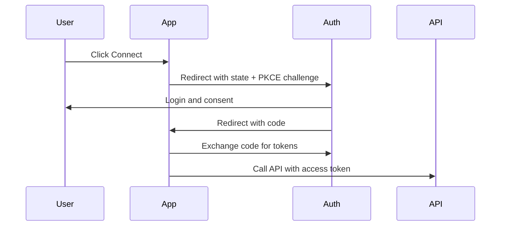

# Authentication guide

Use this guide to implement authentication that is secure by default and easy to operate. You will start with a working request, then choose the best auth model for your architecture.

## Quick start (first successful request)

```bash
curl -X GET https://api.example.com/v1/projects \
  -H "Authorization: Bearer $API_TOKEN" \
  -H "Content-Type: application/json"
```

Expected response:

```json
{
  "data": [
    {
      "id": "prj_123",
      "name": "Marketing automation"
    }
  ]
}
```

## Choose an authentication model

| Model | Use when | Strengths | Tradeoffs |
| --- | --- | --- | --- |
| API key | Server-to-server calls from trusted backend | Simple, fast to ship | Key lifecycle and scope control required |
| OAuth 2.0 | Third-party apps act on behalf of users | Delegated access, revocable tokens | More moving parts |
| JWT service identity | Internal microservices | Stateless verification, low latency | Token issuance and key rotation complexity |

## Prerequisites

- HTTPS for all API traffic
- Secret storage (for example: cloud secrets manager or vault)
- Separate credentials for test and production
- Monitoring for authentication failures

## API key authentication

### Issue keys

1. Create one key per environment and workload.
1. Scope each key to minimum required permissions.
1. Set expiration for temporary workloads.
1. Record owner and rotation date.

### Use keys securely

```javascript
import fetch from 'node-fetch';

const client = async (path, options = {}) => {
  const response = await fetch(`https://api.example.com${path}`, {
    ...options,
    headers: {
      'Content-Type': 'application/json',
      Authorization: `Bearer ${process.env.PRODUCT_API_KEY}`,
      ...(options.headers || {})
    }
  });

  if (!response.ok) {
    const body = await response.text();
    throw new Error(`API error ${response.status}: ${body}`);
  }

  return response.json();
};
```

### Rotation checklist

1. Issue new key.
1. Deploy with dual-key fallback.
1. Verify successful traffic on new key.
1. Revoke old key.
1. Close incident if any auth errors spike.

## OAuth 2.0 authorization code flow

Use OAuth when users connect their account to your integration.



Implementation guardrails:

- Validate `state` to prevent CSRF.
- Use PKCE for public clients.
- Store refresh tokens encrypted at rest.
- Rotate refresh tokens when supported.

## JWT service authentication

For service-to-service traffic, issue short-lived JWTs.

```json
{
  "iss": "service-auth",
  "sub": "worker-sync",
  "aud": "product-api",
  "scope": "projects:read projects:write",
  "iat": 1739010000,
  "exp": 1739010300
}
```

Recommendations:

- TTL 5-10 minutes.
- Sign with asymmetric keys (RS256 or ES256).
- Rotate signing keys and publish JWKS.

## Error handling for auth

| HTTP status | Typical cause | Action |
| --- | --- | --- |
| `401` | Missing, expired, or invalid token | Refresh/reissue token and retry once |
| `403` | Token valid but lacks scope | Request correct scopes/permissions |
| `429` | Auth endpoint rate-limited | Exponential backoff with jitter |

## Observability

Track these metrics from day one:

- Authentication success rate
- Token refresh failures
- Permission denied (`403`) by endpoint
- Time to recover after key rotation

## Security requirements

- Never place secrets in client-side code.
- Never log full tokens.
- Redact secrets in error traces.
- Enforce least privilege by default.

## Adaptation notes for template users

Replace placeholders before publishing:

- `[Product/API]`
- `https://api.example.com`
- Example scopes, endpoint paths, and role names

## Related docs

- `templates/security-guide.md`
- `templates/error-handling-guide.md`
- `templates/integration-guide.md`
