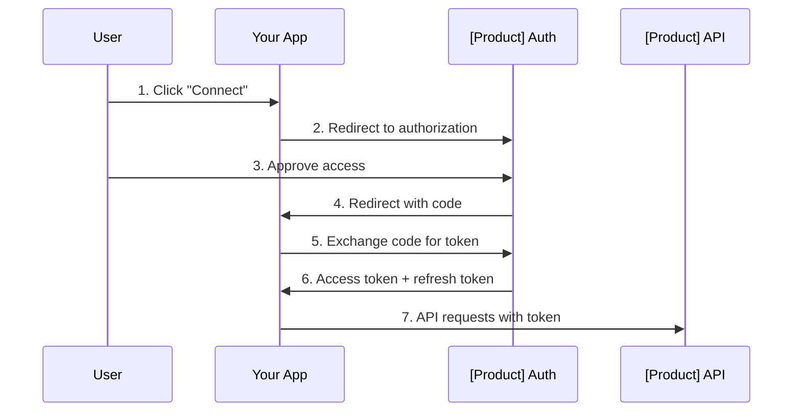

# Authentication

All [Product] API requests require authentication. This guide covers available authentication methods, implementation, and security best practices.

## Authentication methods overview

| Method | Use case | Complexity |
|--------|----------|------------|
| [API Keys](#api-key-authentication) | Server-to-server, scripts | Simple |
| [OAuth 2.0](#oauth-20) | User authorization, third-party apps | Medium |
| [JWT](#jwt-authentication) | Microservices, stateless auth | Medium |

## API key authentication

API keys are the simplest way to authenticate. Use them for server-side applications and scripts.

### Get your API key

1. Go to [Dashboard]([URL]) → Settings → API Keys
2. Click **Create API Key**
3. Select permissions:
   - `read` — Read-only access
   - `write` — Create and update resources
   - `delete` — Delete resources
   - `admin` — Full access
4. Copy the key immediately — it won't be shown again

### Use API keys

Include the API key in the `Authorization` header:

```bash
curl -X GET [API_URL]/v1/[resource] \
  -H "Authorization: Bearer [YOUR_API_KEY]"
```

=== "JavaScript"

    ```javascript
    const response = await fetch('[API_URL]/v1/[resource]', {
      headers: {
        'Authorization': `Bearer ${process.env.API_KEY}`
      }
    });
    ```

=== "Python"

    ```python
    import requests
    import os

    response = requests.get(
        '[API_URL]/v1/[resource]',
        headers={'Authorization': f'Bearer {os.environ["API_KEY"]}'}
    )
    ```

=== "Go"

    ```go
    req, _ := http.NewRequest("GET", "[API_URL]/v1/[resource]", nil)
    req.Header.Set("Authorization", "Bearer "+os.Getenv("API_KEY"))
    ```

### API key types

| Type | Prefix | Environment | Use for |
|------|--------|-------------|---------|
| Test | `sk_test_` | Sandbox | Development, testing |
| Live | `sk_live_` | Production | Production traffic |
| Restricted | `rk_` | Both | Limited permissions |

!!! warning "Test vs. Live keys"
    Test keys only work in the sandbox environment. Never use test keys in production.

## OAuth 2.0

Use OAuth 2.0 when your application needs to access [Product] on behalf of users.

### Supported flows

| Flow | Use case |
|------|----------|
| Authorization Code | Web apps with backend |
| Authorization Code + PKCE | Mobile apps, SPAs |
| Client Credentials | Machine-to-machine |

### Authorization Code flow



#### Step 1: Register your application

1. Go to [Dashboard]([URL]) → OAuth Apps
2. Create new application
3. Configure:
   - **Name:** Your app name
   - **Redirect URIs:** `https://yourapp.com/callback`
   - **Scopes:** Permissions your app needs
4. Save your **Client ID** and **Client Secret**

#### Step 2: Redirect user to authorization

```javascript
const authUrl = new URL('[AUTH_URL]/oauth/authorize');
authUrl.searchParams.set('client_id', CLIENT_ID);
authUrl.searchParams.set('redirect_uri', 'https://yourapp.com/callback');
authUrl.searchParams.set('response_type', 'code');
authUrl.searchParams.set('scope', 'read write');
authUrl.searchParams.set('state', generateRandomState()); // CSRF protection

res.redirect(authUrl.toString());
```

#### Step 3: Handle callback

```javascript
app.get('/callback', async (req, res) => {
  const { code, state } = req.query;

  // Verify state matches (CSRF protection)
  if (state !== req.session.oauthState) {
    return res.status(400).send('Invalid state');
  }

  // Exchange code for token
  const tokenResponse = await fetch('[AUTH_URL]/oauth/token', {
    method: 'POST',
    headers: { 'Content-Type': 'application/x-www-form-urlencoded' },
    body: new URLSearchParams({
      grant_type: 'authorization_code',
      code,
      redirect_uri: 'https://yourapp.com/callback',
      client_id: CLIENT_ID,
      client_secret: CLIENT_SECRET
    })
  });

  const { access_token, refresh_token, expires_in } = await tokenResponse.json();

  // Store tokens securely
  await saveTokens(req.user.id, { access_token, refresh_token, expires_in });

  res.redirect('/dashboard');
});
```

#### Step 4: Refresh tokens

Access tokens expire. Use refresh tokens to get new ones:

```javascript
const refreshAccessToken = async (userId) => {
  const { refresh_token } = await getStoredTokens(userId);

  const response = await fetch('[AUTH_URL]/oauth/token', {
    method: 'POST',
    headers: { 'Content-Type': 'application/x-www-form-urlencoded' },
    body: new URLSearchParams({
      grant_type: 'refresh_token',
      refresh_token,
      client_id: CLIENT_ID,
      client_secret: CLIENT_SECRET
    })
  });

  const tokens = await response.json();
  await saveTokens(userId, tokens);

  return tokens.access_token;
};
```

### Client Credentials flow

For server-to-server authentication without user context:

```javascript
const getClientCredentialsToken = async () => {
  const response = await fetch('[AUTH_URL]/oauth/token', {
    method: 'POST',
    headers: { 'Content-Type': 'application/x-www-form-urlencoded' },
    body: new URLSearchParams({
      grant_type: 'client_credentials',
      client_id: CLIENT_ID,
      client_secret: CLIENT_SECRET,
      scope: 'read write'
    })
  });

  const { access_token, expires_in } = await response.json();
  return access_token;
};
```

### OAuth scopes

| Scope | Access |
|-------|--------|
| `read` | Read resources |
| `write` | Create and update resources |
| `delete` | Delete resources |
| `[resource]:read` | Read specific resource type |
| `[resource]:write` | Write specific resource type |
| `offline_access` | Get refresh tokens |

Request only the scopes you need.

## JWT authentication

Use JWTs for stateless authentication in microservices.

### Generate a JWT

```javascript
import jwt from 'jsonwebtoken';

const generateJWT = () => {
  const payload = {
    iss: CLIENT_ID,          // Issuer (your client ID)
    sub: 'user_123',         // Subject (user or service ID)
    aud: '[PRODUCT]_API',    // Audience
    iat: Math.floor(Date.now() / 1000),
    exp: Math.floor(Date.now() / 1000) + 3600  // 1 hour
  };

  return jwt.sign(payload, CLIENT_SECRET, { algorithm: 'HS256' });
};
```

### Use JWT in requests

```bash
curl -X GET [API_URL]/v1/[resource] \
  -H "Authorization: Bearer [JWT_TOKEN]"
```

## Security best practices

### Do

- Store credentials in environment variables or secrets manager
- Use HTTPS for all API requests
- Implement token refresh before expiry
- Rotate API keys periodically
- Use minimum required scopes/permissions
- Log authentication failures for monitoring

### Don't

- Hardcode credentials in source code
- Commit credentials to version control
- Share API keys across environments
- Use production keys in development
- Expose credentials in client-side code
- Log access tokens

### Secure credential storage

=== "Environment variables"

    ```bash
    # .env (never commit this file)
    [PRODUCT]_API_KEY=sk_live_...
    [PRODUCT]_CLIENT_SECRET=...
    ```

=== "AWS Secrets Manager"

    ```javascript
    import { SecretsManager } from '@aws-sdk/client-secrets-manager';

    const getSecret = async (secretName) => {
      const client = new SecretsManager();
      const response = await client.getSecretValue({ SecretId: secretName });
      return JSON.parse(response.SecretString);
    };
    ```

=== "HashiCorp Vault"

    ```javascript
    import vault from 'node-vault';

    const client = vault({ endpoint: process.env.VAULT_ADDR });
    const { data } = await client.read('secret/data/[product]');
    const apiKey = data.data.api_key;
    ```

### Key rotation

Rotate API keys regularly:

1. Create new API key
2. Update application configuration
3. Deploy with new key
4. Verify functionality
5. Revoke old key

## Error responses

| Status | Error | Description |
|--------|-------|-------------|
| `401` | `unauthorized` | Missing or invalid credentials |
| `403` | `forbidden` | Valid credentials but insufficient permissions |
| `429` | `rate_limited` | Too many requests |

**Error response format:**

```json
{
  "error": "unauthorized",
  "message": "Invalid API key provided",
  "request_id": "req_abc123"
}
```

## Testing authentication

### Test with cURL

```bash
# Test API key
curl -I [API_URL]/v1/[resource] \
  -H "Authorization: Bearer $API_KEY"

# Expected: HTTP/2 200
# Invalid key: HTTP/2 401
```

### Test in sandbox

Use test credentials in the sandbox environment before going live.

## Related

- [API Reference](../reference/api.md)
- [Error codes](../reference/errors.md)
- [Rate limits](../reference/rate-limits.md)
- [Security overview](./security.md)
