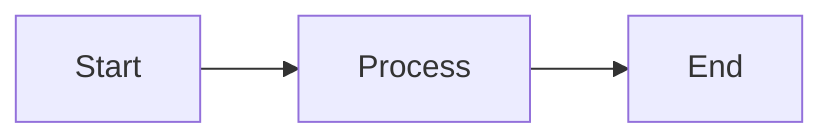

## How [thing] works

[Opening paragraph: Define what [thing] is and why it matters. This is the most important paragraph for LLM extraction. Keep under 60 words. Include a clear definition using "is", "enables", or "provides".]

## [Core concept 1]

[Explanation of the first key concept. Use concrete examples.]



## [Core concept 2]

[Explanation with specific examples and numbers where possible.]

### [Sub-concept if needed]

[More detailed explanation.]

| Term | Definition | Example |
| ------ | ------------ | --------- |
| [Term 1] | [What it means] | [Concrete example] |
| [Term 2] | [What it means] | [Concrete example] |

## [Core concept 3]

[Technical details that advanced users need to understand.]

```json
{
  "example": "structure",
  "showing": "data format"
}
```

## [How it affects your workflows]

[Practical implications - how understanding this concept helps in real scenarios.]

**Example scenario:**

[Concrete example of when this knowledge matters]

## Key takeaways

- [First important point - actionable insight]
- [Second important point - common misconception clarified]
- [Third important point - best practice]

## Related

- [Build your first workflow](../getting-started/quickstart.md) - Tutorial using this concept
- [Configure [related feature]](../how-to/related-guide.md) - Practical application
- [[Component] reference](../reference/component.md) - Technical details
