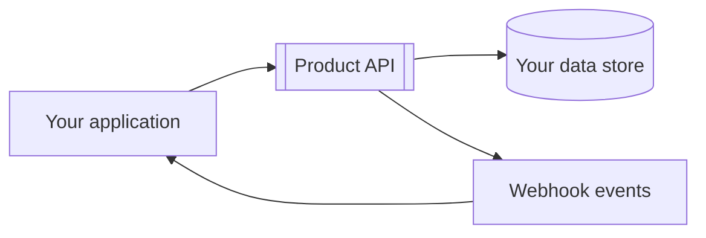

# Integration guide

This guide walks through a complete integration lifecycle from first API call to stable production operations.

## Outcome

By the end, you will have:

- Authenticated API client
- One production-relevant workflow implemented
- Webhook receiver with signature verification
- Monitoring and retry strategy in place

## Architecture at a glance



## Prerequisites

- Account and credentials for test environment
- Secure secret storage
- Ability to expose a webhook endpoint over HTTPS

## Step 1: Authenticate

```javascript
import { ProductClient } from '@acme/product-sdk';

const client = new ProductClient({
  apiKey: process.env.PRODUCT_API_KEY,
  baseUrl: 'https://api.example.com',
  timeout: 30000
});
```

## Step 2: Implement core workflow

```javascript
const project = await client.projects.create({
  name: 'Onboarding automation',
  ownerEmail: 'owner@example.com'
});

const run = await client.runs.create({
  projectId: project.id,
  trigger: 'manual'
});
```

Expected result:

- Project is created.
- Workflow run starts.
- Run ID is persisted for status checks.

## Step 3: Add webhook processing

```javascript
app.post('/webhooks/product', rawBodyMiddleware, async (req, res) => {
  const valid = verifySignature(req.rawBody, req.headers['x-product-signature']);
  if (!valid) return res.status(400).send('invalid signature');

  res.status(200).send('ok');
  await processEvent(JSON.parse(req.rawBody));
});
```

## Step 4: Handle retries and failures

- Retry transient API failures (`429`, `5xx`).
- Use idempotency keys on write endpoints.
- Persist failed webhook events to dead-letter queue.

## Step 5: Validate in staging

- Run integration tests with test credentials.
- Replay webhook fixtures.
- Confirm dashboards and alerts fire correctly.

## Production readiness checklist

- [ ] Secrets are rotated and never logged.
- [ ] Rate-limit handling is implemented.
- [ ] Webhook signatures are verified.
- [ ] Metrics and traces are visible.
- [ ] Runbook exists for auth and webhook incidents.

## Adaptation notes for template users

Replace placeholders and examples with your domain entities (`projects`, `runs`, event names, scopes).

## Related docs

- `templates/authentication-guide.md`
- `templates/webhooks-guide.md`
- `templates/testing-guide.md`
