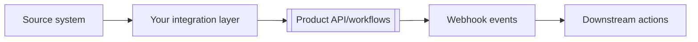

# [Use case]

This guide shows how to achieve [business outcome] with [Product] in a way that is measurable, maintainable, and ready for production.

## Problem and success criteria

**Problem:** [Current pain or inefficiency]

**Target outcome:** [Specific measurable result]

**Success metrics:**

- [Metric 1 with target]
- [Metric 2 with target]
- [Metric 3 with target]

## Solution overview



## Prerequisites

- Credentials and required scopes
- Target system access
- Data model mapping approved

## Step 1: Model the workflow

Define:

- Trigger conditions
- Validation rules
- Success and failure paths

## Step 2: Implement core path

```javascript
const execution = await client.runs.create({
  workflowId: process.env.WORKFLOW_ID,
  input: {
    sourceId: payload.id,
    initiatedBy: 'use-case-guide'
  }
});
```

## Step 3: Handle asynchronous outcomes

- Subscribe to relevant events.
- Correlate by operation ID.
- Update downstream state idempotently.

## Step 4: Add guardrails

- Retries for transient errors
- Dead-letter queue for unrecoverable failures
- Alerts for repeated failures and SLA violations

## Step 5: Roll out safely

1. Ship to staging with sampled traffic.
1. Enable feature flag in production for small cohort.
1. Expand gradually while monitoring metrics.

## Operational playbook

| Signal | Threshold | Action |
| --- | --- | --- |
| Failure rate | `> X%` | pause rollout + investigate |
| Processing latency | `> Y ms` | scale workers or reduce batch size |
| Duplicate operations | any sustained increase | review idempotency implementation |

## Adaptation notes for template users

Replace all placeholders with your domain entities, triggers, and target metrics. Avoid generic words like "resource" in final docs.

## Related docs

- `templates/integration-guide.md`
- `templates/testing-guide.md`
- `templates/error-handling-guide.md`
