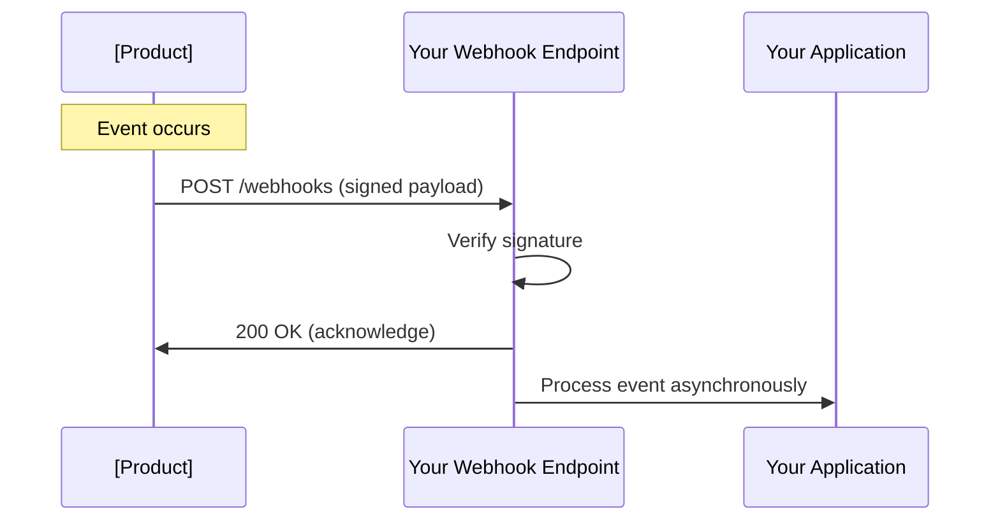

# Webhooks

Webhooks send real-time notifications to your application when events occur in [Product]. Instead of polling the API, your app receives instant updates.

## How webhooks work



## Quick setup

### 1. Create an endpoint

Your webhook endpoint must:

- Accept `POST` requests
- Return `200` status within 30 seconds
- Be publicly accessible via HTTPS

```javascript
// Express.js
app.post('/webhooks/[product]', express.raw({ type: 'application/json' }), (req, res) => {
  // Respond immediately
  res.status(200).send('OK');

  // Process asynchronously
  processWebhook(req.body, req.headers);
});
```

### 2. Register the webhook

=== "Dashboard"

    1. Go to [Dashboard]([URL]) → Webhooks
    2. Click **Add Endpoint**
    3. Enter URL: `https://yourapp.com/webhooks/[product]`
    4. Select events to receive
    5. Copy the **Signing Secret**

=== "API"

    ```bash
    curl -X POST [API_URL]/v1/webhooks \
      -H "Authorization: Bearer $API_KEY" \
      -d '{
        "url": "https://yourapp.com/webhooks/[product]",
        "events": ["[resource].created", "[resource].updated"]
      }'
    ```

### 3. Verify signatures

**Always verify webhook signatures** to ensure requests come from [Product].

```javascript
import crypto from 'crypto';

const verifyWebhookSignature = (payload, signature, secret) => {
  const timestamp = signature.split(',')[0].split('=')[1];
  const sig = signature.split(',')[1].split('=')[1];

  // Check timestamp (prevent replay attacks)
  const tolerance = 300; // 5 minutes
  if (Math.abs(Date.now() / 1000 - timestamp) > tolerance) {
    return false;
  }

  // Verify signature
  const signedPayload = `${timestamp}.${payload}`;
  const expected = crypto
    .createHmac('sha256', secret)
    .update(signedPayload)
    .digest('hex');

  return crypto.timingSafeEqual(Buffer.from(sig), Buffer.from(expected));
};
```

## Event types

### Resource events

| Event | Trigger |
|-------|---------|
| `[resource].created` | New [resource] created |
| `[resource].updated` | [Resource] modified |
| `[resource].deleted` | [Resource] deleted |

### Status events

| Event | Trigger |
|-------|---------|
| `[resource].status.active` | [Resource] activated |
| `[resource].status.failed` | [Resource] failed |
| `[resource].status.completed` | [Resource] completed |

### Account events

| Event | Trigger |
|-------|---------|
| `account.updated` | Account settings changed |
| `billing.invoice.created` | New invoice |
| `billing.payment.failed` | Payment failed |

## Payload structure

All webhooks follow this structure:

```json
{
  "id": "evt_1234567890",
  "type": "[resource].created",
  "created": 1704067200,
  "api_version": "2024-01-01",
  "data": {
    "object": {
      "id": "[resource]_abc123",
      "name": "Example",
      "status": "active",
      "created_at": "2024-01-01T00:00:00Z"
    },
    "previous_attributes": {
      "status": "pending"
    }
  }
}
```

| Field | Type | Description |
|-------|------|-------------|
| `id` | string | Unique event ID |
| `type` | string | Event type |
| `created` | integer | Unix timestamp |
| `api_version` | string | API version used |
| `data.object` | object | Current state of the resource |
| `data.previous_attributes` | object | Changed fields (for updates) |

## Handle events

### Basic handler

```javascript
const processWebhook = async (payload, headers) => {
  const signature = headers['x-[product]-signature'];
  const webhookSecret = process.env.WEBHOOK_SECRET;

  // Verify signature
  if (!verifyWebhookSignature(payload, signature, webhookSecret)) {
    console.error('Invalid signature');
    return;
  }

  const event = JSON.parse(payload);

  // Handle by event type
  switch (event.type) {
    case '[resource].created':
      await handle[Resource]Created(event.data.object);
      break;

    case '[resource].updated':
      await handle[Resource]Updated(
        event.data.object,
        event.data.previous_attributes
      );
      break;

    case '[resource].deleted':
      await handle[Resource]Deleted(event.data.object.id);
      break;

    default:
      console.log('Unhandled event type:', event.type);
  }
};
```

### Event handlers

```javascript
const handle[Resource]Created = async (resource) => {
  // Create in your database
  await db.[resources].create({
    externalId: resource.id,
    name: resource.name,
    status: resource.status
  });

  // Trigger downstream actions
  await notifyTeam(resource);
};

const handle[Resource]Updated = async (resource, changedFields) => {
  // Update only changed fields
  await db.[resources].update(
    { externalId: resource.id },
    changedFields
  );
};

const handle[Resource]Deleted = async (resourceId) => {
  // Soft delete or remove
  await db.[resources].delete({ externalId: resourceId });
};
```

## Best practices

### Respond quickly

Return `200` immediately, process asynchronously:

```javascript
app.post('/webhooks', (req, res) => {
  // Respond first
  res.status(200).send('OK');

  // Then process (don't await)
  processWebhook(req.body).catch(err => {
    console.error('Webhook processing failed:', err);
  });
});
```

### Implement idempotency

Webhooks may be sent multiple times. Handle duplicates:

```javascript
const processWebhook = async (event) => {
  // Check if already processed
  const existing = await db.processedEvents.findOne({ eventId: event.id });
  if (existing) {
    console.log('Event already processed:', event.id);
    return;
  }

  // Process the event
  await handleEvent(event);

  // Mark as processed
  await db.processedEvents.create({
    eventId: event.id,
    processedAt: new Date()
  });
};
```

### Use a queue

For reliability, queue webhooks for processing:

```javascript
import { Queue } from 'bullmq';

const webhookQueue = new Queue('webhooks');

app.post('/webhooks', async (req, res) => {
  res.status(200).send('OK');

  await webhookQueue.add('process', {
    payload: req.body,
    headers: req.headers
  });
});

// Worker processes the queue
const worker = new Worker('webhooks', async (job) => {
  await processWebhook(job.data.payload, job.data.headers);
});
```

### Handle failures gracefully

```javascript
const processWebhook = async (event) => {
  try {
    await handleEvent(event);
  } catch (error) {
    // Log for debugging
    console.error('Webhook failed:', {
      eventId: event.id,
      eventType: event.type,
      error: error.message
    });

    // Re-throw to trigger retry (if using a queue)
    throw error;
  }
};
```

## Retry behavior

[Product] retries failed webhooks with exponential backoff:

| Attempt | Delay |
|---------|-------|
| 1 | Immediate |
| 2 | 1 minute |
| 3 | 5 minutes |
| 4 | 30 minutes |
| 5 | 2 hours |
| 6 | 8 hours |
| 7 | 24 hours |

After 7 failures, the webhook is disabled and you're notified.

### What counts as failure

| Response | Result |
|----------|--------|
| `2xx` | Success |
| `3xx` | Failure (redirects not followed) |
| `4xx` | Failure (won't retry for 4xx except 429) |
| `5xx` | Failure (will retry) |
| Timeout (>30s) | Failure (will retry) |

## Testing webhooks

### Local development

Use [ngrok](https://ngrok.com) to expose localhost:

```bash
ngrok http 3000
# Forwarding https://abc123.ngrok.io -> localhost:3000
```

Register the ngrok URL as your webhook endpoint.

### CLI testing

```bash
# Trigger a test event
curl -X POST [API_URL]/v1/webhooks/[webhook_id]/test \
  -H "Authorization: Bearer $API_KEY" \
  -d '{"event_type": "[resource].created"}'
```

### Replay events

Replay a past event for debugging:

```bash
curl -X POST [API_URL]/v1/events/[event_id]/replay \
  -H "Authorization: Bearer $API_KEY"
```

## Monitoring

### View delivery logs

Check webhook delivery status in the [Dashboard]([URL]) → Webhooks → [Endpoint] → Logs.

### Set up alerts

Monitor for:

- Failed deliveries (5xx responses)
- Disabled endpoints
- High latency (>5s response time)

## Troubleshooting

### Not receiving webhooks

1. **Verify URL:** Endpoint must be HTTPS and publicly accessible
2. **Check firewall:** Allow requests from [Product] IP ranges
3. **Review logs:** Check endpoint logs in the dashboard
4. **Test manually:** Send a test event

### Signature verification failing

1. **Use raw body:** Don't parse JSON before verification
2. **Check secret:** Ensure you're using the correct signing secret
3. **Timing:** Verify system clock is accurate (within 5 minutes)

### Missing events

1. **Check subscriptions:** Verify event types are selected
2. **Review filters:** Check if filters exclude the events
3. **Check disabled:** Endpoint may be disabled after failures

## Security

### IP allowlisting (optional)

If your firewall requires it, allowlist these IP ranges:

```
[IP_RANGE_1]
[IP_RANGE_2]
```

### Rotate signing secrets

1. Generate new secret in dashboard
2. Update your application
3. Both secrets work during rotation period
4. Remove old secret after deployment

## Related

- [Events reference](../reference/events.md)
- [API reference](../reference/api.md)
- [Error codes](../reference/errors.md)
